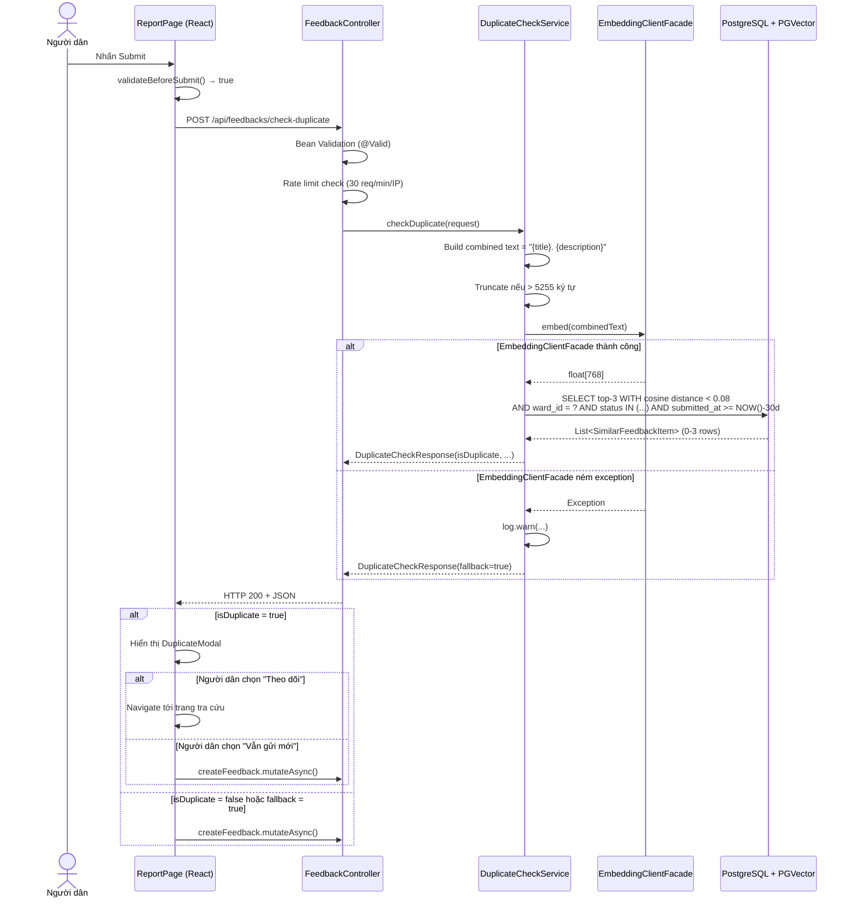

# Design Document: AI Duplicate Detection

## Overview

Tính năng **AI Duplicate Detection** bổ sung một lớp kiểm tra ngữ nghĩa trước bước submit phản ánh trong hệ thống "Đà Nẵng Lắng Nghe". Khi người dân nhấn nút gửi phản ánh, frontend gọi một API riêng biệt (`POST /api/feedback/check-duplicate`) trước khi thực sự tạo phản ánh. Backend sử dụng `EmbeddingClientFacade` (Gemini `text-embedding-004`, 768 chiều) để chuyển nội dung thành vector, rồi truy vấn PGVector tìm các phản ánh đang hoạt động trong cùng phường/xã có cosine distance < 0.08. Nếu phát hiện trùng lặp, frontend hiển thị `DuplicateModal` cho người dân xem các phản ánh tương tự và tự quyết định: theo dõi phản ánh cũ hoặc vẫn gửi mới.

Thiết kế tuân thủ nguyên tắc **pure read-only** — không lưu bất kỳ dữ liệu nào trong quá trình kiểm tra — và **graceful fallback** — mọi lỗi embedding đều trả về HTTP 200 để không cản trở việc gửi phản ánh.

### Phạm vi thay đổi

| Layer | Thành phần mới / thay đổi |
|---|---|
| Database | Migration V7: IVFFlat index trên `description_vector` |
| Backend | `DuplicateCheckRequest`, `DuplicateCheckResponse`, `SimilarFeedbackItem` DTOs |
| Backend | `DuplicateCheckService` (Spring Service mới) |
| Backend | `FeedbackController` — thêm endpoint `POST /api/feedback/check-duplicate` |
| Backend | `SecurityConfig` — permit `/api/feedbacks/check-duplicate` |
| Backend | `AuthRateLimiter` — thêm bucket `duplicateCheck` (30 req/min/IP) |
| Frontend | `useDuplicateCheck` hook (React Query mutation) |
| Frontend | `DuplicateModal` component |
| Frontend | `ReportPage` — tích hợp duplicate check trước `createFeedback.mutateAsync()` |


---

## Architecture

### Luồng xử lý tổng thể



### Quyết định kiến trúc chính

**1. Service riêng biệt, không sửa FeedbackService**
`DuplicateCheckService` là bean Spring mới, không sửa `FeedbackService.checkDuplicateFeedback()`. Lý do: tách biệt luồng "kiểm tra trước submit" (read-only, public, có fallback) với luồng "submit thực sự" (write, authenticated). `checkDuplicateFeedback()` hiện tại trong `FeedbackService` có thể giữ nguyên hoặc xóa đi như một phần tái cấu trúc riêng.

**2. JdbcTemplate trực tiếp (không dùng JPA)**
Tái sử dụng pattern đã có trong codebase với PGVector — JPA không hỗ trợ cú pháp `<=> ?::vector` tự nhiên. `JdbcTemplate` cho phép truyền vector dưới dạng chuỗi PostgreSQL array (`Arrays.toString(float[])`) giống cách `checkDuplicateFeedback()` đang làm.

**3. Endpoint public (không cần JWT)**
Endpoint được đặt tại `/api/feedbacks/check-duplicate` và được permit trong `SecurityConfig` giống pattern `/api/feedbacks/public/**`. Lý do: người dân chưa đăng nhập vẫn cần kiểm tra trùng lặp khi đang điền form (mặc dù submit cuối cùng yêu cầu auth).

**4. Frontend timeout 3000ms**
Frontend thiết lập timeout 3000ms cho duplicate check call. Nếu timeout hoặc API lỗi, bỏ qua bước check và submit bình thường — đảm bảo UX không bị gián đoạn.


---

## Components and Interfaces

### Backend

#### DTOs

**`DuplicateCheckRequest`** (`com.example.smartcity.modules.feedback.dto`)
```java
public record DuplicateCheckRequest(
    @NotBlank(message = "title không được rỗng")
    @Size(max = 255, message = "title tối đa 255 ký tự")
    String title,

    @NotBlank(message = "description không được rỗng")
    @Size(max = 5000, message = "description tối đa 5000 ký tự")
    String description,

    @NotNull(message = "wardId không được null")
    @Positive(message = "wardId phải là số nguyên dương")
    Long wardId
) {}
```

**`SimilarFeedbackItem`** (`com.example.smartcity.modules.feedback.dto`)
```java
public record SimilarFeedbackItem(
    String trackingCode,
    String title,
    String status,          // FeedbackStatus.name()
    String submittedAt,     // ISO 8601
    double similarityScore  // [0.0, 1.0], làm tròn 4 chữ số
) {}
```

**`DuplicateCheckResponse`** (`com.example.smartcity.modules.feedback.dto`)
```java
public record DuplicateCheckResponse(
    boolean isDuplicate,
    List<SimilarFeedbackItem> similarFeedbacks,
    double highestSimilarity,
    boolean fallback
) {
    public static DuplicateCheckResponse fallback() {
        return new DuplicateCheckResponse(false, List.of(), 0.0, true);
    }

    public static DuplicateCheckResponse noMatch() {
        return new DuplicateCheckResponse(false, List.of(), 0.0, false);
    }
}
```


#### DuplicateCheckService

**Package:** `com.example.smartcity.modules.feedback.service`

**Interface:**
```java
public interface DuplicateCheckService {
    DuplicateCheckResponse checkDuplicate(DuplicateCheckRequest request);
}
```

**Triển khai `DuplicateCheckServiceImpl`:**

```java
@Service
@Slf4j
@RequiredArgsConstructor
public class DuplicateCheckServiceImpl implements DuplicateCheckService {

    private static final int MAX_COMBINED_LENGTH = 5255;
    private static final double COSINE_THRESHOLD = 0.08;
    private static final int TOP_K = 3;

    private final EmbeddingClientFacade embeddingFacade;
    private final JdbcTemplate jdbcTemplate;

    @Override
    public DuplicateCheckResponse checkDuplicate(DuplicateCheckRequest request) {
        String combined = buildCombinedText(request.title(), request.description());

        float[] vector;
        try {
            vector = embeddingFacade.embed(combined);
        } catch (Exception e) {
            log.warn("[DUPLICATE-CHECK] EmbeddingClientFacade thất bại: {}", e.getMessage());
            return DuplicateCheckResponse.fallback();
        }

        return queryPgVector(vector, request.wardId());
    }

    private String buildCombinedText(String title, String description) {
        String combined = title + ". " + description;
        return combined.length() > MAX_COMBINED_LENGTH
            ? combined.substring(0, MAX_COMBINED_LENGTH)
            : combined;
    }

    private DuplicateCheckResponse queryPgVector(float[] vector, Long wardId) {
        String vectorStr = Arrays.toString(vector);
        String sql = """
            SELECT tracking_code, title, status, submitted_at,
                   (1.0 - (description_vector <=> ?::vector)) AS similarity_score
            FROM feedbacks
            WHERE ward_id = ?
              AND description_vector <=> ?::vector < ?
              AND status IN ('SUBMITTED','PENDING_RECEIVE','PENDING','IN_PROGRESS')
              AND submitted_at >= NOW() - INTERVAL '30 days'
              AND description_vector IS NOT NULL
            ORDER BY description_vector <=> ?::vector ASC
            LIMIT ?
        """;

        List<SimilarFeedbackItem> items = jdbcTemplate.query(
            sql,
            (rs, rowNum) -> new SimilarFeedbackItem(
                rs.getString("tracking_code"),
                rs.getString("title"),
                rs.getString("status"),
                rs.getTimestamp("submitted_at").toLocalDateTime()
                    .format(DateTimeFormatter.ISO_LOCAL_DATE_TIME),
                Math.round(rs.getDouble("similarity_score") * 10000.0) / 10000.0
            ),
            vectorStr, wardId, vectorStr, COSINE_THRESHOLD, vectorStr, TOP_K
        );

        if (items.isEmpty()) return DuplicateCheckResponse.noMatch();

        double highest = items.get(0).similarityScore();
        return new DuplicateCheckResponse(true, items, highest, false);
    }
}
```


#### FeedbackController — Endpoint mới

Thêm vào `FeedbackController` (hoặc tạo `DuplicateCheckController` riêng nếu muốn tách biệt):

```java
@PostMapping("/check-duplicate")
public ResponseEntity<DuplicateCheckResponse> checkDuplicate(
        @Valid @RequestBody DuplicateCheckRequest request,
        HttpServletRequest httpRequest) {
    rateLimiter.checkDuplicateCheckLimit(getClientIp(httpRequest));
    DuplicateCheckResponse response = duplicateCheckService.checkDuplicate(request);
    return ResponseEntity.ok(response);
}
```

**Route:** `POST /api/feedbacks/check-duplicate`

#### SecurityConfig — Thay đổi

```java
.requestMatchers("/api/feedbacks/public/**", "/api/feedbacks/statuses",
                 "/api/feedbacks/check-duplicate").permitAll()
```

#### AuthRateLimiter — Thêm bucket

```java
// 30 requests/phút/IP cho duplicate check
private final Cache<String, SlidingWindowBucket> duplicateCheckBuckets = Caffeine.newBuilder()
    .maximumSize(20_000)
    .expireAfterWrite(Duration.ofMinutes(2))
    .build();

public void checkDuplicateCheckLimit(String ipAddress) {
    checkLimit(duplicateCheckBuckets, "DUPLICATE:" + ipAddress,
               30, Duration.ofMinutes(1), "Kiểm tra trùng lặp");
}
```

### Frontend

#### `useDuplicateCheck` hook

**File:** `src/hooks/index.ts` (thêm vào cuối)

```typescript
export interface DuplicateCheckRequest {
  title: string;
  description: string;
  wardId: number;
}

export interface SimilarFeedbackItem {
  trackingCode: string;
  title: string;
  status: string;
  submittedAt: string;
  similarityScore: number;
}

export interface DuplicateCheckResponse {
  isDuplicate: boolean;
  similarFeedbacks: SimilarFeedbackItem[];
  highestSimilarity: number;
  fallback: boolean;
}

export function useDuplicateCheck() {
  return useMutation({
    mutationFn: async (req: DuplicateCheckRequest): Promise<DuplicateCheckResponse> => {
      const controller = new AbortController();
      const timeout = setTimeout(() => controller.abort(), 3000);
      try {
        return await request<DuplicateCheckResponse>(
          "/api/feedbacks/check-duplicate",
          { method: "POST", body: req, signal: controller.signal }
        );
      } finally {
        clearTimeout(timeout);
      }
    },
  });
}
```


#### `DuplicateModal` component

**File:** `src/components/DuplicateModal.tsx`

```typescript
interface DuplicateModalProps {
  open: boolean;
  similarFeedbacks: SimilarFeedbackItem[];
  onTrack: (trackingCode: string) => void;
  onSubmitAnyway: () => void;
  onClose: () => void;
}
```

Props:
- `open` — điều khiển hiển thị modal
- `similarFeedbacks` — danh sách tối đa 3 phản ánh tương tự
- `onTrack(trackingCode)` — callback khi người dùng chọn theo dõi một phản ánh
- `onSubmitAnyway()` — callback khi người dùng chọn vẫn gửi mới
- `onClose()` — callback đóng modal (cần thiết cho trường hợp modal lỗi)

Mỗi `SimilarFeedbackItem` trong modal hiển thị: `trackingCode`, `title`, badge `status`, `submittedAt` (format ngắn).

#### `ReportPage` — Tích hợp

Thay đổi `handleSubmit` trong `report.tsx`:

```typescript
const duplicateCheck = useDuplicateCheck();
const [duplicateResult, setDuplicateResult] = useState<DuplicateCheckResponse | null>(null);
const [showDuplicateModal, setShowDuplicateModal] = useState(false);

const handleSubmit = async () => {
  if (!validateBeforeSubmit() || latitude === null || longitude === null || !categoryCode) return;

  // Lấy wardId từ detectedWard (đã resolve qua wardApi.locate)
  // wardId được lưu khi applyLocation gọi thành công
  if (resolvedWardId) {
    try {
      const result = await duplicateCheck.mutateAsync({
        title: title.trim(),
        description: description.trim(),
        wardId: resolvedWardId,
      });

      if (result.isDuplicate && !result.fallback) {
        setDuplicateResult(result);
        setShowDuplicateModal(true);
        return; // Dừng — chờ người dùng quyết định trong modal
      }
    } catch {
      // Timeout hoặc lỗi mạng — bỏ qua, tiến hành submit bình thường
    }
  }

  await doSubmit();
};

const doSubmit = async () => {
  // Logic submit hiện tại (createFeedback.mutateAsync + uploadPhotos)
};
```

Nút Submit cần cập nhật trạng thái loading:
```typescript
disabled={!canSubmit || duplicateCheck.isPending}
// Label: duplicateCheck.isPending ? "Đang kiểm tra..." : "Gửi phản ánh"
```


---

## Data Models

### Database: Migration V7

File: `V7__add_ivfflat_index_for_duplicate_detection.sql`

```sql
-- Tạo IVFFlat index cho duplicate detection queries
-- Sử dụng CONCURRENTLY để không block bảng feedbacks trong production
-- lists=100 phù hợp với quy mô < 100,000 bản ghi
CREATE INDEX CONCURRENTLY IF NOT EXISTS feedbacks_description_vector_ivfflat_idx
    ON feedbacks USING ivfflat (description_vector vector_cosine_ops)
    WITH (lists = 100);

-- Ghi chú: HNSW index (V6) vẫn giữ nguyên để phục vụ ingestion pipeline RAG.
-- IVFFlat index này bổ sung cho duplicate detection queries với probes=10.
```

**Lý do chọn IVFFlat thay vì chỉ dùng HNSW:**
- HNSW index (tạo ở V6) phục vụ tốt cho ingestion pipeline RAG với recall cao.
- IVFFlat với `probes = 10` cho tốc độ truy vấn tốt hơn ở quy mô 10k–100k rows với ngưỡng strict (< 0.08), đánh đổi một phần recall không quan trọng vì ngưỡng rất cao.
- Hai index cùng tồn tại; PostgreSQL query planner chọn index phù hợp.

Trong `DuplicateCheckServiceImpl`, trước khi chạy query PGVector:
```sql
SET LOCAL ivfflat.probes = 10
```
Hoặc sử dụng JdbcTemplate:
```java
jdbcTemplate.execute("SET LOCAL ivfflat.probes = 10");
```

### Cấu trúc bảng liên quan (hiện có)

```sql
-- Bảng feedbacks (cột liên quan)
feedbacks (
  id                  BIGINT PRIMARY KEY,
  tracking_code       VARCHAR(20) UNIQUE NOT NULL,
  title               VARCHAR(255) NOT NULL,
  description         TEXT NOT NULL,
  status              VARCHAR(20) NOT NULL,  -- FeedbackStatus enum
  submitted_at        TIMESTAMP,
  ward_id             BIGINT REFERENCES wards(id),
  citizen_id          BIGINT REFERENCES users(id),
  description_vector  vector(768)            -- từ V6 migration
);

-- Index hiện có (V6)
feedbacks_description_vector_hnsw_idx ON feedbacks USING hnsw (description_vector vector_cosine_ops)

-- Index mới (V7)
feedbacks_description_vector_ivfflat_idx ON feedbacks USING ivfflat (description_vector vector_cosine_ops) WITH (lists=100)
```

### DTO Flow

```
HTTP Request Body
  → DuplicateCheckRequest (Bean Validation)
    → DuplicateCheckServiceImpl.checkDuplicate()
      → EmbeddingClientFacade.embed() → float[768]
      → JdbcTemplate SQL query
        → ResultSet rows
          → List<SimilarFeedbackItem>
    → DuplicateCheckResponse
  → HTTP 200 JSON Response
```


---

## Correctness Properties

*A property is a characteristic or behavior that should hold true across all valid executions of a system — essentially, a formal statement about what the system should do. Properties serve as the bridge between human-readable specifications and machine-verifiable correctness guarantees.*

#### Phân tích loại bỏ trùng lặp (Property Reflection)

Sau khi phân tích prework, các property sau có thể được hợp nhất:
- **2.4 + 2.5** (isDuplicate/highestSimilarity consistency) → **Property 3** — một property tổng quát hơn bao gồm cả hai chiều.
- **2.3 + 4.3** (sort order + size limit) → **Property 2** — kết hợp thành invariant về danh sách kết quả.
- **1.3 + 7.2** (validation reject invalid input) → **Property 1** — một property về validation.
- **5.2 + 5.3** (frontend routing logic) → **Property 6** — một property về điều kiện kích hoạt modal.

---

### Property 1: Input validation từ chối mọi chuỗi chỉ toàn whitespace

*For any* request trong đó `title` hoặc `description` là null, rỗng, hoặc chỉ gồm ký tự whitespace, API phải trả về HTTP 400 và không gọi `DuplicateCheckService`.

**Validates: Requirements 1.3, 7.2**

---

### Property 2: Kết quả trả về luôn đúng thứ tự và không vượt giới hạn

*For any* `DuplicateCheckResponse` hợp lệ, `similarFeedbacks` phải thỏa mãn đồng thời: (a) kích thước ≤ 3, và (b) nếu kích thước ≥ 2, thì `similarFeedbacks[i].similarityScore >= similarFeedbacks[i+1].similarityScore` với mọi `i`.

**Validates: Requirements 2.3, 4.3**

---

### Property 3: Tính nhất quán giữa isDuplicate, highestSimilarity và similarFeedbacks

*For any* `DuplicateCheckResponse` không phải fallback: `isDuplicate` phải bằng `!similarFeedbacks.isEmpty()`, và `highestSimilarity` phải bằng `0.0` khi list rỗng hoặc bằng `similarFeedbacks.get(0).similarityScore()` khi list không rỗng.

**Validates: Requirements 2.4, 2.5**

---

### Property 4: Fallback khi embedding ném exception bất kỳ

*For any* exception type được ném bởi `EmbeddingClientFacade.embed()` (RuntimeException, WebClientException, timeout, hay bất kỳ Throwable nào), `DuplicateCheckService.checkDuplicate()` phải trả về một `DuplicateCheckResponse` với `fallback = true` và không propagate exception.

**Validates: Requirements 3.1**

---

### Property 5: Combined text bị truncate đúng ngưỡng 5255 ký tự

*For any* cặp `(title, description)` trong đó `len(title + ". " + description) > 5255`, văn bản được truyền vào `EmbeddingClientFacade.embed()` phải có độ dài đúng bằng 5255 ký tự.

**Validates: Requirements 7.3**

---

### Property 6: Frontend chỉ hiển thị modal khi isDuplicate = true và fallback = false

*For any* `DuplicateCheckResponse`, `showDuplicateModal` phải bằng `isDuplicate && !fallback`: nếu `isDuplicate = true` và `fallback = false` thì modal được hiển thị; với mọi trường hợp khác (isDuplicate=false, hoặc fallback=true) thì submit tiến hành ngay không qua modal.

**Validates: Requirements 5.2, 5.3**

---

### Property 7: Valid request luôn trả về HTTP 200 với cấu trúc đúng

*For any* `DuplicateCheckRequest` hợp lệ (title không blank, description không blank, wardId dương), API phải trả về HTTP 200 với JSON body chứa đầy đủ 4 fields: `isDuplicate` (boolean), `similarFeedbacks` (array), `highestSimilarity` (number), `fallback` (boolean).

**Validates: Requirements 1.6**

---

### Property 8: Mỗi SimilarFeedbackItem chứa đủ 5 fields bắt buộc, không có PII

*For any* `SimilarFeedbackItem` trong bất kỳ `DuplicateCheckResponse` nào, item phải có đủ: `trackingCode` (non-null), `title` (non-null), `status` (non-null), `submittedAt` (ISO 8601 parse-able), `similarityScore` (trong [0.0, 1.0]). Item không được chứa bất kỳ field nào định danh người gửi.

**Validates: Requirements 4.1, 4.2**


---

## Error Handling

### Backend Error Scenarios

| Tình huống | Xử lý | HTTP Status |
|---|---|---|
| `title` hoặc `description` blank/null | Bean Validation → `@ControllerAdvice` trả JSON 400 | 400 |
| `wardId` null hoặc ≤ 0 | Bean Validation → `@ControllerAdvice` trả JSON 400 | 400 |
| EmbeddingClientFacade ném exception | `catch(Exception)` trong service → log WARN → trả `DuplicateCheckResponse.fallback()` | 200 |
| wardId không tồn tại trong DB | SQL trả về 0 rows → trả `DuplicateCheckResponse.noMatch()` | 200 |
| Rate limit vượt 30 req/min/IP | `RateLimitExceededException` → `@ControllerAdvice` trả JSON 429 | 429 |
| Lỗi DB connection trong JdbcTemplate | Uncaught exception → `@ControllerAdvice` trả JSON 500 | 500 |
| description_vector IS NULL (chưa được index) | Điều kiện `AND description_vector IS NOT NULL` lọc ra | 200 (0 results) |

### Frontend Error Scenarios

| Tình huống | Xử lý |
|---|---|
| API trả về HTTP 4xx/5xx | catch block → gọi `doSubmit()` bình thường |
| Request timeout (3000ms) | AbortController cancel → catch block → gọi `doSubmit()` bình thường |
| `DuplicateModal` render lỗi (Error Boundary) | Gọi `createFeedback.mutateAsync()` ngay lập tức |
| `resolvedWardId` là null/undefined | Skip duplicate check hoàn toàn → gọi `doSubmit()` |

### Logging Strategy

```
WARN  [DUPLICATE-CHECK] EmbeddingClientFacade thất bại: {exception.getMessage()}
INFO  [DUPLICATE-CHECK] Phát hiện {count} phản ánh tương tự cho wardId={wardId}, similarity={highest}
DEBUG [DUPLICATE-CHECK] Kiểm tra xong trong {ms}ms, kết quả: isDuplicate={bool}
```

Không log nội dung `title`/`description` ở mức INFO/WARN để tránh rò rỉ dữ liệu người dùng trong logs.


---

## Testing Strategy

### Dual Testing Approach

Tính năng này sử dụng cả unit tests và property-based tests. Backend sử dụng **jqwik** (Java 21 compatible PBT library). Frontend sử dụng **fast-check** (TypeScript PBT library).

PBT phù hợp ở đây vì:
- `DuplicateCheckService` có logic thuần: string concat, truncation, response assembly từ DB results.
- Input space lớn: title (0–255 chars), description (0–5000 chars), wardId (positive integers), exception types.
- 100+ iterations sẽ phát hiện edge cases như: whitespace-only strings, unicode, chuỗi rất dài, similarity score rounding.

### Backend Unit Tests (JUnit 5 + Mockito)

**`DuplicateCheckServiceTest`**:
- Mock `EmbeddingClientFacade`, mock `JdbcTemplate`
- Test: exception từ embed → fallback response
- Test: wardId không tồn tại → noMatch response
- Test: 0 DB rows → noMatch response
- Test: 1–3 DB rows → sorted descending, isDuplicate=true
- Test: log.warn được gọi khi embed fail

**`DuplicateCheckControllerTest`** (MockMvc / `@WebMvcTest`):
- Test: missing title → HTTP 400
- Test: blank description → HTTP 400
- Test: wardId = 0 → HTTP 400
- Test: valid request → HTTP 200
- Test: no JWT header → HTTP 200 (endpoint is public)

### Backend Property-Based Tests (jqwik)

**Thêm dependency vào `pom.xml`:**
```xml
<dependency>
    <groupId>net.jqwik</groupId>
    <artifactId>jqwik</artifactId>
    <version>1.8.4</version>
    <scope>test</scope>
</dependency>
```

**`DuplicateCheckServicePropertyTest`**:

```java
// Feature: ai-duplicate-detection, Property 3: isDuplicate/highestSimilarity consistency
@Property(tries = 200)
void responseSelfConsistent(@ForAll("validResponses") DuplicateCheckResponse response) {
    assertThat(response.isDuplicate()).isEqualTo(!response.similarFeedbacks().isEmpty());
    if (response.similarFeedbacks().isEmpty()) {
        assertThat(response.highestSimilarity()).isEqualTo(0.0);
    } else {
        assertThat(response.highestSimilarity())
            .isEqualTo(response.similarFeedbacks().get(0).similarityScore());
    }
}

// Feature: ai-duplicate-detection, Property 2: result list sorted and bounded
@Property(tries = 200)
void resultListSortedAndBounded(@ForAll("validResponses") DuplicateCheckResponse response) {
    assertThat(response.similarFeedbacks()).hasSizeLessThanOrEqualTo(3);
    for (int i = 0; i < response.similarFeedbacks().size() - 1; i++) {
        assertThat(response.similarFeedbacks().get(i).similarityScore())
            .isGreaterThanOrEqualTo(response.similarFeedbacks().get(i+1).similarityScore());
    }
}

// Feature: ai-duplicate-detection, Property 4: fallback on any exception
@Property(tries = 100)
void fallbackOnAnyException(@ForAll("anyRuntimeException") RuntimeException ex) {
    when(embeddingFacade.embed(any())).thenThrow(ex);
    DuplicateCheckResponse result = service.checkDuplicate(validRequest);
    assertThat(result.fallback()).isTrue();
    assertThat(result.isDuplicate()).isFalse();
}

// Feature: ai-duplicate-detection, Property 5: truncation at 5255 chars
@Property(tries = 200)
void combinedTextTruncatedAt5255(
        @ForAll @StringLength(min=100, max=300) String title,
        @ForAll @StringLength(min=5000, max=6000) String description) {
    ArgumentCaptor<String> captor = ArgumentCaptor.forClass(String.class);
    service.checkDuplicate(new DuplicateCheckRequest(title, description, 1L));
    verify(embeddingFacade).embed(captor.capture());
    assertThat(captor.getValue().length()).isLessThanOrEqualTo(5255);
}

// Feature: ai-duplicate-detection, Property 1: blank inputs rejected
@Property(tries = 100)
void blankTitleRejected(@ForAll("blankStrings") String blankTitle,
                         @ForAll @StringLength(min=1) String validDesc) {
    // Bean validation test via MockMvc
    mockMvc.perform(post("/api/feedbacks/check-duplicate")
        .contentType(MediaType.APPLICATION_JSON)
        .content(toJson(new DuplicateCheckRequest(blankTitle, validDesc, 1L))))
        .andExpect(status().isBadRequest());
}
```

### Frontend Tests (Vitest + fast-check)

**`DuplicateModal.test.tsx`**:
- Snapshot test với mock data
- Test: 3 items rendered
- Test: "Theo dõi" button calls `onTrack` với đúng trackingCode
- Test: "Vẫn gửi mới" button calls `onSubmitAnyway`

**`useDuplicateCheck.test.ts`** (property test với fast-check):

```typescript
// Feature: ai-duplicate-detection, Property 7: valid request returns HTTP 200 with correct structure
test("valid request always returns correct structure", async () => {
  await fc.assert(
    fc.asyncProperty(
      fc.record({
        title: fc.string({ minLength: 1, maxLength: 255 }),
        description: fc.string({ minLength: 1, maxLength: 5000 }),
        wardId: fc.integer({ min: 1 }),
      }),
      async (req) => {
        server.use(
          http.post("/api/feedbacks/check-duplicate", () =>
            HttpResponse.json({
              isDuplicate: false,
              similarFeedbacks: [],
              highestSimilarity: 0.0,
              fallback: false,
            })
          )
        );
        const result = await checkDuplicate(req);
        expect(typeof result.isDuplicate).toBe("boolean");
        expect(Array.isArray(result.similarFeedbacks)).toBe(true);
        expect(typeof result.highestSimilarity).toBe("number");
        expect(typeof result.fallback).toBe("boolean");
      }
    ),
    { numRuns: 100 }
  );
});

// Feature: ai-duplicate-detection, Property 6: frontend modal logic
test("modal shown iff isDuplicate=true and fallback=false", () => {
  fc.assert(
    fc.property(
      fc.record({
        isDuplicate: fc.boolean(),
        fallback: fc.boolean(),
        similarFeedbacks: fc.array(fc.anything(), { maxLength: 3 }),
        highestSimilarity: fc.float({ min: 0, max: 1 }),
      }),
      (response) => {
        const shouldShowModal = response.isDuplicate && !response.fallback;
        // verify component state logic
        expect(computeShowModal(response)).toBe(shouldShowModal);
      }
    ),
    { numRuns: 200 }
  );
});
```

### Integration Tests

- **Performance**: Đo thời gian response với 10k records trong PostgreSQL test container, verify p95 < 2000ms
- **Public endpoint**: Verify endpoint không yêu cầu JWT (SMOKE)
- **IVFFlat index**: Verify index tồn tại sau migration (SMOKE)
- **Rate limiting**: Send 31 requests, verify request thứ 31 nhận HTTP 429

### Test Coverage Targets

| Layer | Coverage Target |
|---|---|
| `DuplicateCheckServiceImpl` | ≥ 90% line coverage |
| `DuplicateCheckController` endpoint | ≥ 85% |
| `DuplicateModal` component | Snapshot + interaction |
| `ReportPage` submit flow | Happy path + error path |

