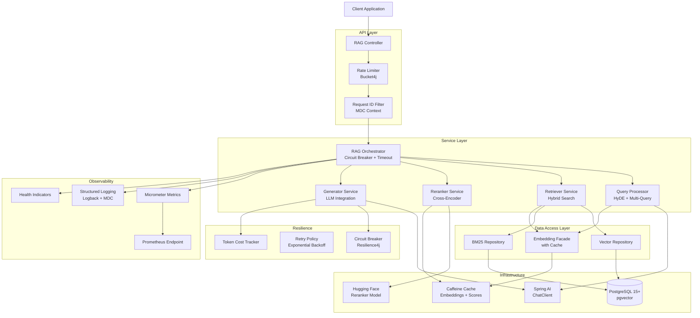
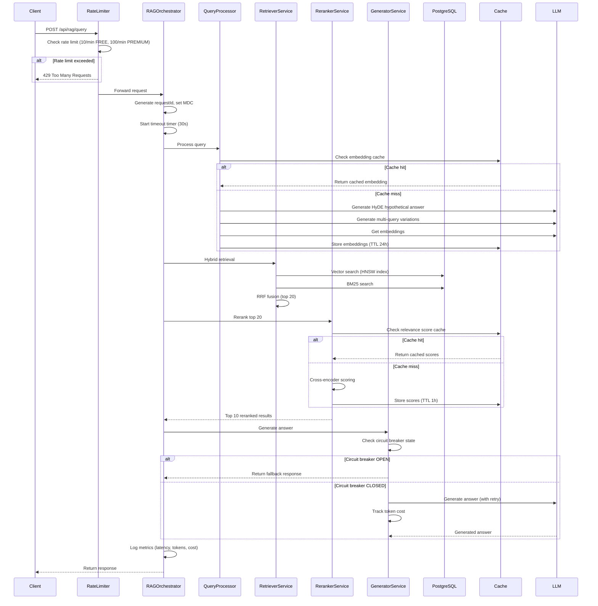
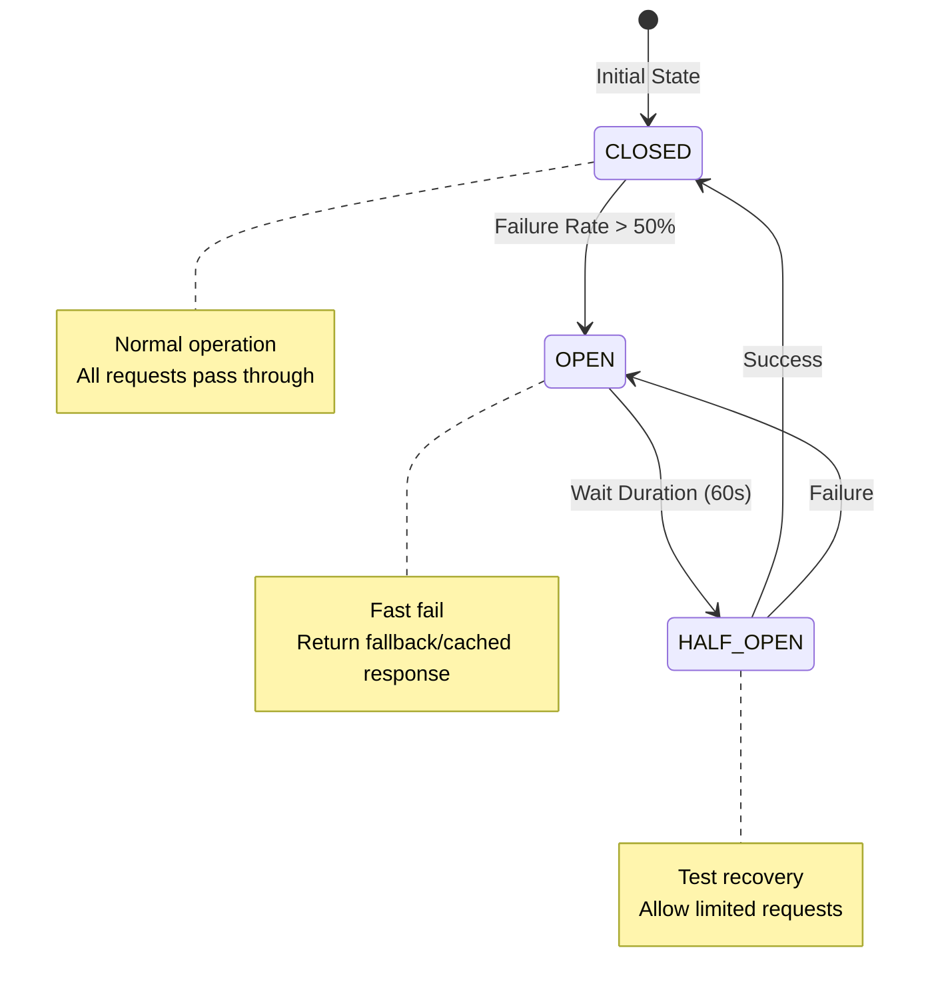
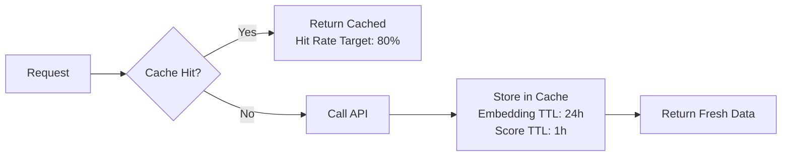
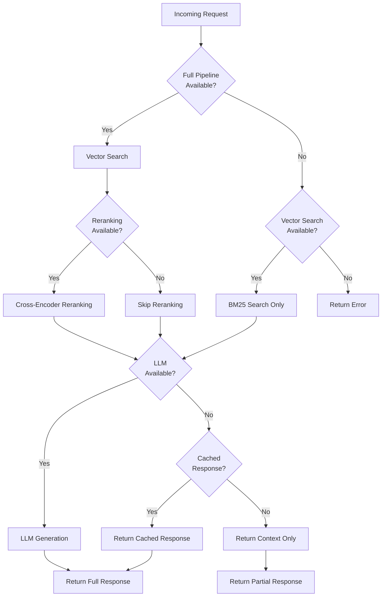
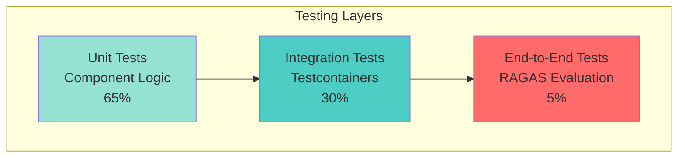

# Design Document: Hybrid RAG Production Upgrade

## Overview

### Purpose

This design document specifies the technical architecture for upgrading the Hybrid RAG (Retrieval-Augmented Generation) system from a basic implementation to a production-ready enterprise solution. The upgrade focuses on performance optimization, resilience patterns, comprehensive observability, and cost efficiency.

### System Context

The Smart City Chatbot currently uses a Hybrid RAG system combining vector search (pgvector) and BM25 for document retrieval. The system processes user queries, retrieves relevant context from a knowledge base, and generates responses using LLM. However, the current implementation suffers from:

- **Performance bottlenecks**: Vector search takes 5-10 seconds (target: <100ms)
- **Low precision**: Precision@10 at 60% (target: 85%)
- **Storage inefficiency**: Using 1536-dimensional vectors when model outputs 768 dimensions
- **Lack of resilience**: No circuit breakers, retry logic, or graceful degradation
- **Limited observability**: Minimal metrics and unstructured logging
- **No cost tracking**: Uncontrolled API spending

### Goals

1. **Performance**: Reduce vector search latency from 5-10s to <100ms (p95)
2. **Accuracy**: Increase Precision@10 from 60% to 85% via cross-encoder reranking
3. **Reliability**: Achieve 99.9% uptime with circuit breakers and retry logic
4. **Cost Optimization**: Reduce storage by 50% and API calls by 80% via caching
5. **Observability**: Implement comprehensive metrics, structured logging, and health checks
6. **Scalability**: Support 1M vectors with horizontal scaling capability

### Technology Stack

- **Backend**: Spring Boot 4.0.6, Java 21
- **Database**: PostgreSQL 15+ with pgvector extension
- **Resilience**: Resilience4j (Circuit Breaker, Retry, Rate Limiter, TimeLimiter)
- **Caching**: Caffeine (in-memory cache)
- **Metrics**: Micrometer + Prometheus
- **AI/ML**: Spring AI, Hugging Face Transformers (BAAI/bge-reranker-base)
- **Testing**: JUnit 5, Testcontainers, RAGAS
- **Token Counting**: JTokkit
- **Migration**: Flyway


## Architecture

### High-Level Architecture




### Request Flow




### Component Interaction Patterns

#### Resilience Pattern



#### Caching Strategy




## Components and Interfaces

### 1. Vector Index Component

**Responsibility**: Manage HNSW vector index for fast similarity search

**Configuration**:
```java
@Configuration
public class VectorIndexConfig {
    // HNSW parameters
    private static final int M = 16;              // Max connections per layer
    private static final int EF_CONSTRUCTION = 64; // Construction time accuracy
    private static final int EF_SEARCH = 40;       // Query time accuracy
    
    // Index creation via Flyway migration
    // V3__create_vector_index.sql
}
```

**Interface**:
```java
public interface VectorSearchRepository {
    /**
     * Perform vector similarity search using HNSW index
     * @param embedding Query embedding (768 dimensions)
     * @param limit Number of results to return
     * @param filters Optional metadata filters
     * @return List of similar documents with scores
     * @throws VectorSearchException if search fails
     * Performance: < 100ms for 1M vectors
     */
    List<ScoredDocument> similaritySearch(
        float[] embedding, 
        int limit, 
        Map<String, Object> filters
    );
    
    /**
     * Create composite index for filtered vector search
     * Combines vector similarity with metadata filters
     */
    void createCompositeIndex(String indexName, List<String> filterColumns);
}
```

**Performance Characteristics**:
- Query latency: < 100ms (p95) for datasets up to 1M vectors
- Index build time: ~10 minutes for 1M vectors
- Memory overhead: ~200 bytes per vector
- Recall@10: > 95% compared to exact search


### 2. Cross-Encoder Reranker Component

**Responsibility**: Rerank retrieval results using transformer-based cross-encoder model

**Model**: BAAI/bge-reranker-base from Hugging Face
- Input: Query-document pairs
- Output: Relevance scores [0, 1]
- Latency: ~10ms per pair (20 pairs in 200ms)

**Interface**:
```java
@Service
public class CrossEncoderRerankerService {
    
    private final HuggingFaceModel rerankerModel;
    private final Cache<String, Double> relevanceScoreCache;
    
    /**
     * Rerank candidates using cross-encoder model
     * @param query User query
     * @param candidates Top-K candidates from retrieval (typically 20)
     * @param topN Number of results to return after reranking (typically 10)
     * @return Reranked documents with relevance scores
     * Performance: < 200ms for 20 candidates
     */
    @Cacheable(value = "relevanceScores", key = "#query + #candidate.id")
    public List<ScoredDocument> rerank(
        String query, 
        List<Document> candidates, 
        int topN
    ) {
        // 1. Generate query-document pairs
        // 2. Compute relevance scores via cross-encoder
        // 3. Sort by score descending
        // 4. Return top N
    }
    
    /**
     * Compute relevance score for single query-document pair
     * @return Score in range [0, 1]
     */
    @Cacheable(value = "relevanceScores", key = "#query + #documentId")
    public double computeRelevanceScore(String query, String documentId, String documentText);
}
```

**Cache Configuration**:
```yaml
spring:
  cache:
    caffeine:
      spec: maximumSize=10000,expireAfterWrite=1h
```


### 3. Circuit Breaker Component

**Responsibility**: Prevent cascade failures when LLM service is unavailable

**Configuration**:
```java
@Configuration
public class CircuitBreakerConfig {
    
    @Bean
    public CircuitBreakerRegistry circuitBreakerRegistry() {
        CircuitBreakerConfig config = CircuitBreakerConfig.custom()
            .failureRateThreshold(50)                    // Open at 50% failure rate
            .waitDurationInOpenState(Duration.ofSeconds(60))  // Wait 60s before retry
            .slidingWindowSize(10)                       // Track last 10 calls
            .minimumNumberOfCalls(5)                     // Min calls before calculation
            .permittedNumberOfCallsInHalfOpenState(3)    // Test calls in half-open
            .automaticTransitionFromOpenToHalfOpenEnabled(true)
            .build();
            
        return CircuitBreakerRegistry.of(config);
    }
}
```

**Usage**:
```java
@Service
public class LLMGeneratorService {
    
    @CircuitBreaker(name = "llmService", fallbackMethod = "fallbackGenerate")
    @TimeLimiter(name = "llmService")
    @Retry(name = "llmService")
    public CompletableFuture<String> generateAnswer(String query, List<Document> context) {
        // Call LLM API
        return chatClient.call(buildPrompt(query, context));
    }
    
    /**
     * Fallback method when circuit breaker is OPEN
     * Returns cached response or graceful error message
     */
    public CompletableFuture<String> fallbackGenerate(
        String query, 
        List<Document> context, 
        Exception ex
    ) {
        log.warn("Circuit breaker OPEN, returning fallback response", ex);
        
        // Try to return cached response
        Optional<String> cached = cacheService.getCachedResponse(query);
        if (cached.isPresent()) {
            return CompletableFuture.completedFuture(cached.get());
        }
        
        // Return graceful error message
        return CompletableFuture.completedFuture(
            "Service temporarily unavailable. Please try again in a moment."
        );
    }
}
```

**Retry Configuration**:
```yaml
resilience4j:
  retry:
    instances:
      llmService:
        maxAttempts: 3
        waitDuration: 1s
        exponentialBackoffMultiplier: 2
        retryExceptions:
          - java.net.SocketTimeoutException
          - org.springframework.web.client.ResourceAccessException
```


### 4. Embedding Cache Component

**Responsibility**: Cache embeddings and relevance scores to reduce API calls by 80%

**Architecture**:
```java
@Configuration
@EnableCaching
public class CacheConfig {
    
    @Bean
    public CacheManager cacheManager() {
        CaffeineCacheManager cacheManager = new CaffeineCacheManager();
        cacheManager.setCaffeine(Caffeine.newBuilder()
            .maximumSize(10_000)
            .expireAfterWrite(24, TimeUnit.HOURS)  // Embedding cache TTL
            .recordStats());
        return cacheManager;
    }
    
    @Bean
    public CacheManager relevanceScoreCacheManager() {
        CaffeineCacheManager cacheManager = new CaffeineCacheManager();
        cacheManager.setCaffeine(Caffeine.newBuilder()
            .maximumSize(50_000)
            .expireAfterWrite(1, TimeUnit.HOURS)   // Relevance score cache TTL
            .recordStats());
        return cacheManager;
    }
}
```

**Service Interface**:
```java
@Service
public class EmbeddingClientFacade {
    
    private final EmbeddingClient embeddingClient;
    
    /**
     * Get embedding with caching
     * Cache key: hash of input text
     * TTL: 24 hours
     * Target hit rate: 80%
     */
    @Cacheable(value = "embeddings", key = "#text.hashCode()")
    public float[] getEmbedding(String text) {
        float[] embedding = embeddingClient.embed(text);
        
        // Validate dimension (must be 768, not 1536)
        if (embedding.length != 768) {
            throw new IllegalStateException(
                "Expected 768 dimensions, got " + embedding.length
            );
        }
        
        return embedding;
    }
    
    /**
     * Batch embedding with caching
     * Checks cache for each text individually
     */
    public List<float[]> getEmbeddings(List<String> texts) {
        return texts.stream()
            .map(this::getEmbedding)
            .collect(Collectors.toList());
    }
}
```

**Cache Metrics**:
```java
@Component
public class CacheMetricsCollector {
    
    @Scheduled(fixedRate = 60000) // Every minute
    public void collectCacheMetrics() {
        CacheStats stats = cache.stats();
        
        meterRegistry.gauge("cache.hit.rate", stats.hitRate());
        meterRegistry.gauge("cache.miss.rate", stats.missRate());
        meterRegistry.gauge("cache.eviction.count", stats.evictionCount());
        meterRegistry.gauge("cache.size", cache.estimatedSize());
    }
}
```


### 5. Rate Limiter Component

**Responsibility**: Enforce per-user rate limits to prevent API abuse

**Implementation**:
```java
@Component
public class RateLimiterService {
    
    private final Map<String, Bucket> userBuckets = new ConcurrentHashMap<>();
    
    /**
     * Get or create bucket for user based on tier
     * FREE: 10 requests/minute
     * PREMIUM: 100 requests/minute
     */
    public Bucket resolveBucket(String userId, UserTier tier) {
        return userBuckets.computeIfAbsent(userId, k -> createBucket(tier));
    }
    
    private Bucket createBucket(UserTier tier) {
        Bandwidth limit = switch (tier) {
            case FREE -> Bandwidth.classic(10, Refill.intervally(10, Duration.ofMinutes(1)));
            case PREMIUM -> Bandwidth.classic(100, Refill.intervally(100, Duration.ofMinutes(1)));
        };
        
        return Bucket.builder()
            .addLimit(limit)
            .build();
    }
    
    /**
     * Check if request is allowed
     * @return true if allowed, false if rate limit exceeded
     */
    public boolean tryConsume(String userId, UserTier tier) {
        Bucket bucket = resolveBucket(userId, tier);
        return bucket.tryConsume(1);
    }
    
    /**
     * Get remaining tokens for user
     */
    public long getAvailableTokens(String userId, UserTier tier) {
        Bucket bucket = resolveBucket(userId, tier);
        return bucket.getAvailableTokens();
    }
}
```

**Filter Integration**:
```java
@Component
@Order(1)
public class RateLimitFilter extends OncePerRequestFilter {
    
    private final RateLimiterService rateLimiterService;
    
    @Override
    protected void doFilterInternal(
        HttpServletRequest request,
        HttpServletResponse response,
        FilterChain filterChain
    ) throws ServletException, IOException {
        
        String userId = extractUserId(request);
        UserTier tier = extractUserTier(request);
        
        if (!rateLimiterService.tryConsume(userId, tier)) {
            response.setStatus(HttpStatus.TOO_MANY_REQUESTS.value());
            response.setHeader("Retry-After", "60");
            response.setHeader("X-RateLimit-Remaining", "0");
            
            response.getWriter().write(
                "{\"error\": \"Rate limit exceeded. Try again in 60 seconds.\"}"
            );
            return;
        }
        
        long remaining = rateLimiterService.getAvailableTokens(userId, tier);
        response.setHeader("X-RateLimit-Remaining", String.valueOf(remaining));
        
        filterChain.doFilter(request, response);
    }
}
```


### 6. Token Cost Tracker Component

**Responsibility**: Track token consumption and costs in real-time

**Implementation**:
```java
@Service
public class TokenCostTracker {
    
    private final JTokkit tokenizer;
    private final MeterRegistry meterRegistry;
    private final AtomicDouble cumulativeCost = new AtomicDouble(0.0);
    
    // Pricing (example: GPT-4 pricing)
    private static final double INPUT_COST_PER_1K = 0.03;
    private static final double OUTPUT_COST_PER_1K = 0.06;
    private static final double BUDGET_THRESHOLD = 100.0;
    
    /**
     * Track token usage and cost for LLM call
     */
    public TokenUsage trackUsage(String input, String output, String model) {
        int inputTokens = tokenizer.encode(input).size();
        int outputTokens = tokenizer.encode(output).size();
        
        double inputCost = (inputTokens / 1000.0) * INPUT_COST_PER_1K;
        double outputCost = (outputTokens / 1000.0) * OUTPUT_COST_PER_1K;
        double totalCost = inputCost + outputCost;
        
        // Update cumulative cost
        double newCumulativeCost = cumulativeCost.addAndGet(totalCost);
        
        // Record metrics
        meterRegistry.counter("llm.tokens.input", "model", model).increment(inputTokens);
        meterRegistry.counter("llm.tokens.output", "model", model).increment(outputTokens);
        meterRegistry.counter("llm.cost.total", "model", model).increment(totalCost);
        
        // Check budget threshold
        if (newCumulativeCost > BUDGET_THRESHOLD) {
            sendBudgetAlert(newCumulativeCost);
        }
        
        return new TokenUsage(inputTokens, outputTokens, totalCost);
    }
    
    /**
     * Send alert when budget threshold exceeded
     */
    private void sendBudgetAlert(double currentCost) {
        log.error("Budget threshold exceeded! Current cost: ${}", currentCost);
        // Send notification (email, Slack, PagerDuty, etc.)
    }
    
    /**
     * Get current cumulative cost
     */
    public double getCumulativeCost() {
        return cumulativeCost.get();
    }
    
    /**
     * Reset cumulative cost (e.g., monthly reset)
     */
    public void resetCost() {
        cumulativeCost.set(0.0);
    }
}

@Data
@AllArgsConstructor
public class TokenUsage {
    private int inputTokens;
    private int outputTokens;
    private double cost;
    
    public int getTotalTokens() {
        return inputTokens + outputTokens;
    }
}
```


### 7. Metrics Collector Component

**Responsibility**: Collect and expose comprehensive metrics for Prometheus

**Implementation**:
```java
@Component
public class RAGMetricsCollector {
    
    private final MeterRegistry meterRegistry;
    
    /**
     * Record query latency
     */
    public void recordQueryLatency(long latencyMs, String queryType) {
        Timer.builder("rag.query.latency")
            .tag("query_type", queryType)
            .publishPercentiles(0.5, 0.95, 0.99)
            .register(meterRegistry)
            .record(latencyMs, TimeUnit.MILLISECONDS);
    }
    
    /**
     * Record vector search latency separately
     */
    public void recordVectorSearchLatency(long latencyMs) {
        Timer.builder("rag.vector.search.latency")
            .publishPercentiles(0.5, 0.95, 0.99)
            .register(meterRegistry)
            .record(latencyMs, TimeUnit.MILLISECONDS);
    }
    
    /**
     * Record query rate
     */
    public void recordQuery(String userId, String userTier) {
        Counter.builder("rag.query.count")
            .tag("user_tier", userTier)
            .register(meterRegistry)
            .increment();
    }
    
    /**
     * Record error
     */
    public void recordError(String errorType, String component) {
        Counter.builder("rag.error.count")
            .tag("error_type", errorType)
            .tag("component", component)
            .register(meterRegistry)
            .increment();
    }
    
    /**
     * Record circuit breaker state
     */
    public void recordCircuitBreakerState(String state) {
        Gauge.builder("rag.circuit.breaker.state", () -> 
            switch(state) {
                case "CLOSED" -> 0;
                case "OPEN" -> 1;
                case "HALF_OPEN" -> 2;
                default -> -1;
            }
        ).register(meterRegistry);
    }
    
    /**
     * Record rate limit violations
     */
    public void recordRateLimitViolation(String userId, String userTier) {
        Counter.builder("rag.rate.limit.violations")
            .tag("user_tier", userTier)
            .register(meterRegistry)
            .increment();
    }
}
```

**Exposed Metrics**:
- `rag.query.latency` - Query latency (p50, p95, p99) by query type
- `rag.vector.search.latency` - Vector search latency (p50, p95, p99)
- `rag.query.count` - Total queries by user tier
- `rag.error.count` - Errors by type and component
- `rag.circuit.breaker.state` - Circuit breaker state (0=CLOSED, 1=OPEN, 2=HALF_OPEN)
- `rag.rate.limit.violations` - Rate limit violations by user tier
- `cache.hit.rate` - Cache hit rate
- `llm.tokens.input` - Input tokens by model
- `llm.tokens.output` - Output tokens by model
- `llm.cost.total` - Total cost by model


### 8. Health Indicator Component

**Responsibility**: Provide health checks for Kubernetes liveness and readiness probes

**Implementation**:
```java
@Component
public class RagHealthIndicator implements HealthIndicator {
    
    private final DataSource dataSource;
    private final EmbeddingClient embeddingClient;
    
    @Override
    public Health health() {
        try {
            // Check PostgreSQL connectivity
            checkPostgreSQL();
            
            // Check pgvector extension
            checkPgvectorExtension();
            
            // Check embedding service
            checkEmbeddingService();
            
            return Health.up()
                .withDetail("database", "UP")
                .withDetail("pgvector", "UP")
                .withDetail("embedding_service", "UP")
                .build();
                
        } catch (Exception e) {
            return Health.down()
                .withException(e)
                .build();
        }
    }
    
    private void checkPostgreSQL() throws SQLException {
        try (Connection conn = dataSource.getConnection()) {
            conn.createStatement().execute("SELECT 1");
        }
    }
    
    private void checkPgvectorExtension() throws SQLException {
        try (Connection conn = dataSource.getConnection()) {
            ResultSet rs = conn.createStatement().executeQuery(
                "SELECT * FROM pg_extension WHERE extname = 'vector'"
            );
            if (!rs.next()) {
                throw new IllegalStateException("pgvector extension not installed");
            }
        }
    }
    
    private void checkEmbeddingService() {
        try {
            embeddingClient.embed("health check");
        } catch (Exception e) {
            throw new IllegalStateException("Embedding service unreachable", e);
        }
    }
}
```

**Actuator Configuration**:
```yaml
management:
  endpoints:
    web:
      exposure:
        include: health,prometheus,metrics
  endpoint:
    health:
      show-details: always
      probes:
        enabled: true
  health:
    livenessState:
      enabled: true
    readinessState:
      enabled: true
```

**Kubernetes Probes**:
```yaml
livenessProbe:
  httpGet:
    path: /actuator/health/liveness
    port: 8080
  initialDelaySeconds: 30
  periodSeconds: 10
  
readinessProbe:
  httpGet:
    path: /actuator/health/readiness
    port: 8080
  initialDelaySeconds: 30
  periodSeconds: 10
```


## Data Models

### Database Schema

#### Vector Documents Table

```sql
CREATE TABLE IF NOT EXISTS vector_documents (
    id UUID PRIMARY KEY DEFAULT gen_random_uuid(),
    content TEXT NOT NULL,
    embedding vector(768) NOT NULL,  -- Changed from vector(1536)
    metadata JSONB,
    document_type VARCHAR(50),
    created_at TIMESTAMP DEFAULT CURRENT_TIMESTAMP,
    updated_at TIMESTAMP DEFAULT CURRENT_TIMESTAMP
);

-- HNSW Index for vector similarity search
CREATE INDEX IF NOT EXISTS idx_vector_documents_embedding_hnsw 
ON vector_documents 
USING hnsw (embedding vector_cosine_ops)
WITH (m = 16, ef_construction = 64);

-- Composite index for filtered vector search
CREATE INDEX IF NOT EXISTS idx_vector_documents_type_date 
ON vector_documents (document_type, created_at);

-- GIN index for metadata JSONB queries
CREATE INDEX IF NOT EXISTS idx_vector_documents_metadata 
ON vector_documents USING gin (metadata);

-- Full-text search index for BM25
CREATE INDEX IF NOT EXISTS idx_vector_documents_content_fts 
ON vector_documents USING gin (to_tsvector('english', content));
```

#### Flyway Migration: V3__create_vector_index.sql

```sql
-- Migration to create HNSW index and alter vector dimension

-- Step 1: Create new column with correct dimension
ALTER TABLE vector_documents 
ADD COLUMN embedding_new vector(768);

-- Step 2: Copy and truncate existing embeddings (if any)
UPDATE vector_documents 
SET embedding_new = embedding[1:768]
WHERE embedding IS NOT NULL;

-- Step 3: Drop old column and rename new column
ALTER TABLE vector_documents DROP COLUMN embedding;
ALTER TABLE vector_documents RENAME COLUMN embedding_new TO embedding;

-- Step 4: Create HNSW index
CREATE INDEX CONCURRENTLY IF NOT EXISTS idx_vector_documents_embedding_hnsw 
ON vector_documents 
USING hnsw (embedding vector_cosine_ops)
WITH (m = 16, ef_construction = 64);

-- Step 5: Create composite indexes
CREATE INDEX CONCURRENTLY IF NOT EXISTS idx_vector_documents_type_date 
ON vector_documents (document_type, created_at);

CREATE INDEX CONCURRENTLY IF NOT EXISTS idx_vector_documents_metadata 
ON vector_documents USING gin (metadata);

CREATE INDEX CONCURRENTLY IF NOT EXISTS idx_vector_documents_content_fts 
ON vector_documents USING gin (to_tsvector('english', content));
```


### Domain Models

#### RAG Request/Response Models

```java
@Data
@Builder
public class RAGRequest {
    @NotBlank(message = "Query cannot be blank")
    @Size(max = 1000, message = "Query too long")
    private String query;
    
    private Map<String, Object> filters;
    
    @Builder.Default
    private int topK = 10;
    
    @Builder.Default
    private boolean enableHyDE = true;
    
    @Builder.Default
    private boolean enableMultiQuery = true;
    
    @Builder.Default
    private boolean enableReranking = true;
}

@Data
@Builder
public class RAGResponse {
    private String answer;
    private List<RetrievedDocument> sources;
    private RAGMetadata metadata;
    
    @Data
    @Builder
    public static class RetrievedDocument {
        private String id;
        private String content;
        private double relevanceScore;
        private Map<String, Object> metadata;
    }
    
    @Data
    @Builder
    public static class RAGMetadata {
        private String requestId;
        private long totalLatencyMs;
        private long vectorSearchLatencyMs;
        private long rerankingLatencyMs;
        private long generationLatencyMs;
        private int retrievedDocuments;
        private TokenUsage tokenUsage;
        private boolean cacheHit;
    }
}
```


#### Semantic Chunking Models

```java
@Data
@Builder
public class DocumentChunk {
    private String id;
    private String content;
    private int startIndex;
    private int endIndex;
    private double semanticCoherence;  // Similarity score with previous chunk
    private Map<String, Object> metadata;
}

@Data
public class ChunkingConfig {
    @Builder.Default
    private int targetChunkSize = 1000;  // Reduced from previous size
    
    @Builder.Default
    private int maxChunkSize = 1200;
    
    @Builder.Default
    private double semanticThreshold = 0.7;  // Similarity threshold for boundaries
    
    @Builder.Default
    private int minChunkSize = 500;
}
```

#### HyDE and Multi-Query Models

```java
@Data
@Builder
public class HyDEResult {
    private String originalQuery;
    private String hypotheticalAnswer;
    private float[] hypotheticalEmbedding;
    private long generationTimeMs;
}

@Data
@Builder
public class MultiQueryResult {
    private String originalQuery;
    private List<String> queryVariations;
    private List<float[]> queryEmbeddings;
    private long generationTimeMs;
}
```

#### RRF Fusion Models

```java
@Data
@Builder
public class RRFResult {
    private String documentId;
    private double rrfScore;
    private double vectorScore;
    private double bm25Score;
    private int vectorRank;
    private int bm25Rank;
}

public class RRFFusion {
    private static final int K = 60;  // RRF constant
    
    /**
     * Reciprocal Rank Fusion algorithm
     * RRF(d) = Σ 1 / (k + rank_i(d))
     */
    public List<RRFResult> fuse(
        List<ScoredDocument> vectorResults,
        List<ScoredDocument> bm25Results,
        int topK
    ) {
        Map<String, RRFResult> rrfScores = new HashMap<>();
        
        // Add vector search scores
        for (int i = 0; i < vectorResults.size(); i++) {
            ScoredDocument doc = vectorResults.get(i);
            rrfScores.computeIfAbsent(doc.getId(), id -> 
                RRFResult.builder()
                    .documentId(id)
                    .vectorScore(doc.getScore())
                    .vectorRank(i + 1)
                    .build()
            );
            rrfScores.get(doc.getId()).setRrfScore(
                rrfScores.get(doc.getId()).getRrfScore() + 1.0 / (K + i + 1)
            );
        }
        
        // Add BM25 scores
        for (int i = 0; i < bm25Results.size(); i++) {
            ScoredDocument doc = bm25Results.get(i);
            rrfScores.computeIfAbsent(doc.getId(), id -> 
                RRFResult.builder()
                    .documentId(id)
                    .bm25Score(doc.getScore())
                    .bm25Rank(i + 1)
                    .build()
            );
            rrfScores.get(doc.getId()).setRrfScore(
                rrfScores.get(doc.getId()).getRrfScore() + 1.0 / (K + i + 1)
            );
        }
        
        // Sort by RRF score and return top K
        return rrfScores.values().stream()
            .sorted(Comparator.comparingDouble(RRFResult::getRrfScore).reversed())
            .limit(topK)
            .collect(Collectors.toList());
    }
}
```


## Error Handling

### Error Classification

#### 1. Client Errors (4xx)

**Rate Limit Exceeded (429)**
```java
@ExceptionHandler(RateLimitExceededException.class)
public ResponseEntity<ErrorResponse> handleRateLimitExceeded(RateLimitExceededException ex) {
    return ResponseEntity.status(HttpStatus.TOO_MANY_REQUESTS)
        .header("Retry-After", "60")
        .body(ErrorResponse.builder()
            .error("RATE_LIMIT_EXCEEDED")
            .message("Rate limit exceeded. Please try again in 60 seconds.")
            .timestamp(Instant.now())
            .build());
}
```

**Invalid Request (400)**
```java
@ExceptionHandler(MethodArgumentNotValidException.class)
public ResponseEntity<ErrorResponse> handleValidationErrors(MethodArgumentNotValidException ex) {
    Map<String, String> errors = ex.getBindingResult()
        .getFieldErrors()
        .stream()
        .collect(Collectors.toMap(
            FieldError::getField,
            FieldError::getDefaultMessage
        ));
    
    return ResponseEntity.badRequest()
        .body(ErrorResponse.builder()
            .error("VALIDATION_ERROR")
            .message("Invalid request parameters")
            .details(errors)
            .timestamp(Instant.now())
            .build());
}
```


#### 2. Server Errors (5xx)

**Service Unavailable (503) - Circuit Breaker Open**
```java
@ExceptionHandler(CallNotPermittedException.class)
public ResponseEntity<ErrorResponse> handleCircuitBreakerOpen(CallNotPermittedException ex) {
    log.warn("Circuit breaker OPEN, service unavailable");
    
    return ResponseEntity.status(HttpStatus.SERVICE_UNAVAILABLE)
        .header("Retry-After", "60")
        .body(ErrorResponse.builder()
            .error("SERVICE_UNAVAILABLE")
            .message("Service temporarily unavailable. Please try again in a moment.")
            .timestamp(Instant.now())
            .build());
}
```

**Timeout (504)**
```java
@ExceptionHandler(TimeoutException.class)
public ResponseEntity<ErrorResponse> handleTimeout(TimeoutException ex) {
    log.error("Request timeout", ex);
    
    return ResponseEntity.status(HttpStatus.GATEWAY_TIMEOUT)
        .body(ErrorResponse.builder()
            .error("REQUEST_TIMEOUT")
            .message("Request took too long to process. Please try a simpler query.")
            .timestamp(Instant.now())
            .build());
}
```

**Internal Server Error (500)**
```java
@ExceptionHandler(Exception.class)
public ResponseEntity<ErrorResponse> handleGenericError(Exception ex) {
    String requestId = MDC.get("requestId");
    log.error("Unexpected error [requestId={}]", requestId, ex);
    
    return ResponseEntity.status(HttpStatus.INTERNAL_SERVER_ERROR)
        .body(ErrorResponse.builder()
            .error("INTERNAL_ERROR")
            .message("An unexpected error occurred. Please contact support with request ID: " + requestId)
            .requestId(requestId)
            .timestamp(Instant.now())
            .build());
}
```


#### 3. Database Errors

**Vector Search Failure**
```java
@ExceptionHandler(VectorSearchException.class)
public ResponseEntity<ErrorResponse> handleVectorSearchError(VectorSearchException ex) {
    log.error("Vector search failed", ex);
    
    // Try fallback to BM25 only
    try {
        List<Document> bm25Results = bm25Repository.search(ex.getQuery(), 10);
        return ResponseEntity.ok(buildFallbackResponse(bm25Results));
    } catch (Exception fallbackEx) {
        return ResponseEntity.status(HttpStatus.INTERNAL_SERVER_ERROR)
            .body(ErrorResponse.builder()
                .error("SEARCH_FAILED")
                .message("Search service temporarily unavailable")
                .timestamp(Instant.now())
                .build());
    }
}
```

**Connection Pool Exhaustion**
```java
@ExceptionHandler(SQLException.class)
public ResponseEntity<ErrorResponse> handleDatabaseError(SQLException ex) {
    if (ex.getMessage().contains("Connection is not available")) {
        log.error("Connection pool exhausted", ex);
        
        return ResponseEntity.status(HttpStatus.SERVICE_UNAVAILABLE)
            .header("Retry-After", "5")
            .body(ErrorResponse.builder()
                .error("DATABASE_OVERLOAD")
                .message("System is experiencing high load. Please try again shortly.")
                .timestamp(Instant.now())
                .build());
    }
    
    return handleGenericError(ex);
}
```

### Graceful Degradation Strategy




### Structured Logging

**MDC Context Setup**
```java
@Component
@Order(0)
public class RequestIdFilter extends OncePerRequestFilter {
    
    @Override
    protected void doFilterInternal(
        HttpServletRequest request,
        HttpServletResponse response,
        FilterChain filterChain
    ) throws ServletException, IOException {
        
        String requestId = UUID.randomUUID().toString();
        String userId = extractUserId(request);
        
        MDC.put("requestId", requestId);
        MDC.put("userId", userId);
        MDC.put("userAgent", request.getHeader("User-Agent"));
        
        response.setHeader("X-Request-ID", requestId);
        
        try {
            filterChain.doFilter(request, response);
        } finally {
            MDC.clear();
        }
    }
}
```

**Logback Configuration**
```xml
<configuration>
    <appender name="CONSOLE" class="ch.qos.logback.core.ConsoleAppender">
        <encoder class="net.logstash.logback.encoder.LogstashEncoder">
            <includeMdcKeyName>requestId</includeMdcKeyName>
            <includeMdcKeyName>userId</includeMdcKeyName>
            <includeMdcKeyName>userAgent</includeMdcKeyName>
        </encoder>
    </appender>
    
    <logger name="com.example.smartcity.rag" level="INFO"/>
    <logger name="org.springframework.web" level="WARN"/>
    
    <root level="INFO">
        <appender-ref ref="CONSOLE"/>
    </root>
</configuration>
```

**Structured Log Examples**
```json
{
  "timestamp": "2025-01-15T10:30:45.123Z",
  "level": "INFO",
  "logger": "com.example.smartcity.rag.RAGOrchestrator",
  "message": "Query processed successfully",
  "requestId": "a1b2c3d4-e5f6-7890-abcd-ef1234567890",
  "userId": "user123",
  "query": "What are the traffic conditions?",
  "totalLatencyMs": 850,
  "vectorSearchLatencyMs": 75,
  "rerankingLatencyMs": 180,
  "generationLatencyMs": 550,
  "retrievedDocuments": 10,
  "cacheHit": true,
  "tokenUsage": {
    "inputTokens": 450,
    "outputTokens": 120,
    "cost": 0.0234
  }
}
```


## Testing Strategy

### Overview

This feature requires a **dual testing approach** combining integration tests and evaluation metrics, as it involves infrastructure upgrades, external service integration, and performance optimization. Property-based testing is **not applicable** because:

1. **Infrastructure as Code**: Database schema changes, index creation, and connection pooling are configuration-based
2. **External Service Integration**: LLM APIs, embedding services, and PostgreSQL interactions require integration testing
3. **Performance Characteristics**: Testing focuses on latency, throughput, and resource utilization
4. **Resilience Patterns**: Circuit breakers, retry logic, and graceful degradation require scenario-based testing

### Testing Pyramid



### 1. Unit Tests

**Target Coverage**: 65% of test suite, 80% code coverage

**Focus Areas**:
- Component logic (RRF fusion, semantic chunking, token counting)
- Cache behavior (hit/miss scenarios)
- Rate limiter bucket management
- Error handling and validation
- Metrics collection

**Example: RRF Fusion Unit Test**
```java
@Test
void testRRFFusion_combinesVectorAndBM25Results() {
    // Given
    List<ScoredDocument> vectorResults = List.of(
        new ScoredDocument("doc1", 0.95),
        new ScoredDocument("doc2", 0.85),
        new ScoredDocument("doc3", 0.75)
    );
    
    List<ScoredDocument> bm25Results = List.of(
        new ScoredDocument("doc2", 12.5),
        new ScoredDocument("doc4", 10.0),
        new ScoredDocument("doc1", 8.5)
    );
    
    // When
    List<RRFResult> results = rrfFusion.fuse(vectorResults, bm25Results, 10);
    
    // Then
    assertThat(results).hasSize(4);
    assertThat(results.get(0).getDocumentId()).isIn("doc1", "doc2"); // Top results
    assertThat(results.get(0).getRrfScore()).isGreaterThan(0);
}
```


**Example: Rate Limiter Unit Test**
```java
@Test
void testRateLimiter_enforcesFreeTierLimit() {
    // Given
    String userId = "user123";
    UserTier tier = UserTier.FREE;
    
    // When - Make 10 requests (at limit)
    for (int i = 0; i < 10; i++) {
        boolean allowed = rateLimiterService.tryConsume(userId, tier);
        assertThat(allowed).isTrue();
    }
    
    // Then - 11th request should be rejected
    boolean allowed = rateLimiterService.tryConsume(userId, tier);
    assertThat(allowed).isFalse();
}

@Test
void testRateLimiter_resetsAfterWindow() throws InterruptedException {
    // Given
    String userId = "user456";
    UserTier tier = UserTier.FREE;
    
    // Exhaust limit
    for (int i = 0; i < 10; i++) {
        rateLimiterService.tryConsume(userId, tier);
    }
    
    // When - Wait for window to reset
    Thread.sleep(61000); // 61 seconds
    
    // Then - Should allow requests again
    boolean allowed = rateLimiterService.tryConsume(userId, tier);
    assertThat(allowed).isTrue();
}
```

**Example: Token Cost Tracker Unit Test**
```java
@Test
void testTokenCostTracker_calculatesCorrectCost() {
    // Given
    String input = "What are the traffic conditions in downtown?";
    String output = "Current traffic is moderate with some delays on Main Street.";
    
    // When
    TokenUsage usage = tokenCostTracker.trackUsage(input, output, "gpt-4");
    
    // Then
    assertThat(usage.getInputTokens()).isGreaterThan(0);
    assertThat(usage.getOutputTokens()).isGreaterThan(0);
    assertThat(usage.getCost()).isGreaterThan(0);
}

@Test
void testTokenCostTracker_sendsBudgetAlert() {
    // Given
    tokenCostTracker.resetCost();
    
    // When - Simulate expensive operations
    for (int i = 0; i < 1000; i++) {
        tokenCostTracker.trackUsage(
            "Long input query " + "x".repeat(500),
            "Long output response " + "y".repeat(500),
            "gpt-4"
        );
    }
    
    // Then - Should exceed threshold and trigger alert
    assertThat(tokenCostTracker.getCumulativeCost()).isGreaterThan(100.0);
    // Verify alert was sent (mock notification service)
}
```


### 2. Integration Tests with Testcontainers

**Target Coverage**: 30% of test suite

**Focus Areas**:
- Vector search with HNSW index
- Database schema migrations
- End-to-end RAG pipeline
- Circuit breaker behavior
- Cache integration
- Health checks

**Base Test Configuration**
```java
@SpringBootTest
@Testcontainers
@ActiveProfiles("test")
public abstract class AbstractIntegrationTest {
    
    @Container
    static PostgreSQLContainer<?> postgres = new PostgreSQLContainer<>("pgvector/pgvector:pg15")
        .withDatabaseName("testdb")
        .withUsername("test")
        .withPassword("test")
        .withInitScript("init-pgvector.sql");
    
    @DynamicPropertySource
    static void configureProperties(DynamicPropertyRegistry registry) {
        registry.add("spring.datasource.url", postgres::getJdbcUrl);
        registry.add("spring.datasource.username", postgres::getUsername);
        registry.add("spring.datasource.password", postgres::getPassword);
    }
    
    @BeforeEach
    void setUp() {
        // Clean database before each test
        jdbcTemplate.execute("TRUNCATE TABLE vector_documents CASCADE");
    }
}
```

**Example: Vector Search Integration Test**
```java
@Test
void testVectorSearch_withHNSWIndex_returnsResultsUnder100ms() {
    // Given - Insert 1000 test documents
    List<VectorDocument> documents = generateTestDocuments(1000);
    vectorRepository.saveAll(documents);
    
    // Create HNSW index
    jdbcTemplate.execute(
        "CREATE INDEX IF NOT EXISTS idx_test_hnsw " +
        "ON vector_documents USING hnsw (embedding vector_cosine_ops) " +
        "WITH (m = 16, ef_construction = 64)"
    );
    
    // When
    float[] queryEmbedding = embeddingClient.embed("test query");
    
    long startTime = System.currentTimeMillis();
    List<ScoredDocument> results = vectorRepository.similaritySearch(queryEmbedding, 10, null);
    long latency = System.currentTimeMillis() - startTime;
    
    // Then
    assertThat(results).hasSize(10);
    assertThat(latency).isLessThan(100); // < 100ms requirement
    assertThat(results.get(0).getScore()).isGreaterThan(0.5);
}

@Test
void testVectorSearch_withMetadataFilters_returnsFilteredResults() {
    // Given
    vectorRepository.save(createDocument("doc1", "content1", Map.of("type", "news")));
    vectorRepository.save(createDocument("doc2", "content2", Map.of("type", "blog")));
    vectorRepository.save(createDocument("doc3", "content3", Map.of("type", "news")));
    
    // When
    float[] queryEmbedding = embeddingClient.embed("test query");
    Map<String, Object> filters = Map.of("type", "news");
    List<ScoredDocument> results = vectorRepository.similaritySearch(queryEmbedding, 10, filters);
    
    // Then
    assertThat(results).hasSize(2);
    assertThat(results).allMatch(doc -> 
        doc.getMetadata().get("type").equals("news")
    );
}
```


**Example: End-to-End RAG Pipeline Integration Test**
```java
@Test
void testRAGPipeline_endToEnd_returnsAccurateResponse() {
    // Given - Seed knowledge base
    seedKnowledgeBase(List.of(
        "Traffic on Main Street is currently heavy due to construction.",
        "Public transit is running on schedule today.",
        "Weather forecast shows sunny conditions for the next 3 days."
    ));
    
    RAGRequest request = RAGRequest.builder()
        .query("What's the traffic situation on Main Street?")
        .topK(10)
        .enableHyDE(true)
        .enableMultiQuery(true)
        .enableReranking(true)
        .build();
    
    // When
    long startTime = System.currentTimeMillis();
    RAGResponse response = ragOrchestrator.process(request);
    long totalLatency = System.currentTimeMillis() - startTime;
    
    // Then
    assertThat(response.getAnswer()).containsIgnoringCase("Main Street");
    assertThat(response.getAnswer()).containsIgnoringCase("heavy");
    assertThat(response.getSources()).isNotEmpty();
    assertThat(response.getSources().get(0).getRelevanceScore()).isGreaterThan(0.7);
    
    // Performance assertions
    assertThat(totalLatency).isLessThan(2000); // < 2s requirement
    assertThat(response.getMetadata().getVectorSearchLatencyMs()).isLessThan(100);
    
    // Verify structured logging
    verify(metricsCollector).recordQueryLatency(anyLong(), eq("hybrid"));
}

@Test
void testRAGPipeline_withCaching_improvesCacheHitRate() {
    // Given
    String query = "What are the traffic conditions?";
    RAGRequest request = RAGRequest.builder().query(query).build();
    
    // When - First request (cache miss)
    RAGResponse response1 = ragOrchestrator.process(request);
    assertThat(response1.getMetadata().isCacheHit()).isFalse();
    
    // When - Second request (cache hit)
    RAGResponse response2 = ragOrchestrator.process(request);
    assertThat(response2.getMetadata().isCacheHit()).isTrue();
    
    // Then - Verify cache metrics
    CacheStats stats = cacheManager.getCache("embeddings").getNativeCache().stats();
    assertThat(stats.hitRate()).isGreaterThan(0.5);
}
```

**Example: Circuit Breaker Integration Test**
```java
@Test
void testCircuitBreaker_opensAfterFailureThreshold() {
    // Given - Mock LLM service to fail
    when(llmClient.generate(any())).thenThrow(new RuntimeException("Service unavailable"));
    
    RAGRequest request = RAGRequest.builder()
        .query("test query")
        .build();
    
    // When - Make requests until circuit breaker opens
    for (int i = 0; i < 10; i++) {
        try {
            ragOrchestrator.process(request);
        } catch (Exception e) {
            // Expected failures
        }
    }
    
    // Then - Circuit breaker should be OPEN
    CircuitBreaker circuitBreaker = circuitBreakerRegistry.circuitBreaker("llmService");
    assertThat(circuitBreaker.getState()).isEqualTo(CircuitBreaker.State.OPEN);
    
    // Verify fallback response is returned
    RAGResponse response = ragOrchestrator.process(request);
    assertThat(response.getAnswer()).contains("temporarily unavailable");
}
```


### 3. RAGAS Evaluation Framework

**Target Coverage**: 5% of test suite (end-to-end quality evaluation)

**Focus Areas**:
- Faithfulness: Factual consistency between answer and context
- Answer Relevancy: Relevance of answer to query
- Context Precision: Quality of retrieved contexts

**RAGAS Metrics**:
- **Faithfulness > 0.8**: Answer is factually grounded in retrieved context
- **Answer Relevancy > 0.85**: Answer directly addresses the query
- **Context Precision > 0.75**: Retrieved contexts are relevant to query

**Evaluation Dataset Structure**
```python
# evaluation_dataset.json
{
  "test_cases": [
    {
      "query": "What are the current traffic conditions on Main Street?",
      "ground_truth": "Traffic on Main Street is heavy due to construction work.",
      "contexts": [
        "Main Street is experiencing heavy traffic delays...",
        "Construction work on Main Street began last week..."
      ],
      "answer": "Current traffic on Main Street is heavy due to ongoing construction work."
    },
    // ... more test cases
  ]
}
```

**RAGAS Evaluation Script**
```python
from ragas import evaluate
from ragas.metrics import faithfulness, answer_relevancy, context_precision
from datasets import Dataset
import requests

def run_ragas_evaluation():
    # Load evaluation dataset
    with open('evaluation_dataset.json') as f:
        data = json.load(f)
    
    # Run RAG system for each test case
    results = []
    for test_case in data['test_cases']:
        response = requests.post('http://localhost:8080/api/rag/query', json={
            'query': test_case['query']
        })
        
        results.append({
            'question': test_case['query'],
            'answer': response.json()['answer'],
            'contexts': [doc['content'] for doc in response.json()['sources']],
            'ground_truth': test_case['ground_truth']
        })
    
    # Create dataset
    dataset = Dataset.from_list(results)
    
    # Evaluate
    scores = evaluate(
        dataset,
        metrics=[faithfulness, answer_relevancy, context_precision]
    )
    
    # Assert minimum thresholds
    assert scores['faithfulness'] > 0.8, f"Faithfulness {scores['faithfulness']} below threshold"
    assert scores['answer_relevancy'] > 0.85, f"Answer relevancy {scores['answer_relevancy']} below threshold"
    assert scores['context_precision'] > 0.75, f"Context precision {scores['context_precision']} below threshold"
    
    return scores

if __name__ == '__main__':
    scores = run_ragas_evaluation()
    print(f"RAGAS Evaluation Results:")
    print(f"  Faithfulness: {scores['faithfulness']:.3f}")
    print(f"  Answer Relevancy: {scores['answer_relevancy']:.3f}")
    print(f"  Context Precision: {scores['context_precision']:.3f}")
```


### 4. Performance Testing

**Load Testing with JMeter/Gatling**
```scala
// Gatling load test scenario
class RAGLoadTest extends Simulation {
  
  val httpProtocol = http
    .baseUrl("http://localhost:8080")
    .acceptHeader("application/json")
  
  val scn = scenario("RAG Query Load Test")
    .exec(http("query")
      .post("/api/rag/query")
      .body(StringBody("""{"query": "What are the traffic conditions?"}"""))
      .check(status.is(200))
      .check(responseTimeInMillis.lte(2000)) // < 2s requirement
    )
  
  setUp(
    scn.inject(
      rampUsersPerSec(1) to 100 during (60 seconds), // Ramp to 100 QPS
      constantUsersPerSec(100) during (300 seconds)  // Sustain 100 QPS for 5 min
    )
  ).protocols(httpProtocol)
   .assertions(
     global.responseTime.percentile3(95).lt(2000),  // p95 < 2s
     global.successfulRequests.percent.gt(99.9)     // 99.9% success rate
   )
}
```

**Performance Benchmarks**
```java
@Test
void benchmarkVectorSearch_1MDocuments() {
    // Given - 1M documents
    seedLargeDataset(1_000_000);
    
    // When - Run 100 queries
    List<Long> latencies = new ArrayList<>();
    for (int i = 0; i < 100; i++) {
        long start = System.nanoTime();
        vectorRepository.similaritySearch(randomEmbedding(), 10, null);
        long latency = TimeUnit.NANOSECONDS.toMillis(System.nanoTime() - start);
        latencies.add(latency);
    }
    
    // Then - Calculate percentiles
    Collections.sort(latencies);
    long p50 = latencies.get(50);
    long p95 = latencies.get(95);
    long p99 = latencies.get(99);
    
    System.out.println("Vector Search Latency:");
    System.out.println("  p50: " + p50 + "ms");
    System.out.println("  p95: " + p95 + "ms");
    System.out.println("  p99: " + p99 + "ms");
    
    assertThat(p95).isLessThan(100); // p95 < 100ms requirement
}
```

### 5. Health Check Testing

```java
@Test
void testHealthCheck_allDependenciesHealthy() {
    // When
    ResponseEntity<Map> response = restTemplate.getForEntity(
        "/actuator/health",
        Map.class
    );
    
    // Then
    assertThat(response.getStatusCode()).isEqualTo(HttpStatus.OK);
    assertThat(response.getBody().get("status")).isEqualTo("UP");
    
    Map<String, Object> components = (Map<String, Object>) response.getBody().get("components");
    assertThat(components.get("ragHealth")).isEqualTo("UP");
    assertThat(components.get("db")).isEqualTo("UP");
}

@Test
void testReadinessProbe_notReadyDuringStartup() {
    // Given - Simulate startup
    applicationContext.publishEvent(new ApplicationStartingEvent());
    
    // When
    ResponseEntity<Map> response = restTemplate.getForEntity(
        "/actuator/health/readiness",
        Map.class
    );
    
    // Then
    assertThat(response.getStatusCode()).isEqualTo(HttpStatus.SERVICE_UNAVAILABLE);
}
```

### Test Execution Strategy

**CI/CD Pipeline**
```yaml
# .github/workflows/test.yml
name: Test Suite

on: [push, pull_request]

jobs:
  unit-tests:
    runs-on: ubuntu-latest
    steps:
      - uses: actions/checkout@v3
      - name: Set up JDK 21
        uses: actions/setup-java@v3
        with:
          java-version: '21'
      - name: Run unit tests
        run: mvn test -Dtest=*Test
      
  integration-tests:
    runs-on: ubuntu-latest
    steps:
      - uses: actions/checkout@v3
      - name: Set up JDK 21
        uses: actions/setup-java@v3
        with:
          java-version: '21'
      - name: Run integration tests
        run: mvn verify -Dtest=*IntegrationTest
      
  ragas-evaluation:
    runs-on: ubuntu-latest
    steps:
      - uses: actions/checkout@v3
      - name: Set up Python
        uses: actions/setup-python@v4
        with:
          python-version: '3.11'
      - name: Install dependencies
        run: pip install ragas datasets requests
      - name: Run RAGAS evaluation
        run: python scripts/ragas_evaluation.py
```

**Coverage Requirements**:
- Overall code coverage: > 80%
- Critical components (RAGOrchestrator, VectorRepository): > 90%
- Integration test coverage: All critical paths
- RAGAS evaluation: All test cases pass minimum thresholds


## Implementation Guidelines

### Phase 1: Critical Performance & Resilience (Week 1)

**Priority**: CRITICAL - 8 hours

#### 1.1 Vector Index Creation (Requirement 1)
```sql
-- Flyway migration: V3__create_vector_index.sql
-- Execute during low-traffic window

-- Step 1: Alter vector dimension (if needed)
ALTER TABLE vector_documents 
ADD COLUMN embedding_new vector(768);

UPDATE vector_documents 
SET embedding_new = embedding[1:768]
WHERE embedding IS NOT NULL;

ALTER TABLE vector_documents DROP COLUMN embedding;
ALTER TABLE vector_documents RENAME COLUMN embedding_new TO embedding;

-- Step 2: Create HNSW index (CONCURRENTLY to avoid locking)
CREATE INDEX CONCURRENTLY idx_vector_documents_embedding_hnsw 
ON vector_documents 
USING hnsw (embedding vector_cosine_ops)
WITH (m = 16, ef_construction = 64);

-- Step 3: Create composite indexes
CREATE INDEX CONCURRENTLY idx_vector_documents_type_date 
ON vector_documents (document_type, created_at);

-- Verify index creation
SELECT indexname, indexdef 
FROM pg_indexes 
WHERE tablename = 'vector_documents';
```

**Validation**:
- Run benchmark: `SELECT * FROM vector_documents ORDER BY embedding <=> '[...]' LIMIT 10;`
- Verify latency < 100ms for 1M vectors
- Check index size: `SELECT pg_size_pretty(pg_relation_size('idx_vector_documents_embedding_hnsw'));`

#### 1.2 Circuit Breaker Implementation (Requirement 7)
```java
// Add to pom.xml
<dependency>
    <groupId>io.github.resilience4j</groupId>
    <artifactId>resilience4j-spring-boot3</artifactId>
    <version>2.1.0</version>
</dependency>

// application.yml
resilience4j:
  circuitbreaker:
    instances:
      llmService:
        failureRateThreshold: 50
        waitDurationInOpenState: 60s
        slidingWindowSize: 10
        minimumNumberOfCalls: 5
  retry:
    instances:
      llmService:
        maxAttempts: 3
        waitDuration: 1s
        exponentialBackoffMultiplier: 2
  timelimiter:
    instances:
      llmService:
        timeoutDuration: 30s
```

**Implementation Steps**:
1. Add `@CircuitBreaker`, `@Retry`, `@TimeLimiter` annotations to LLM calls
2. Implement fallback methods
3. Add circuit breaker state metrics
4. Test failure scenarios


#### 1.3 Prometheus Metrics (Requirement 12)
```java
// Add custom metrics
@Component
public class RAGMetricsConfig {
    
    @Bean
    public MeterRegistryCustomizer<MeterRegistry> metricsCommonTags() {
        return registry -> registry.config()
            .commonTags("application", "smart-city-rag");
    }
    
    @Bean
    public TimedAspect timedAspect(MeterRegistry registry) {
        return new TimedAspect(registry);
    }
}

// Annotate methods
@Service
public class RAGOrchestrator {
    
    @Timed(value = "rag.query.latency", 
           percentiles = {0.5, 0.95, 0.99},
           extraTags = {"query_type", "hybrid"})
    public RAGResponse process(RAGRequest request) {
        // Implementation
    }
}
```

**Exposed Endpoints**:
- `/actuator/prometheus` - Prometheus scrape endpoint
- `/actuator/metrics` - Available metrics list
- `/actuator/health` - Health status

#### 1.4 Vector Dimension Correction (Requirement 2)
```java
// Remove padding logic from EmbeddingClientFacade
@Service
public class EmbeddingClientFacade {
    
    @Cacheable(value = "embeddings", key = "#text.hashCode()")
    public float[] getEmbedding(String text) {
        float[] embedding = embeddingClient.embed(text);
        
        // Validate dimension (must be 768)
        if (embedding.length != 768) {
            throw new IllegalStateException(
                "Expected 768 dimensions, got " + embedding.length
            );
        }
        
        // NO PADDING - return as-is
        return embedding;
    }
}
```

**Migration Checklist**:
- [ ] Backup existing vector_documents table
- [ ] Run Flyway migration V3
- [ ] Verify all embeddings are 768 dimensions
- [ ] Update application code to remove padding
- [ ] Test vector search functionality
- [ ] Monitor storage reduction (target: 50%)


### Phase 2: Accuracy & Cost Optimization (Week 2)

**Priority**: HIGH - 11 hours

#### 2.1 Cross-Encoder Reranking (Requirement 3)
```java
// Add Hugging Face dependency
<dependency>
    <groupId>ai.djl.huggingface</groupId>
    <artifactId>tokenizers</artifactId>
    <version>0.25.0</version>
</dependency>

// Implementation
@Service
public class CrossEncoderRerankerService {
    
    private final HuggingFaceModel rerankerModel;
    
    @PostConstruct
    public void init() {
        // Load BAAI/bge-reranker-base model
        this.rerankerModel = HuggingFaceModel.load("BAAI/bge-reranker-base");
    }
    
    @Cacheable(value = "relevanceScores", key = "#query + #candidate.id")
    public List<ScoredDocument> rerank(
        String query, 
        List<Document> candidates, 
        int topN
    ) {
        List<ScoredDocument> scored = candidates.stream()
            .map(doc -> {
                double score = computeRelevanceScore(query, doc.getContent());
                return new ScoredDocument(doc, score);
            })
            .sorted(Comparator.comparingDouble(ScoredDocument::getScore).reversed())
            .limit(topN)
            .collect(Collectors.toList());
        
        return scored;
    }
    
    private double computeRelevanceScore(String query, String document) {
        // Cross-encoder inference
        String input = query + " [SEP] " + document;
        float[] logits = rerankerModel.predict(input);
        return sigmoid(logits[0]); // Convert to [0, 1]
    }
    
    private double sigmoid(float x) {
        return 1.0 / (1.0 + Math.exp(-x));
    }
}
```

**Integration into Pipeline**:
```java
// In RAGOrchestrator
public RAGResponse process(RAGRequest request) {
    // 1. Retrieval (RRF fusion returns top 20)
    List<Document> candidates = retrieverService.hybridSearch(request.getQuery(), 20);
    
    // 2. Reranking (return top 10)
    List<ScoredDocument> reranked = rerankerService.rerank(
        request.getQuery(), 
        candidates, 
        10
    );
    
    // 3. Generation
    String answer = generatorService.generate(request.getQuery(), reranked);
    
    return buildResponse(answer, reranked);
}
```


#### 2.2 Spring AI Integration (Requirement 5)
```java
// Add Spring AI dependency
<dependency>
    <groupId>org.springframework.ai</groupId>
    <artifactId>spring-ai-openai-spring-boot-starter</artifactId>
    <version>1.0.0-M1</version>
</dependency>

// Configuration
@Configuration
public class SpringAIConfig {
    
    @Bean
    public ChatClient chatClient(ChatModel chatModel) {
        return ChatClient.builder(chatModel)
            .defaultOptions(ChatOptions.builder()
                .withModel("gpt-4")
                .withTemperature(0.7)
                .withMaxTokens(500)
                .build())
            .build();
    }
}

// HyDE Implementation
@Service
public class HyDEService {
    
    private final ChatClient chatClient;
    private final EmbeddingClient embeddingClient;
    
    public HyDEResult generateHypotheticalAnswer(String query) {
        String prompt = """
            Given the question: "%s"
            
            Generate a hypothetical answer that would be found in a knowledge base.
            Be specific and factual.
            """.formatted(query);
        
        String hypotheticalAnswer = chatClient.call(prompt);
        float[] embedding = embeddingClient.embed(hypotheticalAnswer);
        
        return HyDEResult.builder()
            .originalQuery(query)
            .hypotheticalAnswer(hypotheticalAnswer)
            .hypotheticalEmbedding(embedding)
            .build();
    }
}

// Multi-Query Implementation
@Service
public class MultiQueryService {
    
    private final ChatClient chatClient;
    private final EmbeddingClient embeddingClient;
    
    public MultiQueryResult generateQueryVariations(String query) {
        String prompt = """
            Given the question: "%s"
            
            Generate 3 alternative phrasings of this question that would help retrieve relevant information.
            Return only the questions, one per line.
            """.formatted(query);
        
        String response = chatClient.call(prompt);
        List<String> variations = Arrays.asList(response.split("\n"));
        
        List<float[]> embeddings = variations.stream()
            .map(embeddingClient::embed)
            .collect(Collectors.toList());
        
        return MultiQueryResult.builder()
            .originalQuery(query)
            .queryVariations(variations)
            .queryEmbeddings(embeddings)
            .build();
    }
}
```


#### 2.3 Rate Limiting (Requirement 8)
```java
// Add Bucket4j dependency
<dependency>
    <groupId>com.github.vladimir-bukhtoyarov</groupId>
    <artifactId>bucket4j-core</artifactId>
    <version>8.7.0</version>
</dependency>

// Implementation (see Component section for full code)
@Component
@Order(1)
public class RateLimitFilter extends OncePerRequestFilter {
    // Implementation in Components section
}
```

**Configuration**:
```yaml
rate-limit:
  free-tier:
    requests-per-minute: 10
  premium-tier:
    requests-per-minute: 100
```

#### 2.4 Request Timeout (Requirement 11)
```java
@Service
public class RAGOrchestrator {
    
    private static final Duration TIMEOUT = Duration.ofSeconds(30);
    
    public CompletableFuture<RAGResponse> processAsync(RAGRequest request) {
        return CompletableFuture.supplyAsync(() -> {
            try {
                return process(request);
            } catch (Exception e) {
                log.error("Error processing request", e);
                throw new CompletionException(e);
            }
        }).orTimeout(TIMEOUT.toSeconds(), TimeUnit.SECONDS)
          .exceptionally(ex -> {
              if (ex instanceof TimeoutException) {
                  log.warn("Request timeout after {}s", TIMEOUT.toSeconds());
                  return buildTimeoutResponse(request);
              }
              throw new CompletionException(ex);
          });
    }
    
    private RAGResponse buildTimeoutResponse(RAGRequest request) {
        // Try to return partial results if available
        Optional<List<Document>> partialResults = getPartialResults(request);
        
        if (partialResults.isPresent()) {
            return RAGResponse.builder()
                .answer("Request timed out, but here are some relevant documents:")
                .sources(partialResults.get())
                .metadata(RAGMetadata.builder()
                    .totalLatencyMs(TIMEOUT.toMillis())
                    .build())
                .build();
        }
        
        return RAGResponse.builder()
            .answer("Request timed out. Please try a simpler query.")
            .sources(Collections.emptyList())
            .build();
    }
}
```


### Phase 3: Observability & Testing (Week 3)

**Priority**: HIGH - 9 hours

#### 3.1 Integration Tests (Requirement 14)
```java
// Base test class (see Testing Strategy section for full implementation)
@SpringBootTest
@Testcontainers
@ActiveProfiles("test")
public abstract class AbstractIntegrationTest {
    // Implementation in Testing Strategy section
}

// Test classes to implement:
// - VectorSearchIntegrationTest
// - HybridRagIntegrationTest
// - CircuitBreakerIntegrationTest
// - CacheIntegrationTest
// - HealthCheckIntegrationTest
```

**Test Execution**:
```bash
# Run all integration tests
mvn verify -Dtest=*IntegrationTest

# Run specific test
mvn test -Dtest=VectorSearchIntegrationTest

# Generate coverage report
mvn jacoco:report
```

#### 3.2 Structured Logging (Requirement 13)
```java
// Add Logstash encoder dependency
<dependency>
    <groupId>net.logstash.logback</groupId>
    <artifactId>logstash-logback-encoder</artifactId>
    <version>7.4</version>
</dependency>

// Logback configuration (see Error Handling section)
// logback-spring.xml with LogstashEncoder

// Usage in code
@Service
public class RAGOrchestrator {
    
    private static final Logger log = LoggerFactory.getLogger(RAGOrchestrator.class);
    
    public RAGResponse process(RAGRequest request) {
        String requestId = MDC.get("requestId");
        String userId = MDC.get("userId");
        
        log.info("Processing RAG query [requestId={}, userId={}, query={}]", 
            requestId, userId, request.getQuery());
        
        long startTime = System.currentTimeMillis();
        
        try {
            RAGResponse response = doProcess(request);
            long latency = System.currentTimeMillis() - startTime;
            
            log.info("Query processed successfully [requestId={}, latency={}ms, sources={}]",
                requestId, latency, response.getSources().size());
            
            return response;
            
        } catch (Exception e) {
            log.error("Query processing failed [requestId={}]", requestId, e);
            throw e;
        }
    }
}
```


#### 3.3 Health Checks (Requirement 16)
```java
// Implementation (see Components section for full code)
@Component
public class RagHealthIndicator implements HealthIndicator {
    // Implementation in Components section
}

// application.yml
management:
  endpoints:
    web:
      exposure:
        include: health,prometheus,metrics,info
  endpoint:
    health:
      show-details: always
      probes:
        enabled: true
  health:
    livenessState:
      enabled: true
    readinessState:
      enabled: true
```

**Kubernetes Deployment**:
```yaml
apiVersion: apps/v1
kind: Deployment
metadata:
  name: smart-city-rag
spec:
  replicas: 3
  template:
    spec:
      containers:
      - name: rag-service
        image: smart-city-rag:latest
        ports:
        - containerPort: 8080
        livenessProbe:
          httpGet:
            path: /actuator/health/liveness
            port: 8080
          initialDelaySeconds: 30
          periodSeconds: 10
          timeoutSeconds: 5
          failureThreshold: 3
        readinessProbe:
          httpGet:
            path: /actuator/health/readiness
            port: 8080
          initialDelaySeconds: 30
          periodSeconds: 10
          timeoutSeconds: 5
          failureThreshold: 3
        resources:
          requests:
            memory: "2Gi"
            cpu: "1000m"
          limits:
            memory: "4Gi"
            cpu: "2000m"
        env:
        - name: SPRING_PROFILES_ACTIVE
          value: "production"
        - name: SPRING_DATASOURCE_URL
          valueFrom:
            secretKeyRef:
              name: db-credentials
              key: url
```

#### 3.4 Embedding Cache (Requirement 4)
```java
// Configuration (see Components section for full implementation)
@Configuration
@EnableCaching
public class CacheConfig {
    // Implementation in Components section
}

// Monitor cache metrics
@Component
public class CacheMetricsCollector {
    
    @Scheduled(fixedRate = 60000)
    public void collectCacheMetrics() {
        Cache embeddingCache = cacheManager.getCache("embeddings");
        CaffeineCache caffeineCache = (CaffeineCache) embeddingCache;
        CacheStats stats = caffeineCache.getNativeCache().stats();
        
        meterRegistry.gauge("cache.embeddings.hit.rate", stats.hitRate());
        meterRegistry.gauge("cache.embeddings.miss.rate", stats.missRate());
        meterRegistry.gauge("cache.embeddings.size", caffeineCache.getNativeCache().estimatedSize());
        
        log.info("Cache metrics: hit_rate={}, miss_rate={}, size={}", 
            stats.hitRate(), stats.missRate(), caffeineCache.getNativeCache().estimatedSize());
    }
}
```


### Phase 4: Optional Enhancements (Week 4)

**Priority**: MEDIUM - 10 hours

#### 4.1 Semantic Chunking (Requirement 6)
```java
@Service
public class SemanticChunker {
    
    private final EmbeddingClient embeddingClient;
    private final ChunkingConfig config;
    
    public List<DocumentChunk> chunk(String document) {
        List<String> sentences = splitIntoSentences(document);
        List<DocumentChunk> chunks = new ArrayList<>();
        
        StringBuilder currentChunk = new StringBuilder();
        int startIndex = 0;
        float[] previousEmbedding = null;
        
        for (int i = 0; i < sentences.size(); i++) {
            String sentence = sentences.get(i);
            currentChunk.append(sentence).append(" ");
            
            // Check if chunk size exceeds target
            if (currentChunk.length() >= config.getTargetChunkSize()) {
                float[] currentEmbedding = embeddingClient.embed(currentChunk.toString());
                
                // Check semantic coherence with previous chunk
                if (previousEmbedding != null) {
                    double similarity = cosineSimilarity(previousEmbedding, currentEmbedding);
                    
                    // If similarity below threshold, create new chunk
                    if (similarity < config.getSemanticThreshold()) {
                        chunks.add(createChunk(currentChunk.toString(), startIndex, similarity));
                        currentChunk = new StringBuilder();
                        startIndex = i;
                    }
                }
                
                previousEmbedding = currentEmbedding;
            }
            
            // Force split if max size exceeded
            if (currentChunk.length() >= config.getMaxChunkSize()) {
                chunks.add(createChunk(currentChunk.toString(), startIndex, 0.0));
                currentChunk = new StringBuilder();
                startIndex = i;
                previousEmbedding = null;
            }
        }
        
        // Add remaining chunk
        if (currentChunk.length() > 0) {
            chunks.add(createChunk(currentChunk.toString(), startIndex, 0.0));
        }
        
        return chunks;
    }
    
    private List<String> splitIntoSentences(String text) {
        // Use sentence tokenizer (e.g., OpenNLP, Stanford CoreNLP)
        return Arrays.asList(text.split("(?<=[.!?])\\s+"));
    }
    
    private double cosineSimilarity(float[] a, float[] b) {
        double dotProduct = 0.0;
        double normA = 0.0;
        double normB = 0.0;
        
        for (int i = 0; i < a.length; i++) {
            dotProduct += a[i] * b[i];
            normA += a[i] * a[i];
            normB += b[i] * b[i];
        }
        
        return dotProduct / (Math.sqrt(normA) * Math.sqrt(normB));
    }
}
```

