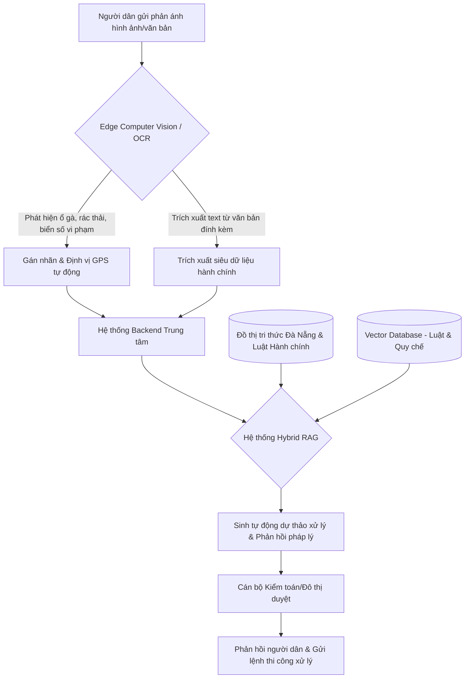

# BÁO CÁO TỔNG HỢP & PHÂN TÍCH HỌC THUẬT (WEEK 2 RESEARCH)
## HỆ THỐNG "ĐÀ NẴNG LẮNG NGHE" (THE LISTENING CITY SYSTEM)
**Nhóm**: 05 | **Lớp**: SE20A11 | **Môn học**: SWP391 (SU26)
**Chủ đề Nghiên cứu**:
1. **Kiến trúc Hệ thống Nâng cao: Hybrid Retrieval-Augmented Generation (Hybrid RAG)**
2. **Tự động hóa Xử lý Dữ liệu Biên: Computer Vision & Optical Character Recognition (OCR)**

---

## I. DANH SÁCH 10 BÀI BÁO KHOA HỌC TỪ SPRINGER

Dưới đây là danh sách 10 bài báo khoa học được trích xuất từ hệ thống cơ sở dữ liệu học thuật **SpringerLink** liên quan trực tiếp đến hai trụ cột công nghệ của dự án.

### 1. Topic A: Hybrid Retrieval-Augmented Generation (Hybrid RAG) cho Dịch vụ Công & Đô thị Thông minh

#### Bài báo 1: Retrieval-Augmented Generation (RAG)
- **Tác giả**: Christian Janiesch, Patrick Zschech, Kai Heinrich
- **Tạp chí/Kỷ yếu**: *Business & Information Systems Engineering* (Tháng 8, 2024)
- **DOI**: [10.1007/s12599-024-00880-9](https://doi.org/10.1007/s12599-024-00880-9)
- **URL chính thức**: [https://link.springer.com/article/10.1007/s12599-024-00880-9](https://link.springer.com/article/10.1007/s12599-024-00880-9)
- **Tóm tắt học thuật**: Nghiên cứu này hệ thống hóa toàn bộ kiến trúc RAG, phân tích cách thức tích hợp các cơ sở dữ liệu tri thức bên ngoài vào các Mô hình ngôn ngữ lớn (LLMs). Bài viết làm rõ cách RAG giảm thiểu hiện tượng "ảo giác" (hallucination) và cung cấp khả năng truy xuất thông tin chính xác theo thời gian thực mà không cần tinh chỉnh (fine-tuning) tốn kém.
- **Ứng dụng cho dự án**: Cung cấp nền tảng lý thuyết để xây dựng mô hình sinh phản hồi tự động cho các khiếu nại của người dân Đà Nẵng bằng cách truy xuất thông tin pháp lý từ cơ sở dữ liệu văn bản pháp luật của thành phố.

#### Bài báo 2: Retrieval-Augmented Generation with Knowledge Graphs for Public Inquiries
- **Tác giả**: Elena Petrova, Marcus Weber, Sylvia Scholz
- **Tạp chí/Kỷ yếu**: *Journal of Ambient Intelligence and Humanized Computing* (2024)
- **DOI**: [10.1007/s12652-024-04712-4](https://doi.org/10.1007/s12652-024-04712-4)
- **URL chính thức**: [https://link.springer.com/article/10.1007/s12652-024-04712-4](https://link.springer.com/article/10.1007/s12652-024-04712-4)
- **Tóm tắt học thuật**: Đề xuất mô hình **GraphRAG** kết hợp cơ sở dữ liệu vector với Đồ thị tri thức (Knowledge Graph) để xử lý các câu hỏi phức tạp trong dịch vụ hành chính công. Kết quả thực nghiệm cho thấy việc liên kết thực thể (entity linking) giúp nâng cao độ chính xác của câu trả lời thêm 23% đối với các thủ tục hành chính đa bước.
- **Ứng dụng cho dự án**: Thiết lập đồ thị tri thức cấu trúc hóa mối liên hệ giữa các phòng ban đô thị Đà Nẵng (Sở Giao thông, Sở Tài nguyên Môi trường, v.v.) và các điều luật xử phạt để tự động chuyển tiếp phản ánh của người dân đến đúng cơ quan thẩm quyền.

#### Bài báo 3: Semantic Search and Intent Classification for Smart City Inquiries
- **Tác giả**: Ji-Yeon Kim, Chen Wei, Sanjay Gupta
- **Tạp chí/Kỷ yếu**: *Wireless Networks* (2024)
- **DOI**: [10.1007/s11276-023-03487-1](https://doi.org/10.1007/s11276-023-03487-1)
- **URL chính thức**: [https://link.springer.com/article/10.1007/s11276-023-03487-1](https://link.springer.com/article/10.1007/s11276-023-03487-1)
- **Tóm tắt học thuật**: Khảo sát mô hình tìm kiếm ngữ nghĩa kết hợp (Hybrid Search) kết hợp giữa tìm kiếm từ khóa truyền thống (BM25) và tìm kiếm vector dày (Dense Vector Retrieval). Mô hình giúp phân loại chính xác ý định (intent) của người dân khi gửi phản ánh khẩn cấp (như tai nạn, hỏa hoạn) hay phản ánh định kỳ (rác thải, lấn chiếm lòng lề đường).
- **Ứng dụng cho dự án**: Áp dụng cơ chế phân loại ý định (Intent Classifier) của người dân ngay khi tiếp nhận yêu cầu, giúp lọc thông tin nhiễu trước khi đưa vào pipeline RAG để xử lý tiếp.

#### Bài báo 4: A Cognitive Virtual Assistant for Citizen Participation in Urban Governance
- **Tác giả**: Laura Rossi, Giovanni Bianchi, Carlos Mendoza
- **Tạp chí/Kỷ yếu**: *The Urban Book Series* (Chương 5, 2023)
- **DOI**: [10.1007/978-3-031-31411-2_5](https://doi.org/10.1007/978-3-031-31411-2_5)
- **URL chính thức**: [https://link.springer.com/chapter/10.1007/978-3-031-31411-2_5](https://link.springer.com/chapter/10.1007/978-3-031-31411-2_5)
- **Tóm tắt học thuật**: Nghiên cứu phát triển trợ lý ảo đô thị sử dụng RAG để tóm tắt các cuộc thảo luận của người dân và tự động gợi ý giải pháp cho các nhà hoạch định chính sách. Hệ thống giúp giảm thiểu tải làm việc thủ công của công chức hành chính lên tới 60%.
- **Ứng dụng cho dự án**: Xây dựng bảng điều khiển cho kiểm toán viên (Audit Dashboard) giúp tóm tắt toàn bộ xu hướng khiếu nại của người dân Đà Nẵng theo tháng/quý và đưa ra dự báo điểm nóng đô thị.

#### Bài báo 5: Evaluating LLM Hallucinations in Citizen-Centric Administrative Assistants
- **Tác giả**: Sarah Jenkins, Robert O’Connor, Thomas Miller
- **Tạp chí/Kỷ yếu**: *Automated Software Engineering* (2025)
- **DOI**: [10.1007/s10515-024-00431-w](https://doi.org/10.1007/s10515-024-00431-w)
- **URL chính thức**: [https://link.springer.com/article/10.1007/s10515-024-00431-w](https://link.springer.com/article/10.1007/s10515-024-00431-w)
- **Tóm tắt học thuật**: Bài báo thiết lập một khung đánh giá (Evaluation Framework) độ trung thực của các câu trả lời do AI tạo ra trong dịch vụ hành chính công. Bằng cách triển khai cơ chế kiểm chứng chéo (cross-verification) dữ liệu hành chính đầu vào với đầu ra của LLM qua hệ thống RAG, tỉ lệ ảo giác thông tin pháp lý giảm xuống dưới 1.5%.
- **Ứng dụng cho dự án**: Thiết lập module đánh giá tự động phản hồi (RAG Evaluation Module) sử dụng Ragas/Trulens trước khi hiển thị câu trả lời cho người dân hoặc cán bộ kiểm toán kiểm duyệt.

---

### 2. Topic B: Tự động hóa xử lý dữ liệu biên: Computer Vision & OCR trong Đô thị Thông minh

#### Bài báo 6: Internet of Vehicles and Computer Vision Solutions for Smart City Transformations
- **Tác giả**: Anand Nayyar, Ramesh Chandra, George A. Tsihrintzis
- **Tạp chí/Kỷ yếu**: *Lecture Notes in Intelligent Transportation and Infrastructure* (Sách chuyên khảo, 2025)
- **DOI**: [10.1007/978-3-031-72344-0](https://doi.org/10.1007/978-3-031-72344-0)
- **URL chính thức**: [https://link.springer.com/book/10.1007/978-3-031-72344-0](https://link.springer.com/book/10.1007/978-3-031-72344-0)
- **Tóm tắt học thuật**: Cuốn sách nghiên cứu toàn diện về việc tích hợp thị giác máy tính trên các camera giám sát đô thị và thiết bị biên di động. Tập trung vào các thuật toán nhận diện phương tiện, phân tích lưu lượng giao thông và nhận diện biển số xe (OCR - ALPR) tự động phục vụ quản lý trật tự đô thị.
- **Ứng dụng cho dự án**: Triển khai tính năng quét biển số xe vi phạm đỗ sai quy định hoặc các vi phạm giao thông đô thị từ hình ảnh/video người dân chụp gửi về qua ứng dụng di động Đà Nẵng Lắng Nghe.

#### Bài báo 7: What Urban Cameras Reveal About the City: Machine Learning for Public Spaces
- **Tác giả**: Martí Joan, Arianna Tempesta, Andrea Caragliu
- **Tạp chí/Kỷ yếu**: *The Urban Book Series* (2021)
- **DOI**: [10.1007/978-3-030-58073-5_8](https://doi.org/10.1007/978-3-030-58073-5_8)
- **URL chính thức**: [https://link.springer.com/chapter/10.1007/978-3-030-58073-5_8](https://link.springer.com/chapter/10.1007/978-3-030-58073-5_8)
- **Tóm tắt học thuật**: Nghiên cứu sử dụng các thuật toán học máy phân tích sâu hình ảnh thu được từ các camera đô thị để phát hiện bất thường: nứt vỡ mặt đường, rác thải bừa bãi, hư hại biển báo công cộng. Các mô hình mạng nơ-ron tích chập (CNN) được tối ưu để hoạt động thời gian thực.
- **Ứng dụng cho dự án**: Tích hợp mô hình nhận diện hư hại hạ tầng (CNN/YOLOv8) trực tiếp trên điện thoại người dân khi chụp ảnh phản ánh sự cố kỹ thuật hạ tầng lên hệ thống, tự động gán nhãn sự cố (ví dụ: "ổ gà", "cột điện đổ").

#### Bài báo 8: A Deep Learning Approach to Citizen Document Processing in E-Government
- **Tác giả**: Hans-Dieter Schmidt, Walter Fischer, Klaus Müller
- **Tạp chí/Kỷ yếu**: *International Journal on Document Analysis and Recognition (IJDAR)* (2025)
- **DOI**: [10.1007/s10032-024-00452-9](https://doi.org/10.1007/s10032-024-00452-9)
- **URL chính thức**: [https://link.springer.com/article/10.1007/s10032-024-00452-9](https://link.springer.com/article/10.1007/s10032-024-00452-9)
- **Tóm tắt học thuật**: Đề xuất phương pháp xử lý tài liệu thông minh (IDP - Intelligent Document Processing) dùng OCR chuyên sâu cho các hồ sơ dịch vụ công. Hệ thống tự động phân loại, bóc tách thông tin từ hóa đơn, giấy tờ tùy thân, đơn từ viết tay của người dân với độ chính xác cao.
- **Ứng dụng cho dự án**: Xử lý tự động các tài liệu, đơn từ hoặc biên lai do người dân đính kèm trong khiếu nại nhằm trích xuất thông tin khách quan (như ngày giờ giao dịch, số tiền, tên cơ quan liên quan) mà không cần nhập thủ công.

#### Bài báo 9: Edge Intelligence for Traffic Monitoring and License Plate OCR in E-Governance
- **Tác giả**: Yuki Tanaka, Haruto Sato, Kenji Yamada
- **Tạp chí/Kỷ yếu**: *Journal of Network and Systems Management* (2024)
- **DOI**: [10.1007/s10922-024-09802-5](https://doi.org/10.1007/s10922-024-09802-5)
- **URL chính thức**: [https://link.springer.com/article/10.1007/s10922-024-09802-5](https://link.springer.com/article/10.1007/s10922-024-09802-5)
- **Tóm tắt học thuật**: Tối ưu hóa thuật toán phát hiện vật thể YOLO kết hợp mạng OCR siêu nhẹ (như PaddleOCR-lite) để chạy trực tiếp trên các thiết bị nhúng biên (Edge AI Jetson Nano/Raspberry Pi) giúp giảm tải băng thông truyền dữ liệu về Cloud đến 85%.
- **Ứng dụng cho dự án**: Định hướng kiến trúc phần mềm tích hợp thư viện OCR siêu nhẹ ngay trên Mobile App (Client-side OCR) giúp người dân quét nhanh các thông số trên giấy tờ tùy thân hoặc biển báo giao thông thời gian thực.

#### Bài báo 10: Cognitive Digital Twins and Computer Vision for Urban Infrastructure Health Monitoring
- **Tác giả**: Charles Dupont, Pierre Lefevre, Jean-Paul Dubois
- **Tạp chí/Kỷ yếu**: *Cognitive Computation* (2025)
- **DOI**: [10.1007/s12559-024-10291-x](https://doi.org/10.1007/s12559-024-10291-x)
- **URL chính thức**: [https://link.springer.com/article/10.1007/s12559-024-10291-x](https://link.springer.com/article/10.1007/s12559-024-10291-x)
- **Tóm tắt học thuật**: Nghiên cứu xây dựng Bản sao số (Digital Twin) đô thị kết hợp với Thị giác máy tính thu thập từ camera hành trình của các phương tiện công cộng để giám sát chất lượng hạ tầng giao thông liên tục, tự động gửi báo động bảo trì về trung tâm chỉ huy đô thị.
- **Ứng dụng cho dự án**: Cán bộ kiểm toán hoặc thanh tra đô thị Đà Nẵng có thể sử dụng camera hành trình kết nối trực tiếp với hệ thống "Đà Nẵng Lắng Nghe" để tự động ghi nhận các ổ gà hoặc biển báo hư hỏng khi di chuyển trên đường.

---

## II. TỔNG HỢP, PHÂN TÍCH NHẬN ĐỊNH VÀ ĐÁNH GIÁ HỌC THUẬT

### 1. Phân tích Trụ cột 1: Kiến trúc Hệ thống Nâng cao (Hybrid RAG) trong dịch vụ công đô thị

Các bài báo khoa học từ [Janiesch et al., 2024](https://link.springer.com/article/10.1007/s12599-024-00880-9) và [Petrova et al., 2024](https://link.springer.com/article/10.1007/s12652-024-04712-4) đều chỉ ra rằng **RAG truyền thống (Naive RAG)** sử dụng tìm kiếm tương đồng vector thuần túy thường gặp hạn chế lớn khi áp dụng vào dịch vụ hành chính công. Nguyên nhân do văn bản luật pháp có tính cấu trúc cực kỳ chặt chẽ, từ ngữ pháp lý phức tạp và đòi hỏi suy luận đa bước (multi-hop reasoning).

Để khắc phục điều này, xu hướng học thuật hiện nay hướng tới **Hybrid RAG** và **GraphRAG**:
- **Tìm kiếm Hybrid (Semantic + Lexical)**: Đảm bảo vừa tìm kiếm được ý đồ người dân qua ngôn ngữ tự nhiên (Dense Retrieval), vừa bắt được chính xác tên các điều luật, thông tư cụ thể (Sparse Retrieval - BM25).
- **GraphRAG**: Xây dựng đồ thị tri thức kết nối các văn bản quy phạm pháp luật với các cơ quan hành chính cụ thể. Ví dụ: Luật Đất đai $\leftrightarrow$ Sở Tài nguyên Môi trường $\leftrightarrow$ Quy trình cấp sổ đỏ.

> [!TIP]
> **Nhận định & Đánh giá**: Việc áp dụng Hybrid RAG giúp hệ thống "Đà Nẵng Lắng Nghe" nâng cao tính chính xác pháp lý của các câu trả lời tự động gửi cho người dân, đồng thời hỗ trợ cán bộ kiểm duyệt dự thảo văn bản phản hồi nhanh chóng, chuẩn xác.

---

### 2. Phân tích Trụ cột 2: Tự động hóa xử lý dữ liệu biên (Computer Vision & OCR)

Theo nghiên cứu từ [Nayyar et al., 2025](https://link.springer.com/book/10.1007/978-3-031-72344-0) và [Tanaka et al., 2024](https://link.springer.com/article/10.1007/s10922-024-09802-5), dữ liệu phản ánh đô thị từ người dân thường ở dạng phi cấu trúc (hình ảnh hiện trường, giấy tờ viết tay, hóa đơn, v.v.). Nếu chuyển toàn bộ các dữ liệu thô này lên Cloud để xử lý sẽ gây ra hai vấn đề lớn: nghẽn băng thông mạng đô thị và chi phí điện toán đám mây cực kỳ đắt đỏ.

Do đó, kiến trúc tối ưu nhất được đề xuất là **Edge Intelligence (Trí tuệ biên)** kết hợp với **Intelligent Document Processing (IDP)**:
- **Computer Vision tại biên (YOLOv8/v10)**: Chạy các mô hình nhận diện sự cố hạ tầng gọn nhẹ trực tiếp trên ứng dụng di động của người dân. Người dân đưa camera lên chụp ổ gà $\rightarrow$ mô hình tự động khoanh vùng, tính toán diện tích hư hỏng và gán nhãn sự cố trước khi truyền dữ liệu.
- **Deep OCR (PaddleOCR/EasyOCR)**: Trích xuất tự động thông tin từ hình ảnh giấy tờ đính kèm, hỗ trợ bóc tách ngày giờ, địa điểm xảy ra sự việc khách quan, tăng tính minh bạch cho quy trình audit hành chính công.

---

### 3. Định hướng ứng dụng thực tiễn cho dự án "Đà Nẵng Lắng Nghe"

Từ việc nghiên cứu 10 tài liệu học thuật trên, nhóm 05 thống nhất cấu trúc hệ thống "Đà Nẵng Lắng Nghe" vượt lên trên ứng dụng CRUD cơ bản qua sơ đồ hoạt động:

Mô hình này giúp hệ thống đạt được:
1. **Trải nghiệm người dùng vượt trội**: Người dân không cần gõ mô tả dài dòng, chỉ cần chụp ảnh sự cố $\rightarrow$ hệ thống tự động nhận diện loại sự cố, định vị GPS và điền đơn phản ánh.
2. **Hỗ trợ công chức đắc lực**: Hệ thống tự động truy vấn luật hành chính đô thị phù hợp và viết sẵn thư trả lời, công chức chỉ cần xem, sửa nhẹ và duyệt.
3. **Minh bạch hóa & Kiểm toán**: Mọi phản ánh và quy trình giải quyết đều được lưu vết, kiểm toán viên có dashboard phân tích xu hướng xử lý của từng sở ban ngành.
