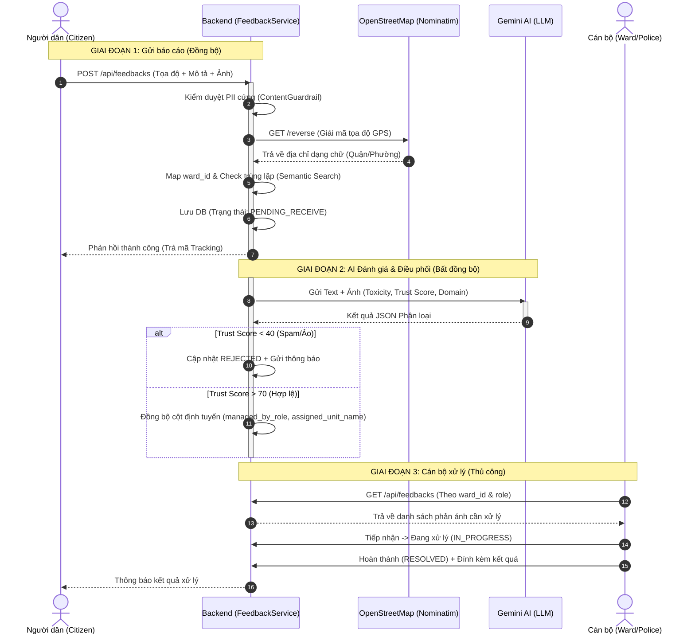

# Tài Liệu Thiết Kế: Giải Quyết Lỗi Định Tuyến AI & Khớp Vị Trí Địa Lý (OSM Nominatim Fallback)

Tài liệu này trình bày giải pháp kiến trúc khắc phục lỗi trong luồng tự động phân loại, điều phối (Auto-Dispatch) bằng AI và cơ chế giải mã địa hình ngược (Reverse Geocoding) từ tọa độ GPS của người dân sang `ward_id` quản lý.

---

## 1. Khảo Sát Hiện Trạng & Vấn Đề (Architecture Assessment)

### Sơ đồ tuần tự vòng đời hiện tại (As-Is Feedback Lifecycle)



### Các điểm lỗi và nguy cơ hệ thống (System Vulnerabilities)

1. **Lệch cấp hành chính (Quận vs Phường)**: 
   * Cơ sở dữ liệu seed tên các **Quận** (Hải Châu, Thanh Khê, Liên Chiểu...) trong bảng `wards` (đặt `type = 'WARD'`).
   * API OpenStreetMap Nominatim lại giải mã tọa độ GPS ra tên cấp **Phường/Xã** (ví dụ: `Hòa Khánh Nam`, `Hòa Cường Bắc`).
   * Hệ thống so khớp chuỗi trực tiếp dẫn đến thất bại, gán `ward_id = null` và báo cáo rơi vào trạng thái `NEED_LOCATION_REVIEW`.
2. **Đứt gãy luồng điều phối của AI**:
   * Khi AI nhận diện báo cáo thuộc lĩnh vực `AN_NINH` hoặc `GIAO_THONG` (yêu cầu chuyển cho `POLICE` - Công an), code chỉ ghi đè cột `receiver_type`. 
   * Các cột quyết định hiển thị danh sách trên Dashboard là `managed_by_role` và `assigned_to_role` vẫn mang giá trị cũ của cán bộ phường (`WARD_STAFF`), khiến Công an Phường không bao giờ thấy báo cáo trên màn hình quản lý của họ.
3. **Nghẽn kết nối Database (DB Pool Exhaustion)**:
   * Cuộc gọi API Nominatim được thực hiện đồng bộ *bên trong* Transaction của hàm `createFeedback` thuộc `FeedbackService.java`. 
   * Nếu API Nominatim bị nghẽn mạng hoặc phản hồi chậm (từ 2 đến 3 giây), kết nối cơ sở dữ liệu sẽ bị chiếm giữ không giải phóng, làm tê liệt toàn bộ hệ thống dưới tải lớn.

---

## 2. Kế Hoạch Triển Khai Chi Tiết (Checklist & Solution)

### 🟩 BƯỚC 1: Khắc phục lỗi đứt gãy định tuyến AI (Độ ưu tiên: Khẩn cấp | Độ khó: Dễ)
* **File sửa đổi**: [AutoDispatchService.java](file:///d:/swp391-su26-ai-audit-project-swp391_se20a11_group-05/Sources/Backend/src/main/java/com/example/smartcity/modules/feedback/service/AutoDispatchService.java)
* **Cách giải quyết**: Cập nhật đồng bộ các thuộc tính phân quyền khi AI tự động định tuyến lĩnh vực xử lý.
* **Mã giả (Pseudo-code)** áp dụng trong hàm `processAiResult`:
```java
// Đồng bộ cột định tuyến khi AI phân loại lại lĩnh vực
String targetRole = ("AN_NINH".equals(aiResult.getDomain()) || "GIAO_THONG".equals(aiResult.getDomain())) 
                    ? "POLICE" : "WARD_STAFF";

feedback.setReceiverType(targetRole);
feedback.setManagedByRole(targetRole); 
feedback.setAssignedToRole(targetRole); 

if (feedback.getWard() != null) {
    String unitSuffix = "POLICE".equals(targetRole) ? " Ward Police" : " Ward People's Committee";
    feedback.setAssignedUnitName(feedback.getWard().getName() + unitSuffix);
}
feedbackRepository.save(feedback);
```

---

### 🟩 BƯỚC 2: Cấu hình Fallback Quận/Huyện cho định vị địa lý (Độ ưu tiên: Cao | Độ khó: Dễ)
* **File sửa đổi**: [LocationResolutionService.java](file:///d:/swp391-su26-ai-audit-project-swp391_se20a11_group-05/Sources/Backend/src/main/java/com/example/smartcity/modules/core/service/LocationResolutionService.java)
* **Cách giải quyết**: Đưa thêm các cấp hành chính lớn hơn (`city_district`, `county`, `district`) vào làm ứng viên so khớp để tự động map về Quận/Huyện khi khớp Phường bị thất bại.
* **Mã giả (Pseudo-code)** trong hàm `extractWardCandidates`:
```java
private List<String> extractWardCandidates(Map<?, ?> address) {
    return List.of(
        value(address.get("ward")),
        value(address.get("suburb")),
        value(address.get("quarter")),
        value(address.get("neighbourhood")),
        value(address.get("village")),
        value(address.get("town")),
        value(address.get("city_district")), // Thêm fallback cấp Quận
        value(address.get("county")),        // Thêm fallback cấp Huyện
        value(address.get("district"))       // Thêm fallback cấp Quận chung
    ).stream().filter(s -> !s.isBlank()).distinct().collect(Collectors.toList());
}
```

---

### 🟨 BƯỚC 3: Phòng vệ xung đột trạng thái (State Validation) (Độ ưu tiên: Trung bình | Độ khó: Trung bình)
* **File sửa đổi**: [AutoDispatchService.java](file:///d:/swp391-su26-ai-audit-project-swp391_se20a11_group-05/Sources/Backend/src/main/java/com/example/smartcity/modules/feedback/service/AutoDispatchService.java)
* **Cách giải quyết**: Đọc trạng thái mới nhất bằng khóa cô lập giao dịch để chặn AI ghi đè dữ liệu nếu Cán bộ đã xử lý tay trước đó.
* **Mã giả (Pseudo-code)**:
```java
@Transactional
public void processAiResult(Long feedbackId, AiAnalysisResult aiResult) {
    Feedback feedback = feedbackRepository.findByIdForUpdate(feedbackId) // Pessimistic Lock
            .orElseThrow(() -> new ResourceNotFoundException("Feedback not found"));

    if (feedback.getStatus() != FeedbackStatus.SUBMITTED && 
        feedback.getStatus() != FeedbackStatus.NEED_LOCATION_REVIEW &&
        feedback.getStatus() != FeedbackStatus.PENDING_RECEIVE) {
        return; // Hủy ghi đè nếu cán bộ đã tiếp nhận
    }
}
```

---

### 🟥 BƯỚC 4: Tách biệt Geocoding ra khỏi DB Transaction (Độ ưu tiên: Cao | Độ khó: Khó)
* **File sửa đổi**: [FeedbackService.java](file:///d:/swp391-su26-ai-audit-project-swp391_se20a11_group-05/Sources/Backend/src/main/java/com/example/smartcity/modules/feedback/service/FeedbackService.java) và [AutoDispatchService.java](file:///d:/swp391-su26-ai-audit-project-swp391_se20a11_group-05/Sources/Backend/src/main/java/com/example/smartcity/modules/feedback/service/AutoDispatchService.java)
* **Cách giải quyết**: Loại bỏ cuộc gọi Nominatim đồng bộ trong thread chính. Đẩy tác vụ giải mã tọa độ sang Thread Pool bất đồng bộ chạy ngầm của AI để giải phóng Database Connection.
* **Thiết kế**: **Transaction Boundary Separation** kết hợp **Asynchronous Task Processing**.
* **Mã giả (Pseudo-code)**:
```java
// Trong FeedbackService.java (Tạo báo cáo nhanh không nghẽn)
@Transactional
public Feedback createFeedback(FeedbackRequest request, String username) {
    Feedback feedback = new Feedback();
    // ... Thiết lập các trường cơ bản ...
    feedback.setStatus(FeedbackStatus.PENDING); // Trạng thái chờ xử lý ngầm
    Feedback saved = feedbackRepository.save(feedback);
    
    autoDispatchService.analyzeAndDispatch(saved.getId()); // Kích hoạt chạy ngầm
    return saved;
}

// Trong AutoDispatchService.java (Chạy ngầm ở background)
@Async("aiTaskExecutor")
public void analyzeAndDispatch(Long feedbackId) {
    // 1. Gọi Nominatim API giải mã tọa độ ngoài transaction chính
    Ward resolvedWard = locationResolutionService.findAuthorityByLocation(lat, lng);
    
    // 2. Gọi Gemini AI phân tích hình ảnh & nội dung
    AiAnalysisResult aiResult = geminiAdapter.callGemini(description);
    
    // 3. Thực hiện ghi dữ liệu cuối cùng vào DB qua transaction riêng
    saveFinalResult(feedbackId, resolvedWard, aiResult);
}
```

---

## 3. Kịch Bản Kiểm Thử & Kiểm Soát Chất Lượng (QA Test cases)

1. **Test Case 1: Kiểm thử tải và giải phóng DB Pool (Stress Test)**
   * *Hành động*: Giả lập 50 request gửi báo cáo đồng thời trong 2 giây. Chặn mạng máy chủ Nominatim để phản hồi trễ 5 giây.
   * *Kỳ vọng*: Backend không báo lỗi cạn kiệt connection pool (Hikari pool-empty exception). Các báo cáo lưu thành công với trạng thái chờ xử lý.
2. **Test Case 2: Kiểm thử khớp địa bàn cấp Quận (Geocoding Fallback)**
   * *Hành động*: Tạo báo cáo từ tọa độ GPS thuộc Phường Hòa Khánh Nam (`16.072481, 108.150905`).
   * *Kỳ vọng*: Hệ thống nhận diện được địa phương thuộc Quận **Liên Chiểu** và gán đúng `ward_id` trong DB. Trạng thái không bị đưa về `NEED_LOCATION_REVIEW`.
3. **Test Case 3: Kiểm thử đồng bộ Dashboard sau AI phân loại (AI Route Sync)**
   * *Hành động*: Đăng nhập tài khoản công an `police1` tại Liên Chiểu. Citizen gửi tin về mất trật tự trộm cắp tại Hòa Khánh.
   * *Kỳ vọng*: Báo cáo tự động hiển thị ngay lập tức trên màn hình của công an Liên Chiểu sau 5 giây (khi AI phân loại xong).
