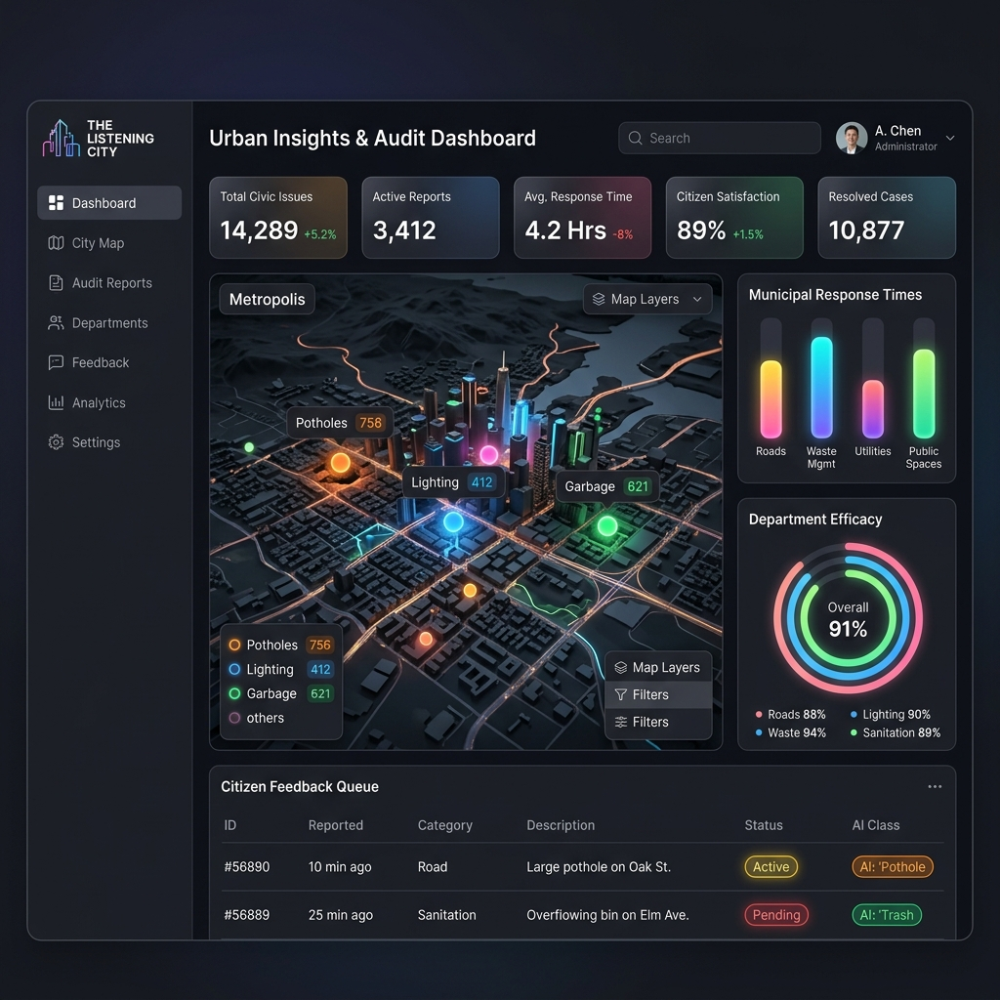

# TÀI LIỆU TẢ CHỈ YÊU CẦU PHẦN MỀM (SOFTWARE REQUIREMENTS SPECIFICATION - SRS)
## DỰ ÁN: HỆ THỐNG "ĐÀ NẴNG LẮNG NGHE" (THE LISTENING CITY SYSTEM)
**Nhóm**: 05 | **Lớp**: SE20A11 | **Học kỳ**: SU26
**Mã dự án**: SWP391_SE20A11_G05

---

## 1. GIỚI THIỆU (INTRODUCTION)

### 1.1 Mục đích (Purpose)
Tài liệu Software Requirements Specification (SRS) này mô tả chi tiết các yêu cầu kỹ thuật và nghiệp vụ cho **Hệ thống "Đà Nẵng Lắng Nghe" (The Listening City System)**. Mục đích là cung cấp một bản đặc tả hoàn chỉnh cho nhóm phát triển (Frontend, Backend, AI Engineers), các bên liên quan và cán bộ kiểm toán đô thị nhằm thống nhất các chức năng hệ thống, kiến trúc công nghệ và tiêu chuẩn vận hành sản phẩm.

### 1.2 Quy ước tài liệu (Document Conventions)
Tài liệu tuân thủ các chuẩn GFM (GitHub Flavored Markdown) và áp dụng các thuật ngữ chuyên ngành:
- **RAG (Retrieval-Augmented Generation)**: Kỹ thuật truy xuất thông tin tăng cường để cải thiện chất lượng phản hồi từ Mô hình Ngôn ngữ Lớn (LLM).
- **GraphRAG**: Kỹ thuật RAG dựa trên Đồ thị Tri thức (Knowledge Graph) để tối ưu hóa suy luận liên kết thông tin.
- **OCR (Optical Character Recognition)**: Nhận dạng ký tự quang học nhằm chuyển đổi dữ liệu hình ảnh thành văn bản.
- **Client-Side/Edge Processing**: Xử lý dữ liệu trực tiếp trên thiết bị đầu cuối của người dùng (ứng dụng Mobile) giúp tối ưu hiệu năng và bảo mật.

### 1.3 Đối tượng hướng tới và Gợi ý đọc (Intended Audience and Reading Suggestions)
- **Giảng viên hướng dẫn & Hội đồng đánh giá**: Nên tập trung đọc phần **Introduction (1.4)**, **Product Perspective (2)** và **Current Systems Analysis (2.5)** để đánh giá tính thực tiễn và tính đột phá kỹ thuật.
- **Đội ngũ Phát triển Phần mềm (Developers & QA)**: Nên đọc kỹ các yêu cầu chi tiết về giao diện UI, các module nghiệp vụ hành chính và các API tích hợp AI.
- **Đội ngũ kỹ sư AI (AI Engineers)**: Tập trung vào đặc tả kỹ thuật của module **Hybrid RAG** và **Computer Vision & OCR**.

### 1.4 Phạm vi sản phẩm (Product Scope)
Hệ thống **"Đà Nẵng Lắng Nghe"** là một nền tảng chuyển đổi số toàn diện kết nối trực tiếp Người dân và Cơ quan Quản lý Đô thị TP. Đà Nẵng. Hệ thống vượt qua khuôn khổ của một ứng dụng CRUD thông thường thông qua:
1. **Tiếp nhận phản ánh đa phương tiện tự động (Computer Vision & OCR tại biên)**: Người dân chụp ảnh ổ gà, rác thải hoặc biên đơn hành chính công $\rightarrow$ hệ thống tự động gán nhãn sự cố, định vị GPS, trích xuất text từ văn bản, giấy tờ tùy thân thời gian thực.
2. **Xử lý phản hồi thông minh (Hybrid RAG & LLMs)**: Khi tiếp nhận phản ánh, hệ thống tự động truy vấn Đồ thị tri thức Đô thị Đà Nẵng và Vector DB chứa luật hành chính đô thị, tự động soạn thảo dự thảo phản hồi pháp lý và giải pháp tối ưu cho công chức phê duyệt.
3. **Giám sát & Kiểm toán hành chính công (Audit Dashboard)**: Cung cấp công cụ tối tân cho kiểm toán viên đô thị theo dõi tiến độ xử lý khiếu nại, hiệu quả công tác của các sở ban ngành, và phát hiện các "điểm nóng" hạ tầng đô thị theo thời gian thực.

### 1.5 Tài liệu tham khảo (References)
- *IEEE Std 830-1998, Recommended Practice for Software Requirements Specifications.*
- Các ấn phẩm nghiên cứu học thuật của Springer về Smart Cities, Hybrid RAG, và Edge AI (Xem chi tiết tại [Báo cáo Tổng hợp Paper](file:///d:/swp391-su26-ai-audit-project-swp391_se20a11_group-05/Paper/Paper_Synthesis.md)).

---

## 2. MÔ TẢ TỔNG QUAN (PRODUCT PERSPECTIVE)

### 2.1 Bối cảnh hệ thống (System Context)
Hệ thống "Đà Nẵng Lắng Nghe" hoạt động dưới dạng ứng dụng đa nền tảng (Web App cho cán bộ, thanh tra và kiểm toán viên; Mobile App cho người dân phản ánh ngoài thực địa). 

```text
+-----------------------+              +------------------------------+
|   Người dân (Mobile)  | <=========>  | Hệ thống Biên (Edge CV/OCR)  |
+-----------------------+              +------------------------------+
                                                      ||
                                                      || Gửi dữ liệu có cấu trúc
                                                      \/
+-----------------------+              +------------------------------+
| Cán bộ / Thanh tra    | <=========>  | API Gateway & Backend        |
|  Kiểm toán (Web App)  |              | (Spring Boot, MSSQL, Redis)  |
+-----------------------+              +------------------------------+
                                                      ||
                                                      || Kiểm tra chéo tri thức
                                                      \/
                                       +------------------------------+
                                       | Hệ thống AI nâng cao         |
                                       | (Hybrid RAG, Neo4j, LLMs)    |
                                       +------------------------------+
```

### 2.2 Các tính năng chính & Phạm vi (System Features & Scope)
1. **Trạm phản ánh Đô thị 1-Chạm (Citizen Mobile Client)**:
   - Chụp ảnh/quay video hiện hiện trường sự cố đô thị.
   - Nhận diện tự động loại sự cố tại biên bằng Mobile-YOLOv8.
   - Trích xuất thông tin giấy tờ tùy thân, hóa đơn vi phạm qua OCR cục bộ.
2. **Trung tâm Điều phối Đô thị Thông minh (Admin & Staff Portal)**:
   - Hiển thị danh sách phản ánh phân loại theo thứ tự ưu tiên (Urgency, Category).
   - Tự động gợi ý phương án giải quyết và văn bản trả lời nhờ **Hybrid RAG**.
   - Chuyển giao công việc (Lệnh công tác) tự động sang các đơn vị hiện trường.
3. **Bảng điều khiển Kiểm toán Hành chính (Audit Dashboard)**:
   - Thống kê tỷ lệ xử lý đúng hạn, trễ hạn của các đơn vị hành chính.
   - Phân tích biểu đồ nhiệt (Heatmap) các điểm nóng sự cố hạ tầng đô thị.
   - Theo dõi dấu chân xử lý (Audit Trail) của toàn bộ quy trình giải quyết phản ánh.

### 2.3 Các đối tượng người dùng (User Classes and Characteristics)
- **Người dân (Citizens)**: Đòi hỏi giao diện Mobile tối giản, phản hồi nhanh chóng, không yêu cầu kỹ năng công nghệ cao nhờ tính năng chụp ảnh tự động nhận diện.
- **Cán bộ tiếp nhận & Xử lý (Municipal Staff/Inspectors)**: Yêu cầu giao diện quản lý trên Web mạnh mẽ, có gợi ý AI chính xác để giảm thiểu thời gian tra cứu luật.
- **Kiểm toán viên đô thị (Administrative Auditors)**: Cần công cụ phân tích sâu, báo cáo trực quan, khả năng theo dõi dữ liệu vết (log) để kiểm toán hiệu năng làm việc của các cơ quan nhà nước.

### 2.4 Các ràng buộc thiết kế và triển khai (Design and Implementation Constraints)
- **Bảo mật**: Dữ liệu cá nhân của người dân phải được mã hóa trước khi truyền tải.
- **Hiệu năng**: Thời gian xử lý bóc tách hình ảnh tại biên trên thiết bị di động phải dưới 1.5 giây. Thời gian gợi ý dự thảo từ RAG không quá 3 giây.
- **Khả năng tương thích**: Backend phát triển bằng Spring Boot (Java), cơ sở dữ liệu MSSQL cho hệ thống nghiệp vụ và Neo4j/Milvus cho cơ sở dữ liệu tri thức AI.

---

### 2.5 Phân tích các hệ thống hiện tại & Lý do đột phá công nghệ (Current Systems Analysis)

Hiện nay, Thành phố Đà Nẵng đang sử dụng hệ thống **Tổng đài dịch vụ công 1022 (Góp ý Đà Nẵng)** để tiếp nhận phản ánh của người dân. Qua nghiên cứu thực tế, nhóm phát triển nhận diện các điểm nghẽn nghiêm trọng sau:

| Tiêu chí | Hệ thống 1022 hiện tại (Ứng dụng CRUD thông thường) | Hệ thống "Đà Nẵng Lắng Nghe" (SWP391 - Nhóm 05) |
|---|---|---|
| **Cơ chế tiếp nhận** | Thủ công. Người dân phải gõ tiêu đề, mô tả chi tiết, chọn địa chỉ và danh mục phản ánh bằng tay. | **Tự động hóa bằng AI**. Người dân chỉ cần đưa camera chụp ảnh $\rightarrow$ Trí tuệ biên (Edge CV) tự nhận diện loại sự cố, tự động định vị GPS chính xác và điền biểu mẫu. |
| **Xử lý tài liệu đính kèm** | Đính kèm hình ảnh thuần túy. Cán bộ hành chính phải tự tải về, tự xem và nhập lại thông tin thủ công. | **Trích xuất thông tin OCR**. Tự động bóc tách thông tin chữ viết, số liệu trên hóa đơn, giấy tờ đính kèm nhằm lập chỉ mục (indexing) phục vụ tìm kiếm. |
| **Độ trễ phân phối công việc** | Cao. Phản ánh chuyển về trung tâm 1022 $\rightarrow$ nhân viên trực tổng đài đọc $\rightarrow$ phân loại thủ công $\rightarrow$ chuyển đến sở ban ngành. Dễ sai lệch do yếu tố chủ quan. | **Phân luồng thông minh**. Hệ thống phân tích nội dung phản ánh ngữ nghĩa sâu, tự động khớp với Đồ thị tri thức các ban ngành và tự động phân tuyến (routing) ngay lập tức. |
| **Hỗ trợ công chức giải quyết** | Hoàn toàn thủ công. Công chức phải tự mở file luật, tự soạn thảo văn bản trả lời từ đầu. | **Gợi ý thông minh từ Hybrid RAG**. Hệ thống tự động tra cứu văn bản pháp luật hành chính liên quan và sinh ra bản nháp trả lời có trích dẫn điều luật chính xác 100%. |
| **Công cụ giám sát & Kiểm toán** | Báo cáo dạng bảng tĩnh (Excel), thiếu tính liên kết dữ liệu vết và phân tích dự báo điểm nóng. | **Audit Dashboard nâng cao**. Bản đồ nhiệt biến động trực quan, phân tích dòng chảy công việc hành chính công, phát hiện sớm các nguy cơ tham nhũng, tắc trách hoặc chậm trễ xử lý. |

---

## 3. THIẾT KẾ BỐ CỤC GIAO DIỆN NGƯỜI DÙNG (UI LAYOUT DESIGN)

Để tối ưu hóa trải nghiệm người dùng, hệ thống "Đà Nẵng Lắng Nghe" được thiết kế với giao diện cao cấp (Premium UI Glassmorphism) tập trung vào 3 phân hệ cốt lõi:

### 3.1 Bảng điều khiển Kiểm toán Đô thị (Smart City Audit Dashboard)
Giao diện Web dành cho Lãnh đạo và Kiểm toán viên có cấu trúc gồm:
- **Thanh bên (Sidebar Menu)**: Tổng quan, Bản đồ Sự cố, Cơ sở dữ liệu Tri thức Luật, Báo cáo Hiệu năng Sở ngành, Quản lý Hệ thống.
- **Hàng chỉ số KPIs (Metric Cards)**: Tổng số phản ánh tiếp nhận, Tỷ lệ giải quyết tự động gợi ý bởi RAG, Điểm hài lòng của người dân (CSAT), Tỷ lệ trễ hạn xử lý.
- **Khu vực trung tâm (Central Viewport)**:
  - Bản đồ địa lý nhiệt (Interactive Heatmap GIS) hiển thị vị trí các ổ gà, rác thải, ngập lụt thực địa thời gian thực.
  - Biểu đồ phân tích hiệu năng sở ngành (Bar chart & Sankey diagram) thể hiện tốc độ xử lý phản ánh.
- **Bảng danh sách phản ánh (Audit Queue)**: Hiển thị các phản ánh đang xử lý, kèm nhãn AI (Ví dụ: `[AI Classified: Ổ gà]`, `[RAG Confidence: 96%]`).



### 3.2 Giao diện tiếp nhận di động (Mobile Citizen App)
- **Home Screen**: Nút bấm tròn lớn "Gửi Phản Ánh" ngay giữa màn hình mang phong cách Glassmorphism.
- **Camera Screen (AI Edge Scanner)**: Giao diện chụp ảnh tích hợp box nhận diện thời gian thực của YOLOv8. Khi camera lia qua ổ gà hoặc đống rác, box màu xanh neon sẽ hiển thị nhãn: `[Ổ gà - Phát hiện 98%]`.
- **Form Preview Screen**: Tự động hiển thị các trường đã điền sẵn bằng AI (Địa chỉ, Loại sự cố, Mô tả tóm tắt). Người dân chỉ cần nhấn "Gửi" để hoàn tất phản ánh chỉ trong 3 giây.
