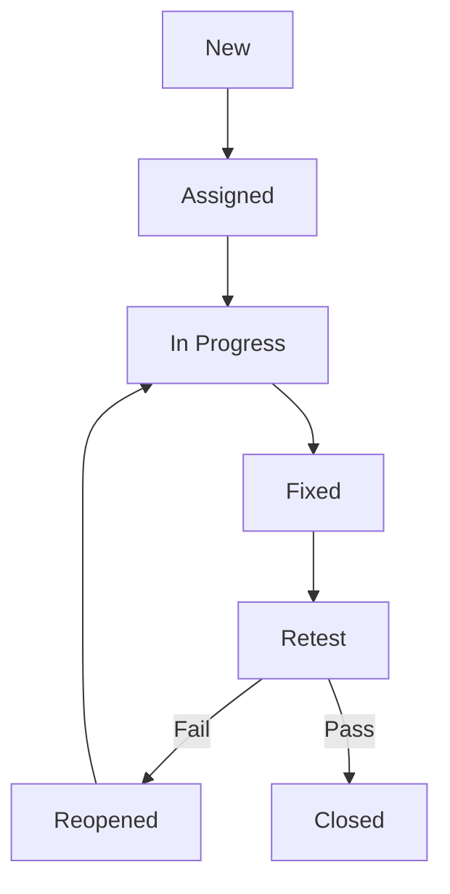

# TEST PLAN - HỆ THỐNG TIẾP NHẬN & XỬ LÝ PHẢN ÁNH (ĐÀ NẴNG LẮNG NGHE / THE LISTENING CITY)

---

## 1. DOCUMENT INFORMATION
| Field | Description |
| --- | --- |
| **Project Name** | Hệ thống Tiếp nhận & Xử lý Phản ánh (The Listening City / Đà Nẵng Lắng Nghe) |
| **Document Title** | TEST PLAN – System Management + Dashboard Module |
| **Version** | v2.0 |
| **Prepared By** | **Nhóm 05 - Lớp SE20A11 (Môn SWP391)** • Trần Minh Vĩ (DE190182) - QA Lead • Nguyễn Hoàng Trọng (DE190357) - Tester • Phạm Tuấn Việt (DE190714) - Tester • Phan Thanh Bình (DE190210) - Tester • Phạm Bá Trí (DE191029) - Tester |
| **Reviewed By** | PM / QA Manager |
| **Approved By** | Giảng viên hướng dẫn môn SWP391 / Hội đồng thẩm định |
| **Date** | 26/06/2026 |
| **Status** | Approved / Active |

---

## 2. REVISION HISTORY
| Version | Date | Author | Description |
| --- | --- | --- | --- |
| **1.0** | 19/05/2026 | QA Team | Phiên bản dự thảo ban đầu dựa trên mô tả giả lập (Vue/.NET) |
| **2.0** | 26/06/2026 | Nhóm 05 - SE20A11 | Cập nhật cấu trúc thực tế của hệ thống (React 19 + Spring Boot 4.0.6 + PostgreSQL & pgvector), cập nhật lịch trình kiểm thử 01 tháng và phân rã chi tiết kịch bản theo yêu cầu báo cáo môn học. |

---

## 3. INTRODUCTION
### 3.1 Purpose
Tài liệu Test Plan này xác định kế hoạch, mục tiêu, phạm vi, lịch trình, nguồn lực và các kỹ thuật kiểm thử áp dụng cho module **System Management + Dashboard** trong hệ thống Tiếp nhận & Xử lý Phản ánh. Tài liệu này đóng vai trò định hướng kiểm thử chất lượng cho toàn bộ thành viên Nhóm 05 trong thời gian triển khai dự án môn học SWP391.

### 3.2 Background
Hệ thống cho phép người dân gửi phản ánh hiện trường và hỗ trợ điều phối tự động qua AI (pgvector, RAG). Module **System Management + Dashboard** cung cấp công cụ vận hành cho Super Admin và cán bộ phường (Ward Staff) để quản lý cấu hình danh mục, phường/xã, tiếp nhận và phân công đơn vị giải quyết, đồng thời hiển thị biểu đồ thống kê đo lường KPI hiệu quả xử lý phản ánh đô thị.

---

## 4. PROJECT OVERVIEW
### 4.1 System Overview
Hệ thống hỗ trợ tiếp nhận, định vị GPS địa lý (geofencing), phân loại tự động bằng AI (RAG + pgvector), phân công và theo dõi xử lý phản ánh của người dân trên địa bàn thành phố Đà Nẵng. Module System Management + Dashboard tập trung vào việc vận hành và giám sát toàn hệ thống từ góc nhìn cấp cao của Super Admin và cán bộ xử lý đơn vị.

### 4.2 Key Modules
* **Ward & Location Management (Area)**: Quản lý phường/xã và địa bàn hành chính, hỗ trợ định vị theo tọa độ GPS bằng bounding-box geofencing.
* **Category Management**: Quản lý danh mục sự cố (Category), cấu hình vai trò chịu trách nhiệm xử lý (Managed by Role).
* **Dispatch & State Machine Management**: Tiếp nhận phản ánh, tự động phân loại bằng AI (RAG), phân công (Assign) cho cán bộ và chuyển đổi trạng thái của phản ánh qua máy trạng thái (`SUBMITTED`, `PENDING_RECEIVE`, `PENDING`, `NEED_LOCATION_REVIEW`, `ASSIGNED`, `IN_PROGRESS`, `WAITING_INFO`, `RESOLVED`, `REJECTED`).
* **Dashboard & Analytics**: Thống kê số lượng phản ánh, chỉ số KPI xử lý, xu hướng hàng tháng, hiệu suất giải quyết theo từng phường và các cơ quan chuyên trách (EVN, VNPT, DAWACO) qua biểu đồ trực quan.
* **Report Export**: Xuất báo cáo PDF và Excel thống kê phục vụ công tác thanh tra, giám sát.

### 4.3 Technology Stack
| Layer | Technology |
| --- | --- |
| **Frontend** | React 19 + TypeScript + TanStack Start (Router & Query) + Vite + Tailwind CSS v4 + Recharts (dashboard charts) |
| **Backend** | Spring Boot 4.0.6 (Java 21) Web API (Root package: `com.example.smartcity`) |
| **Database** | PostgreSQL 16 (với extension `vector` cho pgvector RAG và `postgis` cho geofencing) |
| **Authentication** | JWT Stateless Session (các vai trò: `CITIZEN`, `WARD_STAFF`, `POLICE`, `SUPER_ADMIN`) |

---

## 5. TEST OBJECTIVES
| Objective | Priority |
| --- | --- |
| **1** | Xác minh các API CRUD dữ liệu nền (Ward, Category) hoạt động chính xác và an toàn | High |
| **2** | Xác thực luồng điều phối phản ánh từ khi tiếp nhận (submit) $\rightarrow$ tự động phân loại bằng AI (RAG) và kiểm tra trùng lặp (vector similarity check) $\rightarrow$ phân công cán bộ $\rightarrow$ cập nhật trạng thái $\rightarrow$ ghi lịch sử logs | High |
| **3** | Đảm bảo các chỉ số Dashboard và Analytics hiển thị dữ liệu chính xác theo cơ sở dữ liệu thực tế và thời gian thực | High |
| **4** | Kiểm tra nghiêm ngặt phân quyền truy cập (RBAC), ngăn chặn lỗ hổng IDOR/BOLA trên các API phản ánh và quản trị (`/api/feedbacks/admin/all`, `/api/users/**`) | High |
| **5** | Xác minh tính năng xuất báo cáo PDF/Excel đầy đủ dữ liệu và định dạng | Medium |
| **6** | Đánh giá hiệu năng của các truy vấn aggregation (kpi, trend) trên lượng dữ liệu lớn và các câu lệnh JOIN tránh lỗi N+1 Query | Medium |
| **7** | Phát hiện lỗi bảo mật, lỗi logic và sự cố AI định tuyến sai để giảm thiểu rủi ro vận hành | High |

---

## 6. TEST SCOPE
### 6.1 In Scope
| Module | Feature | Description | Priority |
| --- | --- | --- | --- |
| **Ward** | Lấy danh sách phường | `GET /api/wards` – Lấy toàn bộ phường/xã | High |
| **Ward** | Tìm kiếm phường | `GET /api/wards/search` – Tìm kiếm theo tên | High |
| **Ward** | Định vị phường | `GET /api/wards/locate` – Xác định phường qua GPS (lat/lng) | High |
| **Category** | CRUD danh mục | `GET/POST/PUT/DELETE /api/categories`, `GET /api/categories/{id}` | High |
| **Dispatch** | Xem tất cả phản ánh | `GET /api/feedbacks/admin/all` – Danh sách admin feedback với phân trang | High |
| **Dispatch** | Gửi phản ánh (AI Auto-Dispatch) | `POST /api/feedbacks/submit` – Gửi phản ánh mới, tự động định tuyến và phân loại | High |
| **Dispatch** | Phân công phản ánh | `PATCH /api/feedbacks/{id}/assign` – Phân công cán bộ xử lý | High |
| **Dispatch** | Chuyển đổi trạng thái máy | `PATCH /api/feedbacks/{id}/status` – Cập nhật trạng thái và ghi nhận note | High |
| **Monitoring** | Theo dõi lịch sử phản ánh | `GET /api/feedbacks/{id}/logs` – Lịch sử thay đổi trạng thái | High |
| **Dashboard** | Thống kê cán bộ | `GET /api/dashboard/ward-staff/statistics` – Thống kê trạng thái | High |
| **Analytics** | Xem KPI tổng thể | `GET /api/analytics/kpi` – Chỉ số KPI theo các trạng thái lớn | High |
| **Analytics** | Hiệu suất giải quyết | `GET /api/analytics/ward-performance` – Thống kê hiệu suất theo phường | Medium |
| **Analytics** | Xu hướng hàng tháng | `GET /api/analytics/monthly-trend` – Số phản ánh và số đã xử lý theo tháng | Medium |
| **Analytics** | Đơn vị chuyên trách | `GET /api/analytics/dispatch` – Cơ quan chuyên trách (EVN, VNPT, DAWACO) | Medium |
| **Report** | Xuất báo cáo PDF | `GET /api/reports/pdf` – Xuất PDF báo cáo | Medium |
| **Report** | Xuất báo cáo Excel | `GET /api/reports/excel` – Xuất Excel báo cáo | Medium |

### 6.2 Out of Scope
- Chức năng chi tiết của các vai trò Citizen, Staff, Police khi thao tác trên ứng dụng di động hoặc màn hình cá nhân khác ngoài trang điều phối quản trị.
- Việc kết nối thực tế tới gateway SMS (Twilio) và Firebase MFA trong kiểm thử tự động (sử dụng Mock Services).
- Đánh giá lỗ hổng bảo mật cấp độ mạng/hạ tầng máy chủ (Penetration testing thực tế do bên thứ ba thực hiện).

---

## 7. TEST ITEMS
| No | Test Item | Description | Reference |
| --- | --- | --- | --- |
| **1** | Ward List API | `GET /api/wards` – Lấy danh sách phường/xã | `wards`, `districts` tables |
| **2** | Ward Search API | `GET /api/wards/search` – Tìm kiếm phường | `wards` table |
| **3** | Geofencing Locate API | `GET /api/wards/locate` – Xác định phường theo GPS | `wards` table |
| **4** | Category API | `GET/POST/PUT/DELETE /api/categories` – Quản lý danh mục | `categories` table |
| **5** | Feedback Admin List API | `GET /api/feedbacks/admin/all` – Danh sách admin feedback | `feedbacks` table |
| **6** | Feedback Submit API | `POST /api/feedbacks/submit` – Tạo phản ánh và phân loại AI | `feedbacks`, `ai_audit_logs` |
| **7** | Assign API | `PATCH /api/feedbacks/{id}/assign` – Phân công cán bộ | `feedbacks`, `feedback_logs` |
| **8** | Status API | `PATCH /api/feedbacks/{id}/status` – Chuyển đổi trạng thái | `feedbacks`, `feedback_logs` |
| **9** | Feedback Timeline API | `GET /api/feedbacks/{id}/logs` – Lịch sử thay đổi | `feedback_logs` |
| **10** | Ward Staff Statistics API | `GET /api/dashboard/ward-staff/statistics` – Thống kê đơn vị | `feedbacks` table |
| **11** | Analytics KPI API | `GET /api/analytics/kpi` – Chỉ số KPI tổng thể | `feedbacks` table |
| **12** | Analytics Ward Performance API | `GET /api/analytics/ward-performance` – Thống kê phường | `feedbacks` table |
| **13** | Analytics Monthly Trend API | `GET /api/analytics/monthly-trend` – Xu hướng tháng | `feedbacks` table |
| **14** | Analytics Dispatch Agency API | `GET /api/analytics/dispatch` – Cơ quan chuyên trách | `feedbacks` table |
| **15** | Report PDF API | `GET /api/reports/pdf` – Xuất PDF báo cáo | `dashboard_stats` table |
| **16** | Report Excel API | `GET /api/reports/excel` – Xuất Excel báo cáo | `dashboard_stats` table |
| **17** | Admin UI Screens | Các màn hình React 19 quản trị và Dashboard | Frontend code (`src/features/city-admin`, `src/features/ward`) |
| **18** | Database | PostgreSQL – Ràng buộc, index (`idx_feedbacks_vector`, v.v.) | PostgreSQL 16 DB |

---

## 8. TEST TYPES
| Test Type | Purpose | Application |
| --- | --- | --- |
| **Functional Testing** | Xác thực các nghiệp vụ CRUD, phân công, chuyển trạng thái và các luồng nghiệp vụ quản trị trên giao diện và API | Tất cả API và UI |
| **Integration Testing** | Kiểm tra tích hợp giữa Spring Boot backend và AI Engine (RAG/pgvector) trong việc phân loại và check trùng lặp; luồng ghi nhận logs khi thay đổi trạng thái | Dispatch $\leftrightarrow$ Feedback Logs, Auto-Dispatch $\leftrightarrow$ AI Audit Logs |
| **System Testing** | Kiểm tra luồng End-to-End từ lúc người dân gửi đơn phản ánh $\rightarrow$ AI tự động định tuyến và phân loại $\rightarrow$ Admin/Cán bộ phường tiếp nhận, phân công $\rightarrow$ Cán bộ xử lý cập nhật trạng thái $\rightarrow$ Dashboard cập nhật số liệu | Toàn bộ luồng nghiệp vụ hệ thống |
| **Regression Testing** | Đảm bảo các thay đổi code mới không phá vỡ logic phân quyền và máy trạng thái hiện tại | Thực thi sau mỗi PR hoặc release |
| **Performance Testing** | Đánh giá tốc độ và thời gian phản hồi của các API Analytics, Dashboard và truy vấn RAG dưới tải lớn, kiểm tra N+1 query | Analytics API, Dashboard API, Report export |
| **Security Testing** | Xác thực phân quyền Super Admin/Ward Staff (JWT), kiểm tra lỗ hổng IDOR/BOLA đối với các API xem và chỉnh sửa phản ánh, SQL Injection, XSS | Spring Security, Token-based authorization |
| **Usability Testing** | Đánh giá độ thân thiện của các biểu đồ Recharts trên Dashboard và các form tương tác | Dashboard UI, Form phân công |
| **Compatibility Testing** | Kiểm tra tương thích giao diện React trên Chrome, Edge, Safari, Firefox | Frontend UI |

---

## 9. TEST APPROACH / TEST STRATEGY
### 9.1 Testing Levels & Components Selection
Hệ thống sẽ được chia thành các tầng kiểm thử cụ thể nhằm tối ưu hóa khả năng phát hiện lỗi:

#### 9.1.1 Unit Testing (Kiểm thử đơn vị)
Do nhà phát triển viết sử dụng **JUnit 5** và **Mockito**.
* **Thành phần kiểm thử được lựa chọn**:
  1. `createFeedback(FeedbackRequest request, String username)` trong [FeedbackService](file:///d:/swp391-su26-ai-audit-project-swp391_se20a11_group-05/Sources/Backend/src/main/java/com/example/smartcity/modules/feedback/service/FeedbackService.java): Kiểm thử việc khởi tạo phản ánh hợp lệ, kiểm tra sinh tracking code ngẫu nhiên và tính đúng đắn của việc gán người dùng.
  2. `changeStatus(Long id, FeedbackStatus status, String note, ...)` trong [FeedbackService](file:///d:/swp391-su26-ai-audit-project-swp391_se20a11_group-05/Sources/Backend/src/main/java/com/example/smartcity/modules/feedback/service/FeedbackService.java): Kiểm thử các trạng thái chuyển dịch của máy trạng thái phản ánh và ghi nhận lịch sử vào `feedback_logs`.
  3. `findAuthorityByLocation(double lat, double lng)` trong [LocationResolutionService](file:///d:/swp391-su26-ai-audit-project-swp391_se20a11_group-05/Sources/Backend/src/main/java/com/example/smartcity/modules/core/service/LocationResolutionService.java): Kiểm thử thuật toán bounding-box định vị phường tương ứng từ vị trí GPS.
* **Kỹ thuật kiểm thử đơn vị áp dụng**:
  * **Black Box Testing**:
    * *Equivalence Partitioning (EP - Phân vùng tương đương)*: Chia tọa độ thành 3 vùng: Nằm hoàn toàn trong Đà Nẵng, nằm ngoài Đà Nẵng, và tọa độ không hợp lệ (ví dụ: Lat > 90 hoặc Lng > 180).
    * *Boundary Value Analysis (BVA - Phân tích giá trị biên)*: Kiểm thử giá trị độ dài chuỗi ký tự biên của các trường đầu vào (ví dụ: Tiêu đề đúng 10 ký tự, đúng 255 ký tự, hoặc 256 ký tự để kiểm tra thông báo lỗi).
  * **White Box Testing**:
    * *Statement Coverage (Bao phủ câu lệnh)*: Đảm bảo viết đầy đủ test case để chạy qua 100% dòng lệnh trong service xử lý logic.
    * *Decision Coverage (Bao phủ nhánh/quyết định)*: Đảm bảo kiểm thử tất cả các nhánh điều kiện logic `if/else`, ví dụ logic phân biệt người dùng là `SUPER_ADMIN`, `WARD_STAFF` hay `CITIZEN` trong việc phân quyền xem đơn.

#### 9.1.2 Integration Testing (Kiểm thử tích hợp)
Sử dụng Spring Boot MockMvc để gọi API end-to-end giả lập và đối chiếu dữ liệu trong Database. Kiểm tra tích hợp giữa backend Spring Boot với dịch vụ Mock AI API trong việc nhận diện phản ánh trùng lặp.

#### 9.1.3 System Testing (Kiểm thử hệ thống)
* **Decision Table Testing**: Áp dụng kiểm thử giao diện (UI Form) với các quy tắc ràng buộc chặt chẽ của các trường (Chi tiết xem tại Appendix C).
* **Use Case Testing**: Áp dụng kiểm thử hành trình người dùng (User Journey) (Chi tiết xem tại Appendix D).

#### 9.1.4 User Acceptance Testing (UAT)
Kiểm thử chấp nhận người dùng được thực hiện bởi đại diện quản lý đô thị Đà Nẵng trên môi trường pre-production.

---

## 10. ENTRY CRITERIA
* Tài liệu yêu cầu (SRS) và các tài liệu kiến trúc của module System Management + Dashboard đã được phê duyệt.
* Môi trường kiểm thử (Staging) đã sẵn sàng với DB PostgreSQL và dữ liệu mẫu đầy đủ.
* Build chứa backend Spring Boot (cổng 8081) và frontend React (TanStack Start) đã được deploy thành công.
* Dữ liệu thử nghiệm cho các bảng `districts`, `wards`, `categories`, `users` đã được chuẩn bị sẵn sàng.
* Kịch bản kiểm thử (Test Cases) đã được review và phê duyệt bởi QA Lead.
* Tài liệu API (Swagger UI) đã cập nhật đầy đủ.

---

## 11. EXIT CRITERIA
* 100% test cases mức độ High đã được thực thi và PASS.
* $\ge$ 95% test cases mức độ Medium đã được thực thi và PASS.
* Không còn lỗi ở mức độ Severity Critical và High ở trạng thái Open.
* Tất cả lỗi liên quan đến phân quyền (RBAC) và lỗi IDOR/BOLA đã được sửa và retest thành công.
* Báo cáo tổng hợp kiểm thử (Test Summary Report) đã hoàn thành và gửi cho PM.
* Super Admin đại diện khách hàng đã thực hiện UAT và ký biên bản nghiệm thu (Sign-off).

---

## 12. TEST ENVIRONMENT
| Component | Configuration |
| --- | --- |
| **Frontend** | React 19 + TypeScript + Vite + Tailwind CSS v4 |
| **Backend** | Spring Boot 4.0.6 (Java 21) |
| **Database** | PostgreSQL 16 (PostGIS + pgvector extension) |
| **Browser** | Chrome (latest), Edge (latest), Firefox (latest), Safari (latest) |
| **OS Server** | Windows Server 2022 / Linux Ubuntu 22.04 |
| **OS Client** | Windows 11 / macOS |

---

## 13. TEST TOOLS
Hệ thống sử dụng các bộ công cụ kiểm thử hiện đại để kiểm soát chất lượng từ khâu phát triển đến vận hành:

* **Static Code Analysis Tool (SonarQube)**:
  * *Mục đích*: Tự động phân tích chất lượng code (code smells, bảo mật lỗ hổng OWASP) cho phần backend Spring Boot và frontend React.
  * *Cài đặt/Tích hợp*: Cài đặt SonarQube cục bộ bằng Docker và tích hợp plugin quét qua maven command (`mvn sonar:sonar`).
* **Automation Testing Tool (Playwright & Newman/Postman)**:
  * *Playwright*: Dùng để tự động hóa kịch bản kiểm thử giao diện người dùng React 19 (tự động hóa luồng click chọn, điền form, kiểm tra hiển thị Dashboard).
  * *Postman / Newman*: Viết bộ test API tự động dưới dạng JSON Collection, sử dụng Newman để chạy trực tiếp trên cửa sổ dòng lệnh trong CI/CD.
* **Test Management Tool (Jira)**:
  * *Mục đích*: Quản lý danh sách lỗi phát hiện, gán lỗi cho Developer và theo dõi trạng thái vòng đời lỗi.
* **Database Verification Tool (DBeaver / pgAdmin)**:
  * *Mục đích*: Truy vấn dữ liệu thực tế trong PostgreSQL để đối chiếu tính đúng đắn khi thực hiện test.
* **CI/CD Integration (GitHub Actions)**:
  * *Mục đích*: Tự động kích hoạt toàn bộ suite test JUnit và quét SonarQube mỗi khi tạo Pull Request mới.

---

## 14. TEST DATA MANAGEMENT
### 14.1 Data Sources
* Sử dụng công cụ migration Flyway (`V1__init_all.sql` và các script seed) để tự động hóa việc đưa dữ liệu giả lập (mock data) vào môi trường staging.
* Dữ liệu giả lập bao gồm các trường hợp tên tiếng Việt có dấu, ký tự đặc biệt, tọa độ biên của các phường/quận tại Đà Nẵng để kiểm tra định vị địa lý (geofencing).

### 14.2 Sample Datasets
| Dataset | Purpose | Tables |
| --- | --- | --- |
| **Valid Locations** | Kiểm thử CRUD Ward và định vị địa lý GPS | `districts`, `wards` |
| **Valid Categories** | Kiểm thử CRUD danh mục sự cố | `categories` |
| **User Accounts** | Kiểm thử phân quyền RBAC & chống IDOR | `users` (SUPER_ADMIN, WARD_STAFF, POLICE, CITIZEN) |
| **Mixed Feedbacks** | Kiểm thử máy trạng thái, cập nhật tiến độ | `feedbacks`, `feedback_logs`, `attachments` |
| **Large Dataset** | Kiểm thử hiệu năng truy vấn Dashboard & Analytics | `feedbacks`, `dashboard_stats` (10k+ records) |
| **Invalid Data** | Kiểm thử lỗi đầu vào, validate dữ liệu | All tables |

---

## 15. ROLES AND RESPONSIBILITIES
Để đáp ứng đầy đủ yêu cầu phân công công việc của dự án môn học SWP391 gồm 5 thành viên, vai trò của từng thành viên trong nhóm QA được phân chia cụ thể như sau:

| No | Student ID | Full Name | Project Role | Responsibility |
| --- | --- | --- | --- | --- |
| 1 | **DE190182** | **Trần Minh Vĩ** | QA Lead / Tester | • Lập kế hoạch kiểm thử (Test Plan) • Quản lý tiến độ kiểm thử, quản lý Jira Board • Phê duyệt kịch bản kiểm thử và làm báo cáo tổng kết |
| 2 | **DE190357** | **Nguyễn Hoàng Trọng** | Tester | • Thiết kế và thực thi kịch bản **Unit Test** trên Spring Boot • Áp dụng kỹ thuật phân vùng tương đương (EP), phân tích giá trị biên (BVA) • Đánh giá Statement Coverage và Decision Coverage |
| 3 | **DE190714** | **Phạm Tuấn Việt** | Tester | • Thiết kế và thực thi kiểm thử hệ thống bằng kỹ thuật **Decision Table Testing** • Tập trung kiểm thử giao diện Form Gửi phản ánh với các quy tắc ràng buộc các trường dữ liệu đầu vào |
| 4 | **DE190210** | **Phan Thanh Bình** | Tester | • Thiết kế và thực thi kiểm thử hệ thống bằng kỹ thuật **Use Case Testing** • Thiết kế các kịch bản hành trình người dùng (User Journey) E2E từ citizen đến ward staff |
| 5 | **DE191029** | **Phạm Bá Trí** | Tester | • Quản lý và vận hành các **Testing Tools** trong dự án • Cài đặt quét chất lượng code SonarQube, phát triển kịch bản Playwright và tự động hóa API bằng Postman/Newman |

---

## 16. TEST SCHEDULE
Kế hoạch kiểm thử của dự án được phân bổ kéo dài **đúng 01 tháng (từ ngày 26/06/2026 đến ngày 26/07/2026)** theo tiến độ môn học:

| Phase | Start Date | End Date | Owner | Deliverable |
| --- | --- | --- | --- | --- |
| **Test Planning** | 26/06/2026 | 30/06/2026 | Trần Minh Vĩ | Kế hoạch kiểm thử (Test Plan v2.0) được phê duyệt |
| **Test Case Design** | 01/07/2026 | 07/07/2026 | Cả nhóm QA | Kịch bản kiểm thử chi tiết (Test Cases) + Bảng ma trận đặc tả RTM |
| **Environment Setup & Data Seeding** | 08/07/2026 | 10/07/2026 | Phạm Bá Trí | Môi trường Staging sẵn sàng, nạp dữ liệu mẫu thành công |
| **Test Execution (Sprint 1 - CRUD APIs)** | 11/07/2026 | 15/07/2026 | Nguyễn Hoàng Trọng | Báo cáo kiểm thử đơn vị, CRUD Ward & Category hoàn thành |
| **Test Execution (Sprint 2 - Dispatch Workflow)** | 16/07/2026 | 20/07/2026 | Phạm Tuấn Việt & Phan Thanh Bình | Hoàn thành kiểm thử luồng State Machine, phân công và AI Auto-dispatch |
| **Test Execution (Sprint 3 - Dashboard & Report)** | 21/07/2026 | 23/07/2026 | Cả nhóm QA | Hoàn thành kiểm thử Recharts, Analytics KPI & xuất báo cáo PDF/Excel |
| **Regression & Bug Retesting** | 24/07/2026 | 25/07/2026 | Cả nhóm QA | Xác minh lỗi đã sửa thành công, báo cáo Regression Test |
| **Test Closure & Sign-off** | 26/07/2026 | 26/07/2026 | Trần Minh Vĩ | Ký duyệt UAT, xuất bản Báo cáo kết quả kiểm thử (Test Summary Report) |

---

## 17. DEFECT MANAGEMENT PROCESS
### 17.1 Workflow

### 17.2 Severity Levels
* **Critical**: Hệ thống crash, lộ thông tin nhạy cảm qua API log; lỗi cập nhật `feedback_logs` làm mất dữ liệu lịch sử xử lý; dashboard analytics treo hoàn toàn không phản hồi.
* **High**: Không thực hiện được chức năng nghiệp vụ chính (không gán được người xử lý, không cập nhật được trạng thái phản ánh); lỗi IDOR cho phép tài khoản `WARD_STAFF` của phường A xem/sửa phản ánh của phường B; AI Auto-dispatch bị lỗi định tuyến liên tục.
* **Medium**: Các bộ lọc trên Dashboard hiển thị sai lệch nhẹ do múi giờ; xuất báo cáo Excel/PDF bị lỗi định dạng hoặc thiếu cột đính kèm; KPI tính toán sai công thức tỉ lệ % giải quyết.
* **Low**: Lỗi chính tả giao diện; icon không đúng thiết kế; màu sắc hiển thị trạng thái lệch tông.

---

## 18. RISKS AND MITIGATION
| Risk | Impact | Mitigation |
| --- | --- | --- |
| **Delayed build delivery** | Trì hoãn việc thực thi kiểm thử | QA chủ động viết kịch bản test trước, theo dõi sát tiến độ deploy và chạy smoke test nhanh khi có build mới. |
| **Unstable AI Engine** | AI Auto-Dispatch phân loại sai hoặc timeout | Sử dụng Mock Gemini/GroQ Service trong bộ kiểm thử API tự động để cô lập logic backend. |
| **Complex Analytics SQL** | Tính toán số liệu thống kê sai lệch | Viết các câu lệnh SQL đối chiếu trực tiếp dữ liệu thô (raw data) với kết quả trả về từ API Analytics. |
| **Requirements change** | Rework kịch bản kiểm thử nhiều lần | Giữ kịch bản kiểm thử ở dạng modular, thảo luận sớm với PM khi có thay đổi nghiệp vụ để cập nhật kịp thời. |

---

## 19. TEST DELIVERABLES
* Test Plan (tài liệu này)
* Test Cases & Ma trận RTM (Requirement Traceability Matrix)
* Test Scripts (JUnit, Playwright, Newman API collections)
* Defect Reports (Danh sách lỗi trên Jira)
* Test Execution Logs
* Test Summary Report (Báo cáo tổng hợp kết quả kiểm thử)

---

## 20. COMMUNICATION PLAN
| Activity | Frequency | Participants | Method |
| --- | --- | --- | --- |
| **Daily QA Standup** | Hàng ngày | QA Team | Online meeting / Chat nhóm |
| **Defect Review Meeting** | 2 lần/tuần | QA + Dev + PM | Jira board + Meeting |
| **Test Status Report** | Hàng tuần | Stakeholders, PM | Gửi email báo cáo + Dashboard |
| **UAT Feedback Session** | Theo lịch UAT | Super Admin + QA + PM | Demo trực tiếp + Ghi nhận danh sách lỗi |

---

## 21. APPROVALS
| Name | Role | Signature | Date |
| --- | --- | --- | --- |
| **Trần Minh Vĩ** | QA Lead | | |
| **Project Manager** | PM | | |
| **Customer Representative** | Super Admin | | |

---

## 22. APPENDIX A – TEST CASE TEMPLATE
| Field | Description |
| --- | --- |
| **Test Case ID** | Mã định danh duy nhất (Ví dụ: SYS-WARD-001, DSH-KPI-001) |
| **Module** | Tên module (System Management / Dashboard / Analytics / Dispatch) |
| **Feature** | Tên chức năng kiểm thử |
| **Priority** | Mức độ ưu tiên (High / Medium / Low) |
| **Preconditions** | Điều kiện tiên quyết để chạy test (Ví dụ: User đã login vai trò SUPER_ADMIN, DB đã seed dữ liệu...) |
| **Test Steps** | Các bước thực hiện chi tiết theo thứ tự |
| **Expected Result** | Kết quả mong đợi của hệ thống |
| **Actual Result** | Kết quả thực tế khi chạy |
| **Status** | Trạng thái (Pass / Fail / Blocked) |
| **Notes** | Ghi chú thêm (nếu có) |

---

## 23. APPENDIX B – DEFECT REPORT TEMPLATE
| Field | Description |
| --- | --- |
| **Defect ID** | Mã định danh lỗi (Ví dụ: BUG-2026-001) |
| **Summary** | Mô tả ngắn gọn tiêu đề lỗi |
| **Module** | Tên module phát hiện lỗi |
| **Steps to Reproduce** | Các bước chi tiết để tái hiện lỗi |
| **Expected Result** | Kết quả đúng hệ thống phải đạt được |
| **Actual Result** | Kết quả sai thực tế hệ thống đang hiển thị |
| **Severity** | Mức độ nghiêm trọng (Critical / High / Medium / Low) |
| **Priority** | Mức độ ưu tiên xử lý (P1 / P2 / P3 / P4) |
| **Status** | Trạng thái lỗi (New / Assigned / In Progress / Fixed / Retest / Closed) |
| **Environment** | Môi trường phát hiện lỗi (Staging / Production) |
| **Attachments** | Các tệp đính kèm (Ảnh chụp màn hình, video tái hiện, file logs) |

---

## 24. APPENDIX C – DECISION TABLE TESTING SAMPLE
* **Chức năng lựa chọn**: Giao diện Form Gửi phản ánh (Submit Feedback UI Form) với các ràng buộc về mặt dữ liệu nhập liệu trên màn hình trước khi gửi đi.
* **Quy tắc đầu vào (UI Fields Validation Rules)**:
  * **R1 (Title)**: Tiêu đề không được để trống và tối đa 255 ký tự.
  * **R2 (Description)**: Mô tả không được để trống và tối đa 5000 ký tự.
  * **R3 (Location)**: Tọa độ GPS (Lat/Lng) hợp lệ và nằm trong phạm vi địa giới TP Đà Nẵng (Lat: 15.9000 đến 16.2000; Lng: 108.0000 đến 108.3000).
  * **R4 (Category)**: Danh mục sự cố được người dùng lựa chọn từ Dropdown.

### 24.1 Bảng Quyết định (Decision Table)
| Conditions (Điều kiện) | TC1 | TC2 | TC3 | TC4 | TC5 | TC6 |
| --- | --- | --- | --- | --- | --- | --- |
| Tiêu đề hợp lệ (R1) | Y | N | Y | Y | Y | Y |
| Mô tả hợp lệ (R2) | Y | Y | N | Y | Y | Y |
| Tọa độ nằm trong Đà Nẵng (R3) | Y | Y | Y | N (Trống) | N (Ngoại tỉnh) | Y |
| Danh mục được chọn (R4) | Y | Y | Y | Y | Y | N |
| **Actions (Hành động mong đợi)** | | | | | | |
| Cho phép gửi đơn thành công | **X** | | | | | |
| Hiện thông báo lỗi tiêu đề trống/quá dài | | **X** | | | | |
| Hiện thông báo lỗi mô tả trống/quá dài | | | **X** | | | |
| Hiện thông báo yêu cầu truy cập GPS | | | | **X** | | |
| Hiện cảnh báo "Tọa độ nằm ngoài phạm vi" | | | | | **X** | |
| Hiện thông báo lỗi yêu cầu chọn danh mục | | | | | | **X** |

### 24.2 Thiết kế Kịch bản kiểm thử (Test Cases)
| Test Case ID | Feature | Preconditions | Test Steps | Expected Result | Status |
| --- | --- | --- | --- | --- | --- |
| **SYS-DT-001** | Gửi đơn hợp lệ | User đã đăng nhập, ở Đà Nẵng | 1. Nhập Tiêu đề: "Đèn đường hỏng" 2. Nhập Mô tả: "Đèn đường tại số 12 Nguyễn Văn Linh bị hỏng" 3. Cho phép truy cập GPS (tự động lấy vị trí) 4. Chọn danh mục: "Hạ tầng" 5. Bấm nút "Gửi" | Hệ thống gửi đơn thành công. Hiển thị thông báo "Gửi phản ánh thành công" kèm tracking code mới. | Pass |
| **SYS-DT-002** | Lỗi tiêu đề trống | User đã đăng nhập | 1. Để trống tiêu đề 2. Nhập mô tả hợp lệ 3. GPS hợp lệ 4. Chọn danh mục hợp lệ 5. Bấm nút "Gửi" | Giao diện hiện báo đỏ lỗi trường Tiêu đề: "Tiêu đề không được để trống". Nút Gửi bị vô hiệu hóa. | Pass |
| **SYS-DT-003** | Lỗi định vị trống | User đã đăng nhập, tắt quyền vị trí | 1. Nhập tiêu đề hợp lệ 2. Nhập mô tả hợp lệ 3. Từ chối chia sẻ GPS 4. Chọn danh mục hợp lệ 5. Bấm nút "Gửi" | Hệ thống hiển thị hộp thoại cảnh báo: "Vui lòng cho phép truy cập vị trí GPS để gửi phản ánh". | Pass |
| **SYS-DT-004** | Lỗi ngoài phạm vi | User đã đăng nhập, tọa độ ở tỉnh khác | 1. Nhập tiêu đề hợp lệ 2. Nhập mô tả hợp lệ 3. GPS trả về tọa độ ngoại tỉnh (ví dụ Hà Nội) 4. Chọn danh mục hợp lệ 5. Bấm nút "Gửi" | Giao diện hiển thị cảnh báo lỗi: "Vị trí của bạn nằm ngoài phạm vi phục vụ của hệ thống (chỉ hỗ trợ TP Đà Nẵng)". | Pass |

---

## 25. APPENDIX D – USE CASE TESTING SAMPLE
* **Use Case được chọn**: Hành trình người dùng E2E (Submit, Auto-Classification, Assignment & Resolution Feedback Journey) từ khi người dân tạo đơn, hệ thống định vị địa lý, AI tự động phân loại, cán bộ phường phân công, cán bộ xử lý giải quyết và trả kết quả.
* **Tác nhân (Actors)**: Citizen (Người dân), Ward Staff (Cán bộ phường), AI Engine.
* **Điều kiện tiên quyết (Preconditions)**: Người dân đã đăng nhập tài khoản Citizen. Cán bộ phường đã đăng nhập tài khoản Ward Staff của phường Hải Châu I.

### 25.1 Đặc tả luồng xử lý (Use Case Specification Flow)
* **Luồng cơ bản (Basic Flow - BF)**:
  1. Người dân mở màn hình "Gửi Phản ánh".
  2. Người dân nhập thông tin sự cố hợp lệ (tiêu đề, mô tả), chọn danh mục ban đầu và định vị GPS Đà Nẵng.
  3. Người dân bấm nút "Gửi".
  4. Hệ thống kiểm tra tính trùng lặp qua vector cosine similarity của pgvector. Không phát hiện trùng lặp.
  5. Hệ thống lưu phản ánh vào bảng `feedbacks` với trạng thái ban đầu là `PENDING_RECEIVE`, gọi AI phân tích nội dung đề xuất phân loại danh mục tối ưu.
  6. Cán bộ phường Hải Châu I mở màn hình quản lý, xem phản ánh vừa gửi, nhấn "Tiếp nhận". Trạng thái chuyển sang `PENDING`.
  7. Cán bộ phường nhấn "Phân công", chọn cán bộ kỹ thuật xử lý cụ thể. Trạng thái chuyển thành `ASSIGNED`.
  8. Cán bộ kỹ thuật nhận phản ánh, đi sửa chữa sự cố thực địa, sau đó chuyển đổi trạng thái thành `IN_PROGRESS`.
  9. Khi sửa xong, cán bộ kỹ thuật cập nhật ghi chú giải quyết, tải lên hình ảnh kết quả thực tế. Trạng thái chuyển sang `RESOLVED`.
  10. Hệ thống gửi thông báo kết quả giải quyết cho người dân. Kết thúc.

* **Luồng thay thế A (Alternative Flow A - Phát hiện trùng lặp)**:
  * Tại bước 4 của BF, hệ thống truy vấn pgvector và phát hiện một phản ánh khác có độ tương đồng nội dung > 80% tại bán kính 100m.
  * Hệ thống hiển thị cảnh báo trên màn hình người dân: "Sự cố này đã được người khác báo cáo trước đó (Tracking Code: FB-xxxx)".
  * Hệ thống cho phép người dùng đăng ký nhận thông báo theo dõi tiến độ của đơn đã có thay vì gửi đơn mới.

* **Luồng thay thế B (Alternative Flow B - Tọa độ GPS biên cần kiểm tra)**:
  * Tại bước 5 của BF, hệ thống phát hiện tọa độ GPS nằm ở khu vực giáp ranh hoặc chưa xác định rõ thuộc phường nào.
  * Trạng thái phản ánh được chuyển thành `NEED_LOCATION_REVIEW`.
  * Super Admin sẽ mở giao diện điều phối và gán phường thủ công bằng bản đồ trực quan. Luồng quay lại bước 6.

* **Luồng thay thế C (Alternative Flow C - Cán bộ từ chối phản ánh)**:
  * Tại bước 6 của BF, cán bộ kiểm tra hình ảnh/nội dung phản ánh thấy thông tin sai sự thật hoặc nội dung spam quấy rối.
  * Cán bộ cập nhật trạng thái đơn thành `REJECTED`, bắt buộc nhập lý do từ chối.
  * Hệ thống gửi thông báo từ chối kèm lý do rõ ràng cho người dân. Kết thúc luồng.

### 25.2 Thiết kế Kịch bản kiểm thử Use Case (Test Cases Design)
| Test Case ID | Flow Path | Preconditions | Input Data / Steps | Expected Result | Status |
| --- | --- | --- | --- | --- | --- |
| **UC-FEEDBACK-001** | BF (Basic Flow) | Người dân và Cán bộ đã đăng nhập | Thực hiện đầy đủ các bước 1-10 của luồng cơ bản. Gửi đơn $\rightarrow$ AI đề xuất $\rightarrow$ Tiếp nhận $\rightarrow$ Phân công $\rightarrow$ Giải quyết. | Đơn kết thúc thành công với trạng thái `RESOLVED`. Lịch sử chuyển trạng thái lưu đúng 4 bản ghi trong bảng `feedback_logs`. Người dân nhận được thông báo. | Pass |
| **UC-FEEDBACK-002** | AF-A (Trùng lặp) | Có 1 đơn phản ánh "Hố ga mất nắp tại số 2 Hùng Vương" đang xử lý | Người dân gửi đơn mới có vị trí tại số 2 Hùng Vương, mô tả "Hố ga bị mất nắp". | Giao diện hiển thị cảnh báo đơn trùng lặp và không cho phép tạo thêm bản ghi trùng lặp trong DB. | Pass |
| **UC-FEEDBACK-003** | AF-B (Biên tọa độ) | Tọa độ nhập vào nằm trên ranh giới biển | Thực hiện gửi đơn với tọa độ giáp ranh địa giới. | Đơn lưu thành công với trạng thái `NEED_LOCATION_REVIEW` trong DB `feedbacks`. | Pass |
| **UC-FEEDBACK-004** | AF-C (Từ chối) | Đơn gửi có nội dung không hợp lệ | Cán bộ phường chọn "Từ chối tiếp nhận", nhập lý do: "Thông tin phản ánh không có thực". | Trạng thái đơn chuyển sang `REJECTED`. Bảng `feedback_logs` ghi nhận log của hành động từ chối. | Pass |
