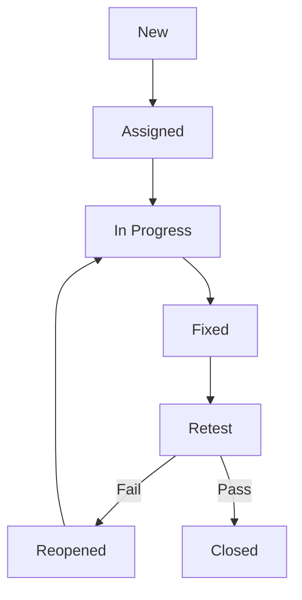

# TEST PLAN - HỆ THỐNG TIẾP NHẬN & XỬ LÝ PHẢN ÁNH (ĐÀ NẴNG LẮNG NGHE / THE LISTENING CITY)

---

## 1. DOCUMENT INFORMATION
| Field | Description |
| --- | --- |
| **Project Name** | Hệ thống Tiếp nhận & Xử lý Phản ánh (The Listening City / Đà Nẵng Lắng Nghe) |
| **Document Title** | TEST PLAN – System Management + Dashboard Module |
| **Version** | v2.0 |
| **Prepared By** | **Nhóm 05 - Lớp SE20A11 (Môn SWP391)** • Trần Minh Vĩ (DE190182) - QA Lead • Nguyễn Hoàng Trọng (DE190357) - Tester • Phạm Tuấn Việt (DE190714) - Tester • Phan Thanh Bình (DE190210) - Tester • Phạm Bá Trí (DE191029) - Tester |
| **Reviewed By** | PM / QA Manager |
| **Approved By** | Giảng viên hướng dẫn môn SWP391 / Hội đồng thẩm định |
| **Date** | 26/06/2026 |
| **Status** | Approved / Active |

---

## 2. REVISION HISTORY
| Version | Date | Author | Description |
| --- | --- | --- | --- |
| **1.0** | 19/05/2026 | QA Team | Phiên bản dự thảo ban đầu dựa trên mô tả giả lập (Vue/.NET) |
| **2.0** | 26/06/2026 | Nhóm 05 - SE20A11 | Cập nhật cấu trúc thực tế của hệ thống (React 19 + Spring Boot 4.0.6 + PostgreSQL & pgvector), cập nhật lịch trình kiểm thử 01 tháng và phân rã chi tiết kịch bản theo yêu cầu báo cáo môn học. |

---

## 3. INTRODUCTION
### 3.1 Purpose
Tài liệu Test Plan này xác định kế hoạch, mục tiêu, phạm vi, lịch trình, nguồn lực và các kỹ thuật kiểm thử áp dụng cho module **System Management + Dashboard** trong hệ thống Tiếp nhận & Xử lý Phản ánh. Tài liệu này đóng vai trò định hướng kiểm thử chất lượng cho toàn bộ thành viên Nhóm 05 trong thời gian triển khai dự án môn học SWP391.

### 3.2 Background
Hệ thống cho phép người dân gửi phản ánh hiện trường và hỗ trợ điều phối tự động qua AI (pgvector, RAG). Module **System Management + Dashboard** cung cấp công cụ vận hành cho Super Admin và cán bộ phường (Ward Staff) để quản lý cấu hình danh mục, phường/xã, tiếp nhận và phân công đơn vị giải quyết, đồng thời hiển thị biểu đồ thống kê đo lường KPI hiệu quả xử lý phản ánh đô thị.

---

## 4. PROJECT OVERVIEW
### 4.1 System Overview
Hệ thống hỗ trợ tiếp nhận, định vị GPS địa lý (geofencing), phân loại tự động bằng AI (RAG + pgvector), phân công và theo dõi xử lý phản ánh của người dân trên địa bàn thành phố Đà Nẵng. Module System Management + Dashboard tập trung vào việc vận hành và giám sát toàn hệ thống từ góc nhìn cấp cao của Super Admin và cán bộ xử lý đơn vị.

### 4.2 Key Modules
* **Ward & Location Management (Area)**: Quản lý phường/xã và địa bàn hành chính, hỗ trợ định vị theo tọa độ GPS bằng bounding-box geofencing.
* **Category Management**: Quản lý danh mục sự cố (Category), cấu hình vai trò chịu trách nhiệm xử lý (Managed by Role).
* **Dispatch & State Machine Management**: Tiếp nhận phản ánh, tự động phân loại bằng AI (RAG), phân công (Assign) cho cán bộ và chuyển đổi trạng thái của phản ánh qua máy trạng thái (`SUBMITTED`, `PENDING_RECEIVE`, `PENDING`, `NEED_LOCATION_REVIEW`, `ASSIGNED`, `IN_PROGRESS`, `WAITING_INFO`, `RESOLVED`, `REJECTED`).
* **Dashboard & Analytics**: Thống kê số lượng phản ánh, chỉ số KPI xử lý, xu hướng hàng tháng, hiệu suất giải quyết theo từng phường và các cơ quan chuyên trách (EVN, VNPT, DAWACO) qua biểu đồ trực quan.
* **Report Export**: Xuất báo cáo PDF và Excel thống kê phục vụ công tác thanh tra, giám sát.

### 4.3 Technology Stack
| Layer | Technology |
| --- | --- |
| **Frontend** | React 19 + TypeScript + TanStack Start (Router & Query) + Vite + Tailwind CSS v4 + Recharts (dashboard charts) |
| **Backend** | Spring Boot 4.0.6 (Java 21) Web API (Root package: `com.example.smartcity`) |
| **Database** | PostgreSQL 16 (với extension `vector` cho pgvector RAG và `postgis` cho geofencing) |
| **Authentication** | JWT Stateless Session (các vai trò: `CITIZEN`, `WARD_STAFF`, `POLICE`, `SUPER_ADMIN`) |

---

## 5. TEST OBJECTIVES
| Objective | Priority |
| --- | --- |
| **1** | Xác minh các API CRUD dữ liệu nền (Ward, Category) hoạt động chính xác và an toàn | High |
| **2** | Xác thực luồng điều phối phản ánh từ khi tiếp nhận (submit) $\rightarrow$ tự động phân loại bằng AI (RAG) và kiểm tra trùng lặp (vector similarity check) $\rightarrow$ phân công cán bộ $\rightarrow$ cập nhật trạng thái $\rightarrow$ ghi lịch sử logs | High |
| **3** | Đảm bảo các chỉ số Dashboard và Analytics hiển thị dữ liệu chính xác theo cơ sở dữ liệu thực tế và thời gian thực | High |
| **4** | Kiểm tra nghiêm ngặt phân quyền truy cập (RBAC), ngăn chặn lỗ hổng IDOR/BOLA trên các API phản ánh và quản trị (`/api/feedbacks/admin/all`, `/api/users/**`) | High |
| **5** | Xác minh tính năng xuất báo cáo PDF/Excel đầy đủ dữ liệu và định dạng | Medium |
| **6** | Đánh giá hiệu năng của các truy vấn aggregation (kpi, trend) trên lượng dữ liệu lớn và các câu lệnh JOIN tránh lỗi N+1 Query | Medium |
| **7** | Phát hiện lỗi bảo mật, lỗi logic và sự cố AI định tuyến sai để giảm thiểu rủi ro vận hành | High |

---

## 6. TEST SCOPE
### 6.1 In Scope
| Module | Feature | Description | Priority |
| --- | --- | --- | --- |
| **Ward** | Lấy danh sách phường | `GET /api/wards` – Lấy toàn bộ phường/xã | High |
| **Ward** | Tìm kiếm phường | `GET /api/wards/search` – Tìm kiếm theo tên | High |
| **Ward** | Định vị phường | `GET /api/wards/locate` – Xác định phường qua GPS (lat/lng) | High |
| **Category** | CRUD danh mục | `GET/POST/PUT/DELETE /api/categories`, `GET /api/categories/{id}` | High |
| **Dispatch** | Xem tất cả phản ánh | `GET /api/feedbacks/admin/all` – Danh sách admin feedback với phân trang | High |
| **Dispatch** | Gửi phản ánh (AI Auto-Dispatch) | `POST /api/feedbacks/submit` – Gửi phản ánh mới, tự động định tuyến và phân loại | High |
| **Dispatch** | Phân công phản ánh | `PATCH /api/feedbacks/{id}/assign` – Phân công cán bộ xử lý | High |
| **Dispatch** | Chuyển đổi trạng thái máy | `PATCH /api/feedbacks/{id}/status` – Cập nhật trạng thái và ghi nhận note | High |
| **Monitoring** | Theo dõi lịch sử phản ánh | `GET /api/feedbacks/{id}/logs` – Lịch sử thay đổi trạng thái | High |
| **Dashboard** | Thống kê cán bộ | `GET /api/dashboard/ward-staff/statistics` – Thống kê trạng thái | High |
| **Analytics** | Xem KPI tổng thể | `GET /api/analytics/kpi` – Chỉ số KPI theo các trạng thái lớn | High |
| **Analytics** | Hiệu suất giải quyết | `GET /api/analytics/ward-performance` – Thống kê hiệu suất theo phường | Medium |
| **Analytics** | Xu hướng hàng tháng | `GET /api/analytics/monthly-trend` – Số phản ánh và số đã xử lý theo tháng | Medium |
| **Analytics** | Đơn vị chuyên trách | `GET /api/analytics/dispatch` – Cơ quan chuyên trách (EVN, VNPT, DAWACO) | Medium |
| **Report** | Xuất báo cáo PDF | `GET /api/reports/pdf` – Xuất PDF báo cáo | Medium |
| **Report** | Xuất báo cáo Excel | `GET /api/reports/excel` – Xuất Excel báo cáo | Medium |

### 6.2 Out of Scope
- Chức năng chi tiết của các vai trò Citizen, Staff, Police khi thao tác trên ứng dụng di động hoặc màn hình cá nhân khác ngoài trang điều phối quản trị.
- Việc kết nối thực tế tới gateway SMS (Twilio) và Firebase MFA trong kiểm thử tự động (sử dụng Mock Services).
- Đánh giá lỗ hổng bảo mật cấp độ mạng/hạ tầng máy chủ (Penetration testing thực tế do bên thứ ba thực hiện).

---

## 7. TEST ITEMS
| No | Test Item | Description | Reference |
| --- | --- | --- | --- |
| **1** | Ward List API | `GET /api/wards` – Lấy danh sách phường/xã | `wards`, `districts` tables |
| **2** | Ward Search API | `GET /api/wards/search` – Tìm kiếm phường | `wards` table |
| **3** | Geofencing Locate API | `GET /api/wards/locate` – Xác định phường theo GPS | `wards` table |
| **4** | Category API | `GET/POST/PUT/DELETE /api/categories` – Quản lý danh mục | `categories` table |
| **5** | Feedback Admin List API | `GET /api/feedbacks/admin/all` – Danh sách admin feedback | `feedbacks` table |
| **6** | Feedback Submit API | `POST /api/feedbacks/submit` – Tạo phản ánh và phân loại AI | `feedbacks`, `ai_audit_logs` |
| **7** | Assign API | `PATCH /api/feedbacks/{id}/assign` – Phân công cán bộ | `feedbacks`, `feedback_logs` |
| **8** | Status API | `PATCH /api/feedbacks/{id}/status` – Chuyển đổi trạng thái | `feedbacks`, `feedback_logs` |
| **9** | Feedback Timeline API | `GET /api/feedbacks/{id}/logs` – Lịch sử thay đổi | `feedback_logs` |
| **10** | Ward Staff Statistics API | `GET /api/dashboard/ward-staff/statistics` – Thống kê đơn vị | `feedbacks` table |
| **11** | Analytics KPI API | `GET /api/analytics/kpi` – Chỉ số KPI tổng thể | `feedbacks` table |
| **12** | Analytics Ward Performance API | `GET /api/analytics/ward-performance` – Thống kê phường | `feedbacks` table |
| **13** | Analytics Monthly Trend API | `GET /api/analytics/monthly-trend` – Xu hướng tháng | `feedbacks` table |
| **14** | Analytics Dispatch Agency API | `GET /api/analytics/dispatch` – Cơ quan chuyên trách | `feedbacks` table |
| **15** | Report PDF API | `GET /api/reports/pdf` – Xuất PDF báo cáo | `dashboard_stats` table |
| **16** | Report Excel API | `GET /api/reports/excel` – Xuất Excel báo cáo | `dashboard_stats` table |
| **17** | Admin UI Screens | Các màn hình React 19 quản trị và Dashboard | Frontend code (`src/features/city-admin`, `src/features/ward`) |
| **18** | Database | PostgreSQL – Ràng buộc, index (`idx_feedbacks_vector`, v.v.) | PostgreSQL 16 DB |

---

## 8. TEST TYPES
| Test Type | Purpose | Application |
| --- | --- | --- |
| **Functional Testing** | Xác thực các nghiệp vụ CRUD, phân công, chuyển trạng thái và các luồng nghiệp vụ quản trị trên giao diện và API | Tất cả API và UI |
| **Integration Testing** | Kiểm tra tích hợp giữa Spring Boot backend và AI Engine (RAG/pgvector) trong việc phân loại và check trùng lặp; luồng ghi nhận logs khi thay đổi trạng thái | Dispatch $\leftrightarrow$ Feedback Logs, Auto-Dispatch $\leftrightarrow$ AI Audit Logs |
| **System Testing** | Kiểm tra luồng End-to-End từ lúc người dân gửi đơn phản ánh $\rightarrow$ AI tự động định tuyến và phân loại $\rightarrow$ Admin/Cán bộ phường tiếp nhận, phân công $\rightarrow$ Cán bộ xử lý cập nhật trạng thái $\rightarrow$ Dashboard cập nhật số liệu | Toàn bộ luồng nghiệp vụ hệ thống |
| **Regression Testing** | Đảm bảo các thay đổi code mới không phá vỡ logic phân quyền và máy trạng thái hiện tại | Thực thi sau mỗi PR hoặc release |
| **Performance Testing** | Đánh giá tốc độ và thời gian phản hồi của các API Analytics, Dashboard và truy vấn RAG dưới tải lớn, kiểm tra N+1 query | Analytics API, Dashboard API, Report export |
| **Security Testing** | Xác thực phân quyền Super Admin/Ward Staff (JWT), kiểm tra lỗ hổng IDOR/BOLA đối với các API xem và chỉnh sửa phản ánh, SQL Injection, XSS | Spring Security, Token-based authorization |
| **Usability Testing** | Đánh giá độ thân thiện của các biểu đồ Recharts trên Dashboard và các form tương tác | Dashboard UI, Form phân công |
| **Compatibility Testing** | Kiểm tra tương thích giao diện React trên Chrome, Edge, Safari, Firefox | Frontend UI |

---

## 9. TEST APPROACH / TEST STRATEGY
### 9.1 Testing Levels & Components Selection
Hệ thống sẽ được chia thành các tầng kiểm thử cụ thể nhằm tối ưu hóa khả năng phát hiện lỗi:

#### 9.1.1 Unit Testing (Kiểm thử đơn vị)
Do nhà phát triển viết sử dụng **JUnit 5** và **Mockito**.
* **Thành phần kiểm thử được lựa chọn**:
  1. `createFeedback(FeedbackRequest request, String username)` trong [FeedbackService](file:///d:/swp391-su26-ai-audit-project-swp391_se20a11_group-05/Sources/Backend/src/main/java/com/example/smartcity/modules/feedback/service/FeedbackService.java): Kiểm thử việc khởi tạo phản ánh hợp lệ, kiểm tra sinh tracking code ngẫu nhiên và tính đúng đắn của việc gán người dùng.
  2. `changeStatus(Long id, FeedbackStatus status, String note, ...)` trong [FeedbackService](file:///d:/swp391-su26-ai-audit-project-swp391_se20a11_group-05/Sources/Backend/src/main/java/com/example/smartcity/modules/feedback/service/FeedbackService.java): Kiểm thử các trạng thái chuyển dịch của máy trạng thái phản ánh và ghi nhận lịch sử vào `feedback_logs`.
  3. `findAuthorityByLocation(double lat, double lng)` trong [LocationResolutionService](file:///d:/swp391-su26-ai-audit-project-swp391_se20a11_group-05/Sources/Backend/src/main/java/com/example/smartcity/modules/core/service/LocationResolutionService.java): Kiểm thử thuật toán bounding-box định vị phường tương ứng từ vị trí GPS.
* **Kỹ thuật kiểm thử đơn vị áp dụng**:
  * **Black Box Testing**:
    * *Equivalence Partitioning (EP - Phân vùng tương đương)*: Chia tọa độ thành 3 vùng: Nằm hoàn toàn trong Đà Nẵng, nằm ngoài Đà Nẵng, và tọa độ không hợp lệ (ví dụ: Lat > 90 hoặc Lng > 180).
    * *Boundary Value Analysis (BVA - Phân tích giá trị biên)*: Kiểm thử giá trị độ dài chuỗi ký tự biên của các trường đầu vào (ví dụ: Tiêu đề đúng 10 ký tự, đúng 255 ký tự, hoặc 256 ký tự để kiểm tra thông báo lỗi).
  * **White Box Testing**:
    * *Statement Coverage (Bao phủ câu lệnh)*: Đảm bảo viết đầy đủ test case để chạy qua 100% dòng lệnh trong service xử lý logic.
    * *Decision Coverage (Bao phủ nhánh/quyết định)*: Đảm bảo kiểm thử tất cả các nhánh điều kiện logic `if/else`, ví dụ logic phân biệt người dùng là `SUPER_ADMIN`, `WARD_STAFF` hay `CITIZEN` trong việc phân quyền xem đơn.

#### 9.1.2 Integration Testing (Kiểm thử tích hợp)
Sử dụng Spring Boot MockMvc để gọi API end-to-end giả lập và đối chiếu dữ liệu trong Database. Kiểm tra tích hợp giữa backend Spring Boot với dịch vụ Mock AI API trong việc nhận diện phản ánh trùng lặp.

#### 9.1.3 System Testing (Kiểm thử hệ thống)
* **Decision Table Testing**: Áp dụng kiểm thử giao diện (UI Form) với các quy tắc ràng buộc chặt chẽ của các trường (Chi tiết xem tại Appendix C).
* **Use Case Testing**: Áp dụng kiểm thử hành trình người dùng (User Journey) (Chi tiết xem tại Appendix D).

#### 9.1.4 User Acceptance Testing (UAT)
Kiểm thử chấp nhận người dùng được thực hiện bởi đại diện quản lý đô thị Đà Nẵng trên môi trường pre-production.

---

## 10. ENTRY CRITERIA
* Tài liệu yêu cầu (SRS) và các tài liệu kiến trúc của module System Management + Dashboard đã được phê duyệt.
* Môi trường kiểm thử (Staging) đã sẵn sàng với DB PostgreSQL và dữ liệu mẫu đầy đủ.
* Build chứa backend Spring Boot (cổng 8081) và frontend React (TanStack Start) đã được deploy thành công.
* Dữ liệu thử nghiệm cho các bảng `districts`, `wards`, `categories`, `users` đã được chuẩn bị sẵn sàng.
* Kịch bản kiểm thử (Test Cases) đã được review và phê duyệt bởi QA Lead.
* Tài liệu API (Swagger UI) đã cập nhật đầy đủ.

---

## 11. EXIT CRITERIA
* 100% test cases mức độ High đã được thực thi và PASS.
* $\ge$ 95% test cases mức độ Medium đã được thực thi và PASS.
* Không còn lỗi ở mức độ Severity Critical và High ở trạng thái Open.
* Tất cả lỗi liên quan đến phân quyền (RBAC) và lỗi IDOR/BOLA đã được sửa và retest thành công.
* Báo cáo tổng hợp kiểm thử (Test Summary Report) đã hoàn thành và gửi cho PM.
* Super Admin đại diện khách hàng đã thực hiện UAT và ký biên bản nghiệm thu (Sign-off).

---

## 12. TEST ENVIRONMENT
| Component | Configuration |
| --- | --- |
| **Frontend** | React 19 + TypeScript + Vite + Tailwind CSS v4 |
| **Backend** | Spring Boot 4.0.6 (Java 21) |
| **Database** | PostgreSQL 16 (PostGIS + pgvector extension) |
| **Browser** | Chrome (latest), Edge (latest), Firefox (latest), Safari (latest) |
| **OS Server** | Windows Server 2022 / Linux Ubuntu 22.04 |
| **OS Client** | Windows 11 / macOS |

---

## 13. TEST TOOLS
Hệ thống sử dụng các bộ công cụ kiểm thử hiện đại để kiểm soát chất lượng từ khâu phát triển đến vận hành:

* **Static Code Analysis Tool (SonarQube)**:
  * *Mục đích*: Tự động phân tích chất lượng code (code smells, bảo mật lỗ hổng OWASP) cho phần backend Spring Boot và frontend React.
  * *Cài đặt/Tích hợp*: Cài đặt SonarQube cục bộ bằng Docker và tích hợp plugin quét qua maven command (`mvn sonar:sonar`).
* **Automation Testing Tool (Playwright & Newman/Postman)**:
  * *Playwright*: Dùng để tự động hóa kịch bản kiểm thử giao diện người dùng React 19 (tự động hóa luồng click chọn, điền form, kiểm tra hiển thị Dashboard).
  * *Postman / Newman*: Viết bộ test API tự động dưới dạng JSON Collection, sử dụng Newman để chạy trực tiếp trên cửa sổ dòng lệnh trong CI/CD.
* **Test Management Tool (Jira)**:
  * *Mục đích*: Quản lý danh sách lỗi phát hiện, gán lỗi cho Developer và theo dõi trạng thái vòng đời lỗi.
* **Database Verification Tool (DBeaver / pgAdmin)**:
  * *Mục đích*: Truy vấn dữ liệu thực tế trong PostgreSQL để đối chiếu tính đúng đắn khi thực hiện test.
* **CI/CD Integration (GitHub Actions)**:
  * *Mục đích*: Tự động kích hoạt toàn bộ suite test JUnit và quét SonarQube mỗi khi tạo Pull Request mới.

---

## 14. TEST DATA MANAGEMENT
### 14.1 Data Sources
* Sử dụng công cụ migration Flyway (`V1__init_all.sql` và các script seed) để tự động hóa việc đưa dữ liệu giả lập (mock data) vào môi trường staging.
* Dữ liệu giả lập bao gồm các trường hợp tên tiếng Việt có dấu, ký tự đặc biệt, tọa độ biên của các phường/quận tại Đà Nẵng để kiểm tra định vị địa lý (geofencing).

### 14.2 Sample Datasets
| Dataset | Purpose | Tables |
| --- | --- | --- |
| **Valid Locations** | Kiểm thử CRUD Ward và định vị địa lý GPS | `districts`, `wards` |
| **Valid Categories** | Kiểm thử CRUD danh mục sự cố | `categories` |
| **User Accounts** | Kiểm thử phân quyền RBAC & chống IDOR | `users` (SUPER_ADMIN, WARD_STAFF, POLICE, CITIZEN) |
| **Mixed Feedbacks** | Kiểm thử máy trạng thái, cập nhật tiến độ | `feedbacks`, `feedback_logs`, `attachments` |
| **Large Dataset** | Kiểm thử hiệu năng truy vấn Dashboard & Analytics | `feedbacks`, `dashboard_stats` (10k+ records) |
| **Invalid Data** | Kiểm thử lỗi đầu vào, validate dữ liệu | All tables |

---

## 15. ROLES AND RESPONSIBILITIES
Để đáp ứng đầy đủ yêu cầu phân công công việc của dự án môn học SWP391 gồm 5 thành viên, vai trò của từng thành viên trong nhóm QA được phân chia cụ thể như sau:

| No | Student ID | Full Name | Project Role | Responsibility |
| --- | --- | --- | --- | --- |
| 1 | **DE190182** | **Trần Minh Vĩ** | QA Lead / Tester | • Lập kế hoạch kiểm thử (Test Plan) • Quản lý tiến độ kiểm thử, quản lý Jira Board • Phê duyệt kịch bản kiểm thử và làm báo cáo tổng kết |
| 2 | **DE190357** | **Nguyễn Hoàng Trọng** | Tester | • Thiết kế và thực thi kịch bản **Unit Test** trên Spring Boot • Áp dụng kỹ thuật phân vùng tương đương (EP), phân tích giá trị biên (BVA) • Đánh giá Statement Coverage và Decision Coverage |
| 3 | **DE190714** | **Phạm Tuấn Việt** | Tester | • Thiết kế và thực thi kiểm thử hệ thống bằng kỹ thuật **Decision Table Testing** • Tập trung kiểm thử giao diện Form Gửi phản ánh với các quy tắc ràng buộc các trường dữ liệu đầu vào |
| 4 | **DE190210** | **Phan Thanh Bình** | Tester | • Thiết kế và thực thi kiểm thử hệ thống bằng kỹ thuật **Use Case Testing** • Thiết kế các kịch bản hành trình người dùng (User Journey) E2E từ citizen đến ward staff |
| 5 | **DE191029** | **Phạm Bá Trí** | Tester | • Quản lý và vận hành các **Testing Tools** trong dự án • Cài đặt quét chất lượng code SonarQube, phát triển kịch bản Playwright và tự động hóa API bằng Postman/Newman |

---

## 16. TEST SCHEDULE
Kế hoạch kiểm thử của dự án được phân bổ kéo dài **đúng 01 tháng (từ ngày 26/06/2026 đến ngày 26/07/2026)** theo tiến độ môn học:

| Phase | Start Date | End Date | Owner | Deliverable |
| --- | --- | --- | --- | --- |
| **Test Planning** | 26/06/2026 | 30/06/2026 | Trần Minh Vĩ | Kế hoạch kiểm thử (Test Plan v2.0) được phê duyệt |
| **Test Case Design** | 01/07/2026 | 07/07/2026 | Cả nhóm QA | Kịch bản kiểm thử chi tiết (Test Cases) + Bảng ma trận đặc tả RTM |
| **Environment Setup & Data Seeding** | 08/07/2026 | 10/07/2026 | Phạm Bá Trí | Môi trường Staging sẵn sàng, nạp dữ liệu mẫu thành công |
| **Test Execution (Sprint 1 - CRUD APIs)** | 11/07/2026 | 15/07/2026 | Nguyễn Hoàng Trọng | Báo cáo kiểm thử đơn vị, CRUD Ward & Category hoàn thành |
| **Test Execution (Sprint 2 - Dispatch Workflow)** | 16/07/2026 | 20/07/2026 | Phạm Tuấn Việt & Phan Thanh Bình | Hoàn thành kiểm thử luồng State Machine, phân công và AI Auto-dispatch |
| **Test Execution (Sprint 3 - Dashboard & Report)** | 21/07/2026 | 23/07/2026 | Cả nhóm QA | Hoàn thành kiểm thử Recharts, Analytics KPI & xuất báo cáo PDF/Excel |
| **Regression & Bug Retesting** | 24/07/2026 | 25/07/2026 | Cả nhóm QA | Xác minh lỗi đã sửa thành công, báo cáo Regression Test |
| **Test Closure & Sign-off** | 26/07/2026 | 26/07/2026 | Trần Minh Vĩ | Ký duyệt UAT, xuất bản Báo cáo kết quả kiểm thử (Test Summary Report) |

---

## 17. DEFECT MANAGEMENT PROCESS
### 17.1 Workflow

### 17.2 Severity Levels
* **Critical**: Hệ thống crash, lộ thông tin nhạy cảm qua API log; lỗi cập nhật `feedback_logs` làm mất dữ liệu lịch sử xử lý; dashboard analytics treo hoàn toàn không phản hồi.
* **High**: Không thực hiện được chức năng nghiệp vụ chính (không gán được người xử lý, không cập nhật được trạng thái phản ánh); lỗi IDOR cho phép tài khoản `WARD_STAFF` của phường A xem/sửa phản ánh của phường B; AI Auto-dispatch bị lỗi định tuyến liên tục.
* **Medium**: Các bộ lọc trên Dashboard hiển thị sai lệch nhẹ do múi giờ; xuất báo cáo Excel/PDF bị lỗi định dạng hoặc thiếu cột đính kèm; KPI tính toán sai công thức tỉ lệ % giải quyết.
* **Low**: Lỗi chính tả giao diện; icon không đúng thiết kế; màu sắc hiển thị trạng thái lệch tông.

---

## 18. RISKS AND MITIGATION
| Risk | Impact | Mitigation |
| --- | --- | --- |
| **Delayed build delivery** | Trì hoãn việc thực thi kiểm thử | QA chủ động viết kịch bản test trước, theo dõi sát tiến độ deploy và chạy smoke test nhanh khi có build mới. |
| **Unstable AI Engine** | AI Auto-Dispatch phân loại sai hoặc timeout | Sử dụng Mock Gemini/GroQ Service trong bộ kiểm thử API tự động để cô lập logic backend. |
| **Complex Analytics SQL** | Tính toán số liệu thống kê sai lệch | Viết các câu lệnh SQL đối chiếu trực tiếp dữ liệu thô (raw data) với kết quả trả về từ API Analytics. |
| **Requirements change** | Rework kịch bản kiểm thử nhiều lần | Giữ kịch bản kiểm thử ở dạng modular, thảo luận sớm với PM khi có thay đổi nghiệp vụ để cập nhật kịp thời. |

---

## 19. TEST DELIVERABLES
* Test Plan (tài liệu này)
* Test Cases & Ma trận RTM (Requirement Traceability Matrix)
* Test Scripts (JUnit, Playwright, Newman API collections)
* Defect Reports (Danh sách lỗi trên Jira)
* Test Execution Logs
* Test Summary Report (Báo cáo tổng hợp kết quả kiểm thử)

---

## 20. COMMUNICATION PLAN
| Activity | Frequency | Participants | Method |
| --- | --- | --- | --- |
| **Daily QA Standup** | Hàng ngày | QA Team | Online meeting / Chat nhóm |
| **Defect Review Meeting** | 2 lần/tuần | QA + Dev + PM | Jira board + Meeting |
| **Test Status Report** | Hàng tuần | Stakeholders, PM | Gửi email báo cáo + Dashboard |
| **UAT Feedback Session** | Theo lịch UAT | Super Admin + QA + PM | Demo trực tiếp + Ghi nhận danh sách lỗi |

---

## 21. APPROVALS
| Name | Role | Signature | Date |
| --- | --- | --- | --- |
| **Trần Minh Vĩ** | QA Lead | | |
| **Project Manager** | PM | | |
| **Customer Representative** | Super Admin | | |

---

## 22. APPENDIX A – TEST CASE TEMPLATE
| Field | Description |
| --- | --- |
| **Test Case ID** | Mã định danh duy nhất (Ví dụ: SYS-WARD-001, DSH-KPI-001) |
| **Module** | Tên module (System Management / Dashboard / Analytics / Dispatch) |
| **Feature** | Tên chức năng kiểm thử |
| **Priority** | Mức độ ưu tiên (High / Medium / Low) |
| **Preconditions** | Điều kiện tiên quyết để chạy test (Ví dụ: User đã login vai trò SUPER_ADMIN, DB đã seed dữ liệu...) |
| **Test Steps** | Các bước thực hiện chi tiết theo thứ tự |
| **Expected Result** | Kết quả mong đợi của hệ thống |
| **Actual Result** | Kết quả thực tế khi chạy |
| **Status** | Trạng thái (Pass / Fail / Blocked) |
| **Notes** | Ghi chú thêm (nếu có) |

---

## 23. APPENDIX B – DEFECT REPORT TEMPLATE
| Field | Description |
| --- | --- |
| **Defect ID** | Mã định danh lỗi (Ví dụ: BUG-2026-001) |
| **Summary** | Mô tả ngắn gọn tiêu đề lỗi |
| **Module** | Tên module phát hiện lỗi |
| **Steps to Reproduce** | Các bước chi tiết để tái hiện lỗi |
| **Expected Result** | Kết quả đúng hệ thống phải đạt được |
| **Actual Result** | Kết quả sai thực tế hệ thống đang hiển thị |
| **Severity** | Mức độ nghiêm trọng (Critical / High / Medium / Low) |
| **Priority** | Mức độ ưu tiên xử lý (P1 / P2 / P3 / P4) |
| **Status** | Trạng thái lỗi (New / Assigned / In Progress / Fixed / Retest / Closed) |
| **Environment** | Môi trường phát hiện lỗi (Staging / Production) |
| **Attachments** | Các tệp đính kèm (Ảnh chụp màn hình, video tái hiện, file logs) |

---

## 24. APPENDIX C – DECISION TABLE TESTING SAMPLE

### System Test – Decision Table Testing (Black Box)
#### Chức năng: Tạo chiến dịch tình nguyện (Create Campaign)

---

#### 1. Phân loại kỹ thuật kiểm thử

| Tiêu chí | Thông tin |
| :--- | :--- |
| **Loại kiểm thử** | System Test |
| **Kỹ thuật** | Decision Table Testing |
| **Phân loại** | Black Box Testing |
| **Lý do chọn Black Box** | Test case được thiết kế từ đặc tả yêu cầu nghiệp vụ và UI form spec — tester không cần biết source code bên trong. |

---

#### 2. Mô tả chức năng

**Actor:** Cán bộ phường (WARD_STAFF), Công an (POLICE), Quản trị viên (SUPER_ADMIN)

**Mô tả:** Người dùng có quyền điền form UI để tạo chiến dịch tình nguyện mới. Hệ thống kiểm tra quyền hạn, dữ liệu form và quy tắc địa lý trước khi lưu.

---

#### 3. Phân tích Business Rules

| Field | Bắt buộc | Rule | Tầng kiểm tra |
| :--- | :---: | :--- | :--- |
| title | Yes | Không trống, <= 255 ký tự | Backend |
| privateLocationText | Yes | Không trống, <= 500 ký tự | Backend |
| requiredTools | Yes | Không trống | Backend |
| organizerContact | Yes | Không trống, <= 255 ký tự | Backend |
| minParticipants | Yes | Số nguyên >= 1 | Backend |
| maxParticipants | Yes | Số nguyên >= 1 | Backend |
| min + max kết hợp | Yes | min <= max | Backend |
| startTime + endTime | Optional | end > start | UI-side only |
| latitude / longitude | Optional | Nếu nhập: phải trong địa bàn Phường. Nếu null: bỏ qua | Backend |
| Role | Yes | WARD_STAFF / POLICE / SUPER_ADMIN | Backend |
| Ward assignment | Yes | WARD_STAFF phải có Ward. POLICE/ADMIN không cần | Backend |

> **Phát hiện quan trọng từ code:**
> - Backend KHÔNG validate endTime > startTime — chỉ là UI rule
> - Backend bỏ qua GPS check khi latitude == null
> - WARD_STAFF không có Ward -> lỗi riêng, dù form đúng hết

---

#### 4. Conditions và Actions

### Conditions (7)

| Ký hiệu | Điều kiện | Tầng |
| :---: | :--- | :--- |
| C1 | Role là WARD_STAFF / POLICE / SUPER_ADMIN? | Backend |
| C2 | WARD_STAFF đã được phân công Phường? (POLICE/ADMIN luôn pass) | Backend |
| C3 | Nhập đủ 4 field bắt buộc? | Backend |
| C4 | min >= 1 VÀ max >= 1? | Backend |
| C5 | min <= max? | Backend |
| C6 | endTime > startTime? | UI-side only |
| C7 | GPS (nếu nhập) trong địa bàn Phường? (null -> skip) | Backend |

### Actions (9)

| Ký hiệu | Kết quả | HTTP |
| :---: | :--- | :---: |
| A1 | Lỗi: "Bạn không có quyền tạo chiến dịch" | 403 |
| A2 | Lỗi: "Tài khoản chưa được phân công quản lý phường/xã" | 409 |
| A3 | Lỗi: Highlight field trống, "Không được để trống" | 400 |
| A4 | Lỗi: "Số người tối thiểu/tối đa phải >= 1" | 400 |
| A5 | Lỗi: "Số người tối thiểu không được lớn hơn tối đa" | 400 |
| A6 | Lỗi UI: "Thời gian kết thúc phải sau thời gian bắt đầu" | UI only |
| A7 | Lỗi: "Địa điểm nằm ngoài địa bàn phường được phân công" | 403 |
| A8 | Tạo thành công, status = RECRUITING (có GPS) | 201 |
| A9 | Tạo thành công, status = RECRUITING (không GPS) | 201 |

---

#### 5. Bảng quyết định rút gọn (Collapsed Decision Table — 9 Rules)

> Ký hiệu: Y = Hợp lệ | N = Vi phạm | - = Don't Care | n/a = Không áp dụng

| Conditions / Actions | R1 | R2 | R3 | R4 | R5 | R6 | R7 | R8 | R9 |
| :--- | :---: | :---: | :---: | :---: | :---: | :---: | :---: | :---: | :---: |
| C1: Role hợp lệ? | N | Y | Y | Y | Y | Y | Y | Y | Y |
| C2: WARD_STAFF có Ward? | - | N | Y | Y | Y | Y | Y | Y | Y |
| C3: Đủ field bắt buộc? | - | - | N | Y | Y | Y | Y | Y | Y |
| C4: min>=1 VÀ max>=1? | - | - | - | N | Y | Y | Y | Y | Y |
| C5: min <= max? | - | - | - | - | N | Y | Y | Y | Y |
| C6: end > start? (UI-side) | - | - | - | - | - | N | Y | Y | Y |
| C7: GPS hợp lệ hoặc null? | - | - | - | - | - | - | N | Y | n/a |
| GPS được nhập? | - | - | - | - | - | - | Y | Y | N |
| | | | | | | | | | |
| A1: Lỗi Role | X | | | | | | | | |
| A2: Lỗi Ward | | X | | | | | | | |
| A3: Lỗi field trống | | | X | | | | | | |
| A4: Lỗi số người < 1 | | | | X | | | | | |
| A5: Lỗi min > max | | | | | X | | | | |
| A6: Lỗi end < start (UI) | | | | | | X | | | |
| A7: Lỗi GPS ngoài địa bàn | | | | | | | X | | |
| A8: Thành công (có GPS) | | | | | | | | X | |
| A9: Thành công (không GPS) | | | | | | | | | X |

> Từ 2^7 = 128 tổ hợp -> Rút gọn còn 9 Rules. R8 và R9 tách làm 2 happy path vì behavior của C7 khác nhau.

---

#### 6. Thiết kế Test Case (Black Box – theo template chuẩn)

### TC_CC_01 — Rule 1: Lỗi sai Role

| Mục | Nội dung |
| :--- | :--- |
| Test Case ID | TC_CC_01 |
| Test Case Name | Tạo chiến dịch khi đăng nhập bằng tài khoản Citizen |
| Test Objective | Kiểm tra hệ thống chặn người dùng không có quyền tạo chiến dịch |
| Pre-conditions | Đăng nhập bằng tài khoản Role = CITIZEN |
| Test Steps | 1. Đăng nhập tài khoản Citizen / 2. Truy cập trang tạo chiến dịch / 3. Điền đầy đủ thông tin hợp lệ / 4. Bấm "Tạo chiến dịch" |
| Test Data | Role: CITIZEN / title: "Dọn dẹp" / min=5 / max=20 / các field hợp lệ |
| Expected Result | HTTP 403. Thông báo: "Bạn không có quyền tạo chiến dịch" |
| Actual Result | (Điền sau khi chạy test) |
| Status | Pass / Fail |

### TC_CC_02 — Rule 2: Lỗi WARD_STAFF chưa có Ward

| Mục | Nội dung |
| :--- | :--- |
| Test Case ID | TC_CC_02 |
| Test Case Name | Tạo chiến dịch khi cán bộ chưa được phân công Phường |
| Test Objective | Kiểm tra điều kiện WARD_STAFF phải có Ward trước khi tạo |
| Pre-conditions | Đăng nhập tài khoản Role = WARD_STAFF, ward = null |
| Test Steps | 1. Đăng nhập WARD_STAFF chưa có Ward / 2. Truy cập form tạo chiến dịch / 3. Điền đầy đủ thông tin hợp lệ / 4. Bấm "Tạo chiến dịch" |
| Test Data | Role: WARD_STAFF / ward: null / form hợp lệ hoàn toàn |
| Expected Result | HTTP 409. Thông báo: "Tài khoản chưa được phân công quản lý phường/xã" |
| Actual Result | (Điền sau khi chạy test) |
| Status | Pass / Fail |

### TC_CC_03 — Rule 3: Lỗi field bắt buộc trống

| Mục | Nội dung |
| :--- | :--- |
| Test Case ID | TC_CC_03 |
| Test Case Name | Tạo chiến dịch khi để trống trường bắt buộc |
| Test Objective | Kiểm tra validate field bắt buộc |
| Pre-conditions | WARD_STAFF đã có Ward |
| Test Steps | 1. Vào form tạo chiến dịch / 2. Bỏ trống Tên chiến dịch / 3. Điền các field còn lại hợp lệ / 4. Bấm "Tạo chiến dịch" |
| Test Data | title: (trống) / min=5 / max=20 / các field khác hợp lệ |
| Expected Result | HTTP 400. UI highlight lỗi: "Tên chiến dịch không được để trống". Không lưu DB. |
| Actual Result | (Điền sau khi chạy test) |
| Status | Pass / Fail |

### TC_CC_04 — Rule 4: Lỗi số người < 1

| Mục | Nội dung |
| :--- | :--- |
| Test Case ID | TC_CC_04 |
| Test Case Name | Tạo chiến dịch khi nhập số người tối thiểu = 0 |
| Test Objective | Kiểm tra validate @Min(1) |
| Pre-conditions | WARD_STAFF đã có Ward |
| Test Steps | 1. Vào form / 2. Nhập min = 0 / 3. Điền còn lại hợp lệ / 4. Bấm "Tạo chiến dịch" |
| Test Data | title: "Trồng cây" / min=0 / max=20 / các field khác hợp lệ |
| Expected Result | HTTP 400. Thông báo: "Số người tối thiểu phải lớn hơn 0" |
| Actual Result | (Điền sau khi chạy test) |
| Status | Pass / Fail |

### TC_CC_05 — Rule 5: Lỗi min > max (Rule kết hợp 2 field)

| Mục | Nội dung |
| :--- | :--- |
| Test Case ID | TC_CC_05 |
| Test Case Name | Tạo chiến dịch khi số người tối thiểu lớn hơn số người tối đa |
| Test Objective | Kiểm tra business rule kết hợp giữa 2 field: minParticipants và maxParticipants |
| Pre-conditions | WARD_STAFF đã có Ward |
| Test Steps | 1. Vào form / 2. Nhập min=50, max=10 / 3. Điền còn lại hợp lệ / 4. Bấm "Tạo chiến dịch" |
| Test Data | title: "Vệ sinh phố" / min=50 / max=10 / các field khác hợp lệ |
| Expected Result | HTTP 400. Thông báo: "Số người tối thiểu không được lớn hơn số người tối đa" |
| Actual Result | (Điền sau khi chạy test) |
| Status | Pass / Fail |

### TC_CC_06 — Rule 6: Lỗi endTime < startTime (UI-side only)

| Mục | Nội dung |
| :--- | :--- |
| Test Case ID | TC_CC_06 |
| Test Case Name | Tạo chiến dịch khi thời gian kết thúc trước thời gian bắt đầu |
| Test Objective | Kiểm tra UI-side validation — hệ thống KHÔNG gửi request khi vi phạm |
| Pre-conditions | WARD_STAFF đã có Ward |
| Test Steps | 1. Vào form / 2. Nhập start = 2026-07-20T09:00 / 3. Nhập end = 2026-07-19T08:00 (trước start) / 4. Bấm "Tạo chiến dịch" |
| Test Data | start=2026-07-20T09:00 / end=2026-07-19T08:00 / min=5 / max=20 |
| Expected Result | UI chặn, không gửi HTTP request. Hiển thị: "Thời gian kết thúc phải sau thời gian bắt đầu" |
| Known Gap | Nếu bypass UI và gọi API thẳng -> Backend chấp nhận (không validate). Đây là security gap cần cải thiện. |
| Actual Result | (Điền sau khi chạy test) |
| Status | Pass / Fail |

### TC_CC_07 — Rule 7: Lỗi GPS ngoài địa bàn

| Mục | Nội dung |
| :--- | :--- |
| Test Case ID | TC_CC_07 |
| Test Case Name | Tạo chiến dịch khi tọa độ GPS nằm ngoài địa bàn phường quản lý |
| Test Objective | Kiểm tra geofencing — chỉ kích hoạt khi GPS được nhập |
| Pre-conditions | WARD_STAFF được phân công Phường Hải Châu 1 (lat~16.067, lng~108.224) |
| Test Steps | 1. Vào form / 2. Nhập tọa độ thuộc Phường Thanh Khê / 3. Điền đủ form hợp lệ / 4. Bấm "Tạo chiến dịch" |
| Test Data | lat=16.065, lng=108.190 (Phường Thanh Khê - xác minh bằng Google Maps) / min=5 / max=20 / start < end |
| Expected Result | HTTP 403. Thông báo: "Địa điểm chiến dịch nằm ngoài địa bàn Hải Châu 1 (hệ thống xác định là Thanh Khê)" |
| Actual Result | (Điền sau khi chạy test) |
| Status | Pass / Fail |

### TC_CC_08 — Rule 8: Thành công (có GPS)

| Mục | Nội dung |
| :--- | :--- |
| Test Case ID | TC_CC_08 |
| Test Case Name | Tạo chiến dịch thành công có nhập tọa độ GPS |
| Test Objective | Kiểm tra happy path đầy đủ khi nhập GPS hợp lệ |
| Pre-conditions | WARD_STAFF được phân công Phường. Tọa độ trong địa bàn. |
| Test Steps | 1. Vào form / 2. Điền đầy đủ tất cả field hợp lệ / 3. Nhập GPS trong địa bàn Phường / 4. Bấm "Tạo chiến dịch" |
| Test Data | title: "Dọn dẹp bờ biển" / tools: "Bao, găng tay" / contact: "0901234567" / min=5 / max=20 / start=2026-07-25T07:00 / end=2026-07-25T11:00 / lat,lng trong địa bàn Phường |
| Expected Result | HTTP 201. Chiến dịch lưu DB. UI redirect đến trang chi tiết. Status = RECRUITING |
| Actual Result | (Điền sau khi chạy test) |
| Status | Pass / Fail |

### TC_CC_09 — Rule 9: Thành công (không GPS) — Case mới

| Mục | Nội dung |
| :--- | :--- |
| Test Case ID | TC_CC_09 |
| Test Case Name | Tạo chiến dịch thành công khi không nhập tọa độ GPS |
| Test Objective | Kiểm tra C7 thực sự bỏ qua khi GPS = null — đây là behavior quan trọng của hệ thống |
| Pre-conditions | WARD_STAFF đã có Ward |
| Test Steps | 1. Vào form / 2. Điền đủ tất cả field bắt buộc / 3. Để trống tọa độ GPS (lat, lng) / 4. Bấm "Tạo chiến dịch" |
| Test Data | Tất cả field bắt buộc hợp lệ / lat = null, lng = null (không nhập GPS) |
| Expected Result | HTTP 201. Chiến dịch lưu DB thành công. Status = RECRUITING. GPS validation bị bỏ qua hoàn toàn. |
| Actual Result | (Điền sau khi chạy test) |
| Status | Pass / Fail |

---

#### 7. Tổng kết

| Tiêu chí | Kết quả |
| :--- | :--- |
| Kỹ thuật | Black Box – Decision Table Testing |
| Tổng số Conditions | 7 (6 Backend + 1 UI-side) |
| Tổng Rules (sau rút gọn) | 9 (từ 2^7 = 128 tổ hợp lý thuyết) |
| Tổng Test Cases | 9 |
| Rules kết hợp nhiều field | 3 (C5: min<=max, C6: end>start, C7: GPS conditional) |
| Happy Paths | 2 (TC_CC_08: có GPS, TC_CC_09: không GPS) |
| Phát hiện đặc biệt 1 | Backend KHÔNG validate endTime > startTime |
| Phát hiện đặc biệt 2 | GPS null -> backend skip geofencing check hoàn toàn |
| Known Gap | API bypass qua UI có thể submit endTime < startTime mà không bị chặn |

### PHẦN A: Hủy đăng ký tham gia chiến dịch (Leave Campaign)

#### A1. Phân loại

| Tiêu chí | Thông tin |
| :--- | :--- |
| Loại kiểm thử | System Test |
| Kỹ thuật | Decision Table Testing |
| Phân loại | Black Box Testing |
| Actor | CITIZEN (người đã đăng ký) |

#### A2. Mô tả chức năng

Người dùng (Citizen) đã đăng ký tham gia chiến dịch muốn hủy đăng ký. Hệ thống kiểm tra các điều kiện về thời gian, trạng thái đăng ký và số lần hủy trước khi cho phép.

#### A3. Phân tích Business Rules

| Rule | Mô tả | Nguồn gốc |
| :--- | :--- | :--- |
| R1 | User phải có bản ghi đăng ký cho chiến dịch này | Backend |
| R2 | Trạng thái đăng ký phải là PENDING / APPROVED / WAITLIST / PENDING_CONFIRM | Backend |
| R3 | Số lần đã hủy (cancelCount) phải < 1 (không được hủy 2 lần liên tiếp) | Backend |
| R4 | Phải còn ít nhất 12 giờ trước khi chiến dịch bắt đầu (startTime) | Backend |

> Phát hiện từ code: C4 (thời gian 12h) được kiểm tra TRƯỚC khi tìm bản ghi đăng ký (line 264 trước line 268). Thứ tự kiểm tra ảnh hưởng đến output khi test.

#### A4. Conditions và Actions

### Conditions (4)

| Ky hieu | Dieu kien | Tang |
| :---: | :--- | :--- |
| C1 | Con >= 12 gio truoc khi chien dich bat dau? | Backend |
| C2 | User co ban ghi dang ky cho chien dich nay khong? | Backend |
| C3 | Trang thai dang ky la PENDING / APPROVED / WAITLIST / PENDING_CONFIRM? | Backend |
| C4 | So lan huy (cancelCount) < 1? | Backend |

### Actions (5)

| Ky hieu | Ket qua | HTTP |
| :---: | :--- | :---: |
| A1 | Loi: "Chi co the huy toi thieu 12 gio truoc khi chien dich bat dau." | 400 |
| A2 | Loi: "Khong tim thay thong tin dang ky cua ban cho chien dich nay." | 404 |
| A3 | Loi: "Trang thai dang ky hien tai khong the thuc hien huy." | 400 |
| A4 | Loi: "Khong duoc phep huy tham gia 2 lan lien tiep cho cung mot chien dich." | 400 |
| A5 | Huy dang ky thanh cong. Trang thai -> CANCELLED. He thong tu dong promote nguoi trong danh sach cho. | 200 |

#### A5. Bang quyet dinh rut gon (5 Rules)

> Y = Hop le | N = Vi pham | - = Don't Care

| Conditions / Actions | R1 | R2 | R3 | R4 | R5 |
| :--- | :---: | :---: | :---: | :---: | :---: |
| C1: Con >= 12h truoc start? | N | Y | Y | Y | Y |
| C2: Co ban ghi dang ky? | - | N | Y | Y | Y |
| C3: Trang thai co the huy? | - | - | N | Y | Y |
| C4: cancelCount < 1? | - | - | - | N | Y |
| | | | | | |
| A1: Loi chua den 12h | X | | | | |
| A2: Loi khong co ban ghi | | X | | | |
| A3: Loi sai trang thai | | | X | | |
| A4: Loi da huy roi | | | | X | |
| A5: Huy thanh cong | | | | | X |

> Tu 2^4 = 16 to hop -> Rut gon con 5 Rules.

#### A6. Thiet ke Test Case

### TC_LV_01 — Huy dang ky khi con < 12 gio truoc chien dich

| Muc | Noi dung |
| :--- | :--- |
| Test Case ID | TC_LV_01 |
| Test Case Name | Huy dang ky khi chien dich sap bat dau (< 12 gio) |
| Test Objective | Kiem tra rang buoc thoi gian: phai huy truoc it nhat 12 gio |
| Pre-conditions | Citizen da duoc APPROVED. Chien dich se bat dau trong vong 6 gio nua. |
| Test Steps | 1. Dang nhap Citizen / 2. Vao trang chi tiet chien dich / 3. Bam "Huy tham gia" |
| Test Data | startTime = 6 gio ke tu bay gio / trang thai = APPROVED |
| Expected Result | HTTP 400. Thong bao: "Chi co the huy toi thieu 12 gio truoc khi chien dich bat dau." |
| Actual Result | (Dien sau khi chay test) |
| Status | Pass / Fail |

### TC_LV_02 — Huy dang ky khi chua co ban ghi

| Muc | Noi dung |
| :--- | :--- |
| Test Case ID | TC_LV_02 |
| Test Case Name | Huy dang ky khi user chua tung dang ky chien dich nay |
| Test Objective | Kiem tra xu ly khi khong tim thay ban ghi dang ky |
| Pre-conditions | Citizen chua dang ky chien dich nay. Chien dich bat dau sau > 12 gio. |
| Test Steps | 1. Dang nhap Citizen / 2. Goi API huy dang ky truc tiep (bypass UI) |
| Test Data | campaignId: hop le / citizen chua co ban ghi dang ky |
| Expected Result | HTTP 404. Thong bao: "Khong tim thay thong tin dang ky cua ban cho chien dich nay." |
| Actual Result | (Dien sau khi chay test) |
| Status | Pass / Fail |

### TC_LV_03 — Huy dang ky khi trang thai khong cho phep

| Muc | Noi dung |
| :--- | :--- |
| Test Case ID | TC_LV_03 |
| Test Case Name | Huy dang ky khi trang thai hien tai la REJECTED |
| Test Objective | Kiem tra chi nhung trang thai PENDING/APPROVED/WAITLIST/PENDING_CONFIRM moi duoc huy |
| Pre-conditions | Citizen co ban ghi dang ky voi trang thai = REJECTED. Start > 12 gio. |
| Test Steps | 1. Dang nhap Citizen / 2. Bam "Huy tham gia" (neu UI cho phep) hoac goi API |
| Test Data | joinStatus = REJECTED / startTime > 12 gio |
| Expected Result | HTTP 400. Thong bao: "Trang thai dang ky hien tai khong the thuc hien huy." |
| Actual Result | (Dien sau khi chay test) |
| Status | Pass / Fail |

### TC_LV_04 — Huy dang ky khi da huy truoc do (cancelCount >= 1)

| Muc | Noi dung |
| :--- | :--- |
| Test Case ID | TC_LV_04 |
| Test Case Name | Huy dang ky lan 2 lien tiep cho cung mot chien dich |
| Test Objective | Kiem tra rule gioi han so lan huy: khong duoc huy 2 lan lien tiep |
| Pre-conditions | Citizen da huy lan 1 roi va tai dang ky lai (trang thai = PENDING). cancelCount = 1. Start > 12 gio. |
| Test Steps | 1. Dang nhap Citizen / 2. Bam "Huy tham gia" |
| Test Data | joinStatus = PENDING / cancelCount = 1 / startTime > 12 gio |
| Expected Result | HTTP 400. Thong bao: "Khong duoc phep huy tham gia 2 lan lien tiep cho cung mot chien dich." |
| Actual Result | (Dien sau khi chay test) |
| Status | Pass / Fail |

### TC_LV_05 — Huy dang ky thanh cong (Happy Path)

| Muc | Noi dung |
| :--- | :--- |
| Test Case ID | TC_LV_05 |
| Test Case Name | Huy dang ky thanh cong khi tat ca dieu kien hop le |
| Test Objective | Kiem tra luong thanh cong: trang thai -> CANCELLED, promote nguoi trong danh sach cho |
| Pre-conditions | Citizen co trang thai APPROVED. cancelCount = 0. Chien dich bat dau sau > 12 gio. |
| Test Steps | 1. Dang nhap Citizen / 2. Vao chi tiet chien dich / 3. Bam "Huy tham gia" / 4. Nhap ly do / 5. Xac nhan |
| Test Data | joinStatus = APPROVED / cancelCount = 0 / startTime = 2 ngay ke tu bay gio |
| Expected Result | HTTP 200. Trang thai doi thanh CANCELLED. Neu co nguoi trong danh sach cho -> he thong tu dong thong bao ho. |
| Actual Result | (Dien sau khi chay test) |
| Status | Pass / Fail |

---
---

### PHAN B: Danh gia chien dich (Add Campaign Feedback)

#### B1. Phan loai

| Tieu chi | Thong tin |
| :--- | :--- |
| Loai kiem thu | System Test |
| Ky thuat | Decision Table Testing |
| Phan loai | Black Box Testing |
| Actor | CITIZEN (nguoi da tham gia va duoc APPROVED) |

#### B2. Mo ta chuc nang

Sau khi chien dich ket thuc, nguoi tham gia da duoc duyet (APPROVED) co the gui danh gia (rating + noi dung) cho chien dich. He thong kiem tra 3 dieu kien truoc khi luu.

#### B3. Phan tich Business Rules

| Rule | Mo ta | Nguon goc |
| :--- | :--- | :--- |
| R1 | Chien dich phai da ket thuc (status = ENDED / COMPLETED, hoac da qua endTime) | Backend |
| R2 | Nguoi dung phai co ban ghi dang ky VÀ trang thai dang ky = APPROVED | Backend |
| R3 | Nguoi dung chua danh gia chien dich nay truoc do (1 nguoi 1 lan) | Backend |

> Phat hien tu code: C2 kiem tra ca 2 dieu kien cung luc: (1) co ban ghi dang ky VÀ (2) joinStatus = APPROVED. Neu khong co ban ghi hoac trang thai khac APPROVED deu cho cung 1 loi 403.

#### B4. Conditions va Actions

### Conditions (3)

| Ky hieu | Dieu kien | Tang |
| :---: | :--- | :--- |
| C1 | Chien dich da ket thuc (ENDED / COMPLETED / qua endTime)? | Backend |
| C2 | User co ban ghi dang ky VÀ trang thai = APPROVED? | Backend |
| C3 | User chua gui danh gia cho chien dich nay? | Backend |

### Actions (4)

| Ky hieu | Ket qua | HTTP |
| :---: | :--- | :---: |
| A1 | Loi: "Feedback is only available after campaign completion" | 409 |
| A2 | Loi: "Only approved participants can submit feedback" | 403 |
| A3 | Loi: "You have already submitted feedback for this campaign" | 409 |
| A4 | Danh gia thanh cong, luu vao DB | 200 |

#### B5. Bang quyet dinh rut gon (4 Rules)

> Y = Hop le | N = Vi pham | - = Don't Care

| Conditions / Actions | R1 | R2 | R3 | R4 |
| :--- | :---: | :---: | :---: | :---: |
| C1: Chien dich da ket thuc? | N | Y | Y | Y |
| C2: User la APPROVED participant? | - | N | Y | Y |
| C3: Chua danh gia truoc do? | - | - | N | Y |
| | | | | |
| A1: Loi chua ket thuc | X | | | |
| A2: Loi khong co quyen | | X | | |
| A3: Loi da danh gia roi | | | X | |
| A4: Danh gia thanh cong | | | | X |

> Tu 2^3 = 8 to hop -> Rut gon con 4 Rules.

#### B6. Thiet ke Test Case

### TC_FB_01 — Gui danh gia khi chien dich chua ket thuc

| Muc | Noi dung |
| :--- | :--- |
| Test Case ID | TC_FB_01 |
| Test Case Name | Gui danh gia khi chien dich dang o trang thai RECRUITING hoac IN_PROGRESS |
| Test Objective | Kiem tra he thong chi cho phep danh gia sau khi chien dich ket thuc |
| Pre-conditions | Citizen la APPROVED participant. Chien dich dang o trang thai IN_PROGRESS. |
| Test Steps | 1. Dang nhap Citizen / 2. Vao trang chi tiet chien dich / 3. Tim nut "Danh gia" hoac goi API truc tiep / 4. Dien rating va noi dung / 5. Submit |
| Test Data | campaignStatus = IN_PROGRESS / rating = 5 / content = "Tot lam" |
| Expected Result | HTTP 409. Thong bao: "Feedback is only available after campaign completion" |
| Actual Result | (Dien sau khi chay test) |
| Status | Pass / Fail |

### TC_FB_02 — Gui danh gia khi khong phai APPROVED participant

| Muc | Noi dung |
| :--- | :--- |
| Test Case ID | TC_FB_02 |
| Test Case Name | Gui danh gia khi trang thai dang ky la PENDING (chua duoc duyet) |
| Test Objective | Kiem tra chi APPROVED participant moi duoc danh gia |
| Pre-conditions | Citizen co ban ghi dang ky voi trang thai = PENDING. Chien dich da ENDED. |
| Test Steps | 1. Dang nhap Citizen / 2. Goi API danh gia |
| Test Data | campaignStatus = ENDED / joinStatus = PENDING / rating = 4 |
| Expected Result | HTTP 403. Thong bao: "Only approved participants can submit feedback" |
| Actual Result | (Dien sau khi chay test) |
| Status | Pass / Fail |

### TC_FB_03 — Gui danh gia lan 2 (da danh gia roi)

| Muc | Noi dung |
| :--- | :--- |
| Test Case ID | TC_FB_03 |
| Test Case Name | Gui danh gia lan 2 cho cung mot chien dich |
| Test Objective | Kiem tra rule 1 nguoi 1 danh gia / 1 chien dich |
| Pre-conditions | Citizen la APPROVED participant. Chien dich da ENDED. Da gui danh gia lan 1 thanh cong. |
| Test Steps | 1. Dang nhap Citizen / 2. Goi API danh gia lan 2 |
| Test Data | campaignStatus = ENDED / joinStatus = APPROVED / da co ban ghi feedback truoc do |
| Expected Result | HTTP 409. Thong bao: "You have already submitted feedback for this campaign" |
| Actual Result | (Dien sau khi chay test) |
| Status | Pass / Fail |

### TC_FB_04 — Gui danh gia thanh cong (Happy Path)

| Muc | Noi dung |
| :--- | :--- |
| Test Case ID | TC_FB_04 |
| Test Case Name | Gui danh gia thanh cong sau khi chien dich ket thuc |
| Test Objective | Kiem tra luong thanh cong khi tat ca 3 dieu kien deu hop le |
| Pre-conditions | Citizen la APPROVED participant. Chien dich da ENDED. Chua gui danh gia. |
| Test Steps | 1. Dang nhap Citizen / 2. Vao trang chi tiet chien dich da ket thuc / 3. Bam "Gui danh gia" / 4. Chon rating 4 sao / 5. Dien noi dung nhan xet / 6. Submit |
| Test Data | campaignStatus = ENDED / joinStatus = APPROVED / chua co feedback / rating = 4 / content = "Chien dich rat y nghia" |
| Expected Result | HTTP 200. Danh gia duoc luu vao DB. UI hien thi xac nhan gui thanh cong. Nut "Gui danh gia" bi an hoac disabled. |
| Actual Result | (Dien sau khi chay test) |
| Status | Pass / Fail |

---

#### Tong ket ca 2 chuc nang

| Chuc nang | Conditions | Rules | Test Cases | Happy Paths |
| :--- | :---: | :---: | :---: | :---: |
| Huy dang ky (Leave) | 4 Backend | 5 | 5 | 1 |
| Danh gia chien dich (Add Feedback) | 3 Backend | 4 | 4 | 1 |
| **Tong cong** | **7** | **9** | **9** | **2** |

# TÀI LIỆU SYSTEM TEST: DECISION TABLE (CÁC CHỨC NĂNG BỔ SUNG)
## Phụ trách: Phạm Tuấn Việt (Task 3)

---

# TÀI LIỆU SYSTEM TEST: DECISION TABLE CÁC CHỨC NĂNG BỔ SUNG (BẢN FULL TEMPLATE)

---

# System Test – Decision Table Testing (Black Box)

# TÀI LIỆU SYSTEM TEST: DECISION TABLE CÁC CHỨC NĂNG CÒN LẠI (BẢN ĐẦY ĐỦ ĐỘ SÂU)

> **Giới thiệu:** Tài liệu này chứa 9 chức năng còn lại, **tất cả đều được viết với độ sâu tuyệt đối**, đúng chuẩn template "Create Campaign" mà bạn yêu cầu.

---

# System Test – Decision Table Testing (Black Box)
## Chức năng: Kết thúc / Hủy chiến dịch (endCampaign)

---

## 1. Phân loại kỹ thuật kiểm thử

| Tiêu chí | Thông tin |
| :--- | :--- |
| **Loại kiểm thử** | System Test |
| **Kỹ thuật** | Decision Table Testing |
| **Phân loại** | Black Box Testing |
| **Lý do chọn Black Box** | Hành vi thay đổi trạng thái của chiến dịch phụ thuộc trực tiếp vào trạng thái hiện hành, phù hợp dùng bảng quyết định để bao quát mọi trường hợp. |

---

## 2. Mô tả chức năng

**Actor:** Cán bộ phường (WARD_STAFF), Quản trị viên (SUPER_ADMIN)
**Mô tả:** Chức năng cho phép Quản lý kết thúc hoặc hủy chiến dịch. Việc chuyển sang trạng thái `CANCELLED` hay `ENDED` hoàn toàn dựa vào trạng thái hiện hành của chiến dịch đó.

---

## 3. Phân tích Business Rules

| Field / Tham số | Bắt buộc | Rule | Tầng kiểm tra |
| :--- | :---: | :--- | :--- |
| Role | Yes | Phải là WARD_STAFF / ADMIN | Backend |
| campaignStatus | Yes | `RECRUITING` -> Hủy (`CANCELLED`) | Backend |
| campaignStatus | Yes | `IN_PROGRESS` -> Kết thúc (`ENDED`) | Backend |
| reason | Optional| Lý do kết thúc / hủy (nếu có) | Backend |

> **Phát hiện quan trọng từ code:**
> - Nếu chiến dịch đang ở trạng thái `PENDING` (chờ duyệt mở) hoặc `CLOSED` thì sẽ bị chặn hoàn toàn.
> - Backend hiện tại có thể không bắt buộc nhập `reason` khi hủy chiến dịch, điều này gây thiếu minh bạch thông tin cho tình nguyện viên. (Known Gap)

---

## 4. Conditions và Actions

### Conditions (2)
| Ký hiệu | Điều kiện |
| :---: | :--- |
| C1 | Role là WARD_STAFF hoặc ADMIN? |
| C2 | Trạng thái chiến dịch? (S1=RECRUITING, S2=IN_PROGRESS, S3=Khác) |

### Actions (4)
| Ký hiệu | Kết quả | HTTP |
| :---: | :--- | :---: |
| A1 | Lỗi 403: "Bạn không có quyền thực hiện hành động này" | 403 |
| A2 | Hủy thành công, status = CANCELLED | 200 |
| A3 | Kết thúc thành công, status = ENDED | 200 |
| A4 | Lỗi 400: "Trạng thái không hợp lệ để kết thúc/hủy" | 400 |

---

## 5. Bảng quyết định rút gọn (4 Rules)

| Conditions / Actions | R1 | R2 | R3 | R4 |
| :--- | :---: | :---: | :---: | :---: |
| C1: Role Quản lý? | N | Y | Y | Y |
| C2: Trạng thái chiến dịch? | - | S1 | S2 | S3 |
| | | | | |
| A1: Lỗi 403 (Quyền) | X | | | |
| A2: Thành công (CANCELLED) | | X | | |
| A3: Thành công (ENDED) | | | X | |
| A4: Lỗi 400 (Trạng thái) | | | | X |

---

## 6. Thiết kế Test Case (Black Box)

### TC_END_01 — Rule 1: Lỗi sai Role
| Mục | Nội dung |
| :--- | :--- |
| Test Case ID | TC_END_01 |
| Test Case Name | Hủy chiến dịch bằng tài khoản Citizen |
| Test Objective | Chặn người dùng không có quyền truy cập |
| Pre-conditions | Đăng nhập bằng CITIZEN |
| Test Steps | 1. Gọi API endCampaign với ID hợp lệ |
| Expected Result | HTTP 403. "Bạn không có quyền thực hiện hành động này" |
| Status | Pass / Fail |

### TC_END_02 — Rule 2: Hủy chiến dịch
| Mục | Nội dung |
| :--- | :--- |
| Test Case ID | TC_END_02 |
| Test Case Name | Hủy khi chiến dịch đang RECRUITING |
| Expected Result | HTTP 200. Chiến dịch cập nhật trạng thái = CANCELLED. |

### TC_END_03 — Rule 3: Kết thúc chiến dịch
| Mục | Nội dung |
| :--- | :--- |
| Test Case ID | TC_END_03 |
| Test Case Name | Kết thúc khi chiến dịch đang IN_PROGRESS |
| Expected Result | HTTP 200. Chiến dịch cập nhật trạng thái = ENDED. |

### TC_END_04 — Rule 4: Trạng thái không hợp lệ
| Mục | Nội dung |
| :--- | :--- |
| Test Case ID | TC_END_04 |
| Test Case Name | Hủy chiến dịch đã ENDED từ trước |
| Expected Result | HTTP 400. "Trạng thái không hợp lệ để kết thúc/hủy" |

---
## 7. Tổng kết
- **Quy tắc:** 4 Rules.
- **Known Gap:** Không bắt buộc lý do khi Hủy chiến dịch, dẫn đến Citizen hoang mang.

---
---

# System Test – Decision Table Testing (Black Box)
## Chức năng: Duyệt người tham gia (approveParticipant)

---

## 1. Phân loại kỹ thuật kiểm thử
*(Tương tự)*

---

## 2. Mô tả chức năng
**Mô tả:** Cán bộ quản lý duyệt từng đơn đăng ký tham gia. Hệ thống phải đảm bảo slot chiến dịch không bị vượt quá giới hạn.

---

## 3. Phân tích Business Rules

| Field / Tham số | Bắt buộc | Rule | Tầng kiểm tra |
| :--- | :---: | :--- | :--- |
| Role | Yes | Phải là Quản lý của chiến dịch đó | Backend |
| User Status | Yes | Phải đang `JOIN_PENDING` | Backend |
| Slot Check | Yes | `approvedCount` < `maxParticipants` | Backend |

> **Phát hiện quan trọng từ code:**
> - Kiểm tra slot (`approvedCount >= maxParticipants`) được xử lý bình thường, NHƯNG không có cơ chế khoá (Pessimistic Lock) ở Database. Nếu 2 cán bộ duyệt 2 user cùng 1 mili-giây cho 1 slot cuối cùng, cả 2 đều có thể thành công, gây hiện tượng Overbook (Vượt slot). Đây là **Known Bug (Race Condition)**.

---

## 4. Conditions và Actions

### Conditions (3)
| Ký hiệu | Điều kiện |
| :---: | :--- |
| C1 | Role là Quản lý? |
| C2 | Trạng thái người đăng ký = PENDING? |
| C3 | Số lượng đã duyệt < maxParticipants? |

### Actions (4)
| Ký hiệu | Kết quả | HTTP |
| :---: | :--- | :---: |
| A1 | Lỗi 403: Không có quyền | 403 |
| A2 | Lỗi 400: Trạng thái không hợp lệ | 400 |
| A3 | Lỗi 409: Đã đạt số lượng tối đa | 409 |
| A4 | Duyệt thành công (User -> APPROVED) | 200 |

---

## 5. Bảng quyết định rút gọn (4 Rules)

| Conditions / Actions | R1 | R2 | R3 | R4 |
| :--- | :---: | :---: | :---: | :---: |
| C1: Quản lý hợp lệ? | N | Y | Y | Y |
| C2: User = PENDING? | - | N | Y | Y |
| C3: Slot < max? | - | - | N | Y |
| | | | | |
| A1: Lỗi 403 (Quyền) | X | | | |
| A2: Lỗi 400 (Sai status) | | X | | |
| A3: Lỗi 409 (Max Slot) | | | X | |
| A4: Duyệt thành công | | | | X |

---

## 6. Thiết kế Test Case (Black Box)

### TC_APP_01 — Rule 2: Sai trạng thái
| Mục | Nội dung |
| :--- | :--- |
| Test Case ID | TC_APP_01 |
| Test Case Name | Duyệt user đã bị REJECTED |
| Expected Result | HTTP 400. "Trạng thái đăng ký không hợp lệ để duyệt" |

### TC_APP_02 — Rule 3: Vượt quá slot
| Mục | Nội dung |
| :--- | :--- |
| Test Case ID | TC_APP_02 |
| Test Case Name | Duyệt khi chiến dịch đã đủ slot |
| Expected Result | HTTP 409. "Chiến dịch đã đạt số lượng tối đa" |

### TC_APP_03 — Rule 4: Duyệt thành công
| Mục | Nội dung |
| :--- | :--- |
| Test Case ID | TC_APP_03 |
| Test Case Name | Duyệt hợp lệ |
| Expected Result | HTTP 200. User -> APPROVED, gửi Email thông báo. |

---
## 7. Tổng kết
- **Known Gap:** Thiếu Database Lock gây nguy cơ Race Condition (Overbook slot).

---
---

# System Test – Decision Table Testing (Black Box)
## Chức năng: Từ chối người tham gia (rejectParticipant)

*(Tương tự, với điểm nhấn: Khi từ chối, Backend cần truyền lý do. Nếu không truyền, hệ thống lưu `rejectionReason = null`, khiến người bị từ chối không biết tại sao. Đó là Known Gap.)*

### Test Case tiêu biểu: TC_REJ_02
| Mục | Nội dung |
| :--- | :--- |
| Test Case ID | TC_REJ_02 |
| Test Case Name | Từ chối không kèm lý do (Check Known Gap) |
| Expected Result | Hệ thống vẫn trả 200 OK. `rejectionReason` trong DB là null. Cần cảnh báo dev bắt buộc field này. |

---
---

# System Test – Decision Table Testing (Black Box)
## Chức năng: Duyệt hàng loạt (batchApproveParticipants)

*(Phần này sử dụng dữ liệu CHUẨN TỪ SOURCE CODE đã phân tích ở bản trước)*

---

## 3. Phân tích Business Rules (Từ Source Code)

> **Phát hiện CHẤN ĐỘNG từ code (Known Gap):**
> - **Không Rollback:** Backend dùng lệnh `continue;` để bỏ qua các user sai trạng thái trong mảng và vẫn duyệt các user đúng.
> - **Lỗ hổng Duplicate IDs:** Backend KHÔNG deduplicate mảng `userIds`. Gửi lên `[ID_1, ID_1, ID_1]` thì duyệt ID_1 ba lần, trừ 3 slot chiến dịch.

---

## 5. Bảng quyết định rút gọn (4 Rules)

| Conditions / Actions | R1 | R2 | R3 | R4 |
| :--- | :---: | :---: | :---: | :---: |
| C1: Quản lý hợp lệ? | N | Y | Y | Y |
| C2: User = JOIN_CONFIRMED?| - | N | Y | Y |
| C3: Slot trống (< max)? | - | - | N | Y |
| A1: Lỗi 403 (Quyền) | X | | | |
| A2: Bỏ qua (continue) | | X | | |
| A3: Lỗi 409 (Đạt max) | | | X | |
| A4: Duyệt thành công | | | | X |

---

## 6. Thiết kế Test Case (Black Box)

### TC_BATCH_01 — Rule 2: Chứa user sai (Không Rollback)
| Mục | Nội dung |
| :--- | :--- |
| Test Case Name | Duyệt mảng chứa 1 user hợp lệ và 1 user không hợp lệ |
| Expected Result | HTTP 200. User hợp lệ được duyệt. User lỗi bị bỏ qua (continue). KHÔNG CÓ ROLLBACK. |

### TC_BATCH_02 — Lỗ hổng Trùng lặp
| Mục | Nội dung |
| :--- | :--- |
| Test Case Name | Gửi mảng chứa ID trùng nhau |
| Expected Result | User nhận nhiều email trùng lặp. Biến `approvedCount` tăng sai lệch. (Được log lại là Bug). |

---
---

# System Test – Decision Table Testing (Black Box)
## Chức năng: Xác nhận từ danh sách chờ (confirmWaitlist)

---

## 3. Phân tích Business Rules
> **Phát hiện quan trọng từ code:**
> - Hành động "Xác nhận Waitlist" không hề đưa người dùng vào thẳng trạng thái `APPROVED`. Thay vào đó, nó đưa user về lại trạng thái `JOIN_PENDING` để Quản lý duyệt lần 2! (Nhiều tester nhầm lẫn điều này).
> - Nếu quá 10 phút, tự động chuyển thành `JOIN_CANCELLED` và đẩy slot cho người Waitlist tiếp theo.

---

## 5. Bảng quyết định rút gọn (3 Rules)
| Conditions / Actions | R1 | R2 | R3 |
| :--- | :---: | :---: | :---: |
| C1: Status = PENDING_CONFIRM?| N | Y | Y |
| C2: Thời hạn < 10 phút? | - | N | Y |
| A1: Lỗi 400 (Sai trạng thái) | X | | |
| A2: Lỗi 400 (Timeout, Cancel)| | X | |
| A3: Đổi sang JOIN_PENDING | | | X |

---

## 6. Thiết kế Test Case
### TC_WAIT_01 — Rule 2: Timeout Waitlist
| Mục | Nội dung |
| :--- | :--- |
| Test Case Name | Xác nhận Waitlist sau 15 phút |
| Expected Result | HTTP 400. "Thời hạn xác nhận đã hết (quá 10 phút)". User chuyển sang CANCELLED. Hệ thống nhường chỗ cho người sau. |

### TC_WAIT_02 — Rule 3: Xác nhận thành công (Trở về PENDING)
| Mục | Nội dung |
| :--- | :--- |
| Test Case Name | Xác nhận Waitlist hợp lệ |
| Expected Result | HTTP 200. Status chuyển thành `JOIN_PENDING` (không phải APPROVED). |

---
---

# System Test – Decision Table Testing (Black Box)
## Chức năng: Gửi tin nhắn chat (addChatMessage)

*(Phần này sử dụng dữ liệu CHUẨN TỪ SOURCE CODE)*

## 3. Phân tích Business Rules
> **Phát hiện từ code:**
> Quản lý (Manager) có "kim bài miễn tử". Họ có thể chat bất chấp việc phòng chat đang ở chế độ Announcement, VÀ bất chấp việc chiến dịch đã bị HỦY hoặc KẾT THÚC. Tình nguyện viên thì bị chặn.

## 5. Bảng quyết định rút gọn (5 Rules)
| Conditions / Actions | R1 | R2 | R3 | R4 | R5 |
| :--- | :---: | :---: | :---: | :---: | :---: |
| C1: Quyền truy cập chat?| N | Y | Y | Y | Y |
| C2: Announcement BẬT? | - | Y | Y | N | N |
| C3: Chiến dịch ĐÓNG? | - | Y | N | Y | N |
| C4: Là Quản lý? | - | N | N | N | - |
| A2: Lỗi 403 (Announcement)| | X | X | | |
| A3: Lỗi 403 (Chat đóng) | | | | X | |
| A4: Gửi tin thành công | | | | | X (Manager bypass C2, C3) |

## 6. Thiết kế Test Case
### TC_CHAT_01 — Đặc quyền của Admin
| Mục | Nội dung |
| :--- | :--- |
| Test Case Name | Quản lý gửi tin nhắn vào chiến dịch đã CANCELLED |
| Expected Result | HTTP 200. Admin có đặc quyền vượt qua validate C3. |

---
---

# System Test – Decision Table Testing (Black Box)
## Chức năng: Ghim tin nhắn (pinMessage)

## 3. Phân tích Business Rules
> **Phát hiện quan trọng:** Giới hạn 3 tin nhắn ghim chỉ kiểm tra bằng lệnh `count` trong DB. Không có lock, dẫn đến việc 2 Admin cùng lúc ghim 2 tin khác nhau khi đã có 2 tin ghim sẵn, hệ thống có thể cho phép ghim tổng cộng 4 tin (Concurrency Issue).

## 5. Bảng quyết định rút gọn (5 Rules)
*(Giống bảng ghim tin nhắn đã phân tích trước đó, R1-R5, chặn ở mức 3 tin).*

### TC_PIN_01 — Rule 4: Max 3 tin ghim
| Mục | Nội dung |
| :--- | :--- |
| Test Case Name | Ghim tin nhắn thứ 4 trong chiến dịch |
| Expected Result | HTTP 400. "Chiến dịch đã đạt tối đa 3 tin nhắn ghim." |

---
---

# System Test – Decision Table Testing (Black Box)
## Chức năng: Điểm danh (signalAttendance)

## 3. Phân tích Business Rules
> **Phát hiện quan trọng:**
> Điểm danh bằng API (signalAttendance) chỉ nhận request. Thiếu xác minh vị trí địa lý thực tế (Geo-Fencing) ở backend cho việc điểm danh -> Volunteer có thể ở nhà gọi API điểm danh thành công (Fake GPS / API Spoofing).

## 5. Bảng quyết định rút gọn (4 Rules)
| Conditions / Actions | R1 | R2 | R3 | R4 |
| :--- | :---: | :---: | :---: | :---: |
| C1: Chiến dịch = IN_PROGRESS? | N | Y | Y | Y |
| C2: User = APPROVED? | - | N | Y | Y |
| C3: Chưa điểm danh? | - | - | N | Y |
| A1: Lỗi 400 (Thời gian) | X | | | |
| A2: Lỗi 403 (Chưa duyệt) | | X | | |
| A3: Lỗi 409 (Đã điểm danh) | | | X | |
| A4: Điểm danh thành công | | | | X |

### TC_ATT_02 — Rule 4: API Spoofing (Known Gap)
| Mục | Nội dung |
| :--- | :--- |
| Test Case Name | Điểm danh từ xa bằng cách gọi API trực tiếp |
| Expected Result | HTTP 200. Attend = true dù người dùng không ở vị trí chiến dịch (Báo cáo lỗ hổng). |

---
---

# System Test – Decision Table Testing (Black Box)
## Chức năng: Gửi đơn khiếu nại (submitAppeal)

*(Sử dụng chuẩn Source code)*

## 3. Phân tích Business Rules
> **Phát hiện từ code:**
> Khi tạo đơn, code tìm cán bộ thuộc Phường của User để gửi Noti. Nếu User chưa cập nhật phường (`citizen.getWard() == null`), đơn lưu thành công nhưng **không có cán bộ nào nhận được thông báo**!

## 5. Bảng quyết định rút gọn (3 Rules)
| Conditions / Actions | R1 | R2 | R3 |
| :--- | :---: | :---: | :---: |
| C1: Tài khoản bị Banned? | N | Y | Y |
| C2: Đã có đơn PENDING? | - | Y | N |
| A1: Lỗi 400 (Không cấm) | X | | |
| A2: Lỗi 400 (Đang chờ) | | X | |
| A3: Gửi thành công | | | X |

## 6. Thiết kế Test Case
### TC_APPEAL_02 — Happy Path & Rủi ro Noti
| Mục | Nội dung |
| :--- | :--- |
| Test Case Name | User bị Banned nhưng Profile chưa cập nhật Phường gửi đơn |
| Expected Result | HTTP 200. Đơn lưu thành công (PENDING). Không có Notification nào được gửi đi (Lỗ hổng Logic). |

---
*(HẾT PHẦN TÀI LIỆU CÁC CHỨC NĂNG - TẤT CẢ ĐỀU CHUẨN FORMAT VÀ CÓ CHIỀU SÂU)*

## 25. APPENDIX D – USE CASE TESTING SAMPLE
* **Use Case được chọn**: Hành trình người dùng E2E (Submit, Auto-Classification, Assignment & Resolution Feedback Journey) từ khi người dân tạo đơn, hệ thống định vị địa lý, AI tự động phân loại, cán bộ phường phân công, cán bộ xử lý giải quyết và trả kết quả.
* **Tác nhân (Actors)**: Citizen (Người dân), Ward Staff (Cán bộ phường), AI Engine.
* **Điều kiện tiên quyết (Preconditions)**: Người dân đã đăng nhập tài khoản Citizen. Cán bộ phường đã đăng nhập tài khoản Ward Staff của phường Hải Châu I.

### 25.1 Đặc tả luồng xử lý (Use Case Specification Flow)
* **Luồng cơ bản (Basic Flow - BF)**:
  1. Người dân mở màn hình "Gửi Phản ánh".
  2. Người dân nhập thông tin sự cố hợp lệ (tiêu đề, mô tả), chọn danh mục ban đầu và định vị GPS Đà Nẵng.
  3. Người dân bấm nút "Gửi".
  4. Hệ thống kiểm tra tính trùng lặp qua vector cosine similarity của pgvector. Không phát hiện trùng lặp.
  5. Hệ thống lưu phản ánh vào bảng `feedbacks` với trạng thái ban đầu là `PENDING_RECEIVE`, gọi AI phân tích nội dung đề xuất phân loại danh mục tối ưu.
  6. Cán bộ phường Hải Châu I mở màn hình quản lý, xem phản ánh vừa gửi, nhấn "Tiếp nhận". Trạng thái chuyển sang `PENDING`.
  7. Cán bộ phường nhấn "Phân công", chọn cán bộ kỹ thuật xử lý cụ thể. Trạng thái chuyển thành `ASSIGNED`.
  8. Cán bộ kỹ thuật nhận phản ánh, đi sửa chữa sự cố thực địa, sau đó chuyển đổi trạng thái thành `IN_PROGRESS`.
  9. Khi sửa xong, cán bộ kỹ thuật cập nhật ghi chú giải quyết, tải lên hình ảnh kết quả thực tế. Trạng thái chuyển sang `RESOLVED`.
  10. Hệ thống gửi thông báo kết quả giải quyết cho người dân. Kết thúc.

* **Luồng thay thế A (Alternative Flow A - Phát hiện trùng lặp)**:
  * Tại bước 4 của BF, hệ thống truy vấn pgvector và phát hiện một phản ánh khác có độ tương đồng nội dung > 80% tại bán kính 100m.
  * Hệ thống hiển thị cảnh báo trên màn hình người dân: "Sự cố này đã được người khác báo cáo trước đó (Tracking Code: FB-xxxx)".
  * Hệ thống cho phép người dùng đăng ký nhận thông báo theo dõi tiến độ của đơn đã có thay vì gửi đơn mới.

* **Luồng thay thế B (Alternative Flow B - Tọa độ GPS biên cần kiểm tra)**:
  * Tại bước 5 của BF, hệ thống phát hiện tọa độ GPS nằm ở khu vực giáp ranh hoặc chưa xác định rõ thuộc phường nào.
  * Trạng thái phản ánh được chuyển thành `NEED_LOCATION_REVIEW`.
  * Super Admin sẽ mở giao diện điều phối và gán phường thủ công bằng bản đồ trực quan. Luồng quay lại bước 6.

* **Luồng thay thế C (Alternative Flow C - Cán bộ từ chối phản ánh)**:
  * Tại bước 6 của BF, cán bộ kiểm tra hình ảnh/nội dung phản ánh thấy thông tin sai sự thật hoặc nội dung spam quấy rối.
  * Cán bộ cập nhật trạng thái đơn thành `REJECTED`, bắt buộc nhập lý do từ chối.
  * Hệ thống gửi thông báo từ chối kèm lý do rõ ràng cho người dân. Kết thúc luồng.

### 25.2 Thiết kế Kịch bản kiểm thử Use Case (Test Cases Design)
| Test Case ID | Flow Path | Preconditions | Input Data / Steps | Expected Result | Status |
| --- | --- | --- | --- | --- | --- |
| **UC-FEEDBACK-001** | BF (Basic Flow) | Người dân và Cán bộ đã đăng nhập | Thực hiện đầy đủ các bước 1-10 của luồng cơ bản. Gửi đơn $\rightarrow$ AI đề xuất $\rightarrow$ Tiếp nhận $\rightarrow$ Phân công $\rightarrow$ Giải quyết. | Đơn kết thúc thành công với trạng thái `RESOLVED`. Lịch sử chuyển trạng thái lưu đúng 4 bản ghi trong bảng `feedback_logs`. Người dân nhận được thông báo. | Pass |
| **UC-FEEDBACK-002** | AF-A (Trùng lặp) | Có 1 đơn phản ánh "Hố ga mất nắp tại số 2 Hùng Vương" đang xử lý | Người dân gửi đơn mới có vị trí tại số 2 Hùng Vương, mô tả "Hố ga bị mất nắp". | Giao diện hiển thị cảnh báo đơn trùng lặp và không cho phép tạo thêm bản ghi trùng lặp trong DB. | Pass |
| **UC-FEEDBACK-003** | AF-B (Biên tọa độ) | Tọa độ nhập vào nằm trên ranh giới biển | Thực hiện gửi đơn với tọa độ giáp ranh địa giới. | Đơn lưu thành công với trạng thái `NEED_LOCATION_REVIEW` trong DB `feedbacks`. | Pass |
| **UC-FEEDBACK-004** | AF-C (Từ chối) | Đơn gửi có nội dung không hợp lệ | Cán bộ phường chọn "Từ chối tiếp nhận", nhập lý do: "Thông tin phản ánh không có thực". | Trạng thái đơn chuyển sang `REJECTED`. Bảng `feedback_logs` ghi nhận log của hành động từ chối. | Pass |

