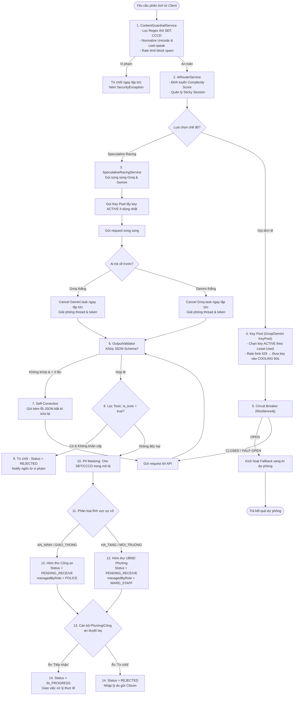

# Kiến Trúc AI Orchestrator: Hướng Dẫn & Cơ Chế Hoạt Động Chi Tiết

> Tài liệu phân tích chuyên sâu các cột trụ kỹ thuật của AI Orchestrator (`AiRouterService`) và luồng phê duyệt phản ánh đô thị thực tế.

---

## 1. SƠ ĐỒ PHỐI HỢP TOÀN DIỆN (COORDINATION FLOW - CÁCH 3)

Dưới đây là sơ đồ luồng hoạt động tích hợp cơ chế **Duyệt tay (Human-in-the-loop)**: AI chỉ làm nhiệm vụ lọc thô (Toxicity) và phân loại lĩnh vực (Domain Routing), không tự ý hủy đơn bằng điểm tin cậy (`trust_score`). Tất cả đơn hợp lệ sẽ được chuyển sang trạng thái `PENDING_RECEIVE` chờ cán bộ nhấn nút tiếp nhận thủ công.

---

## 2. 4 TRỤ CỘT KỸ THUẬT CHI TIẾT

### 2.1 ContentGuardrailService (Lá chắn bảo vệ Tầng 1)
*   **Unicode Normalization:** Chuyển đổi các ký tự unicode đặc biệt về chữ thường không dấu để chống lách luật.
*   **Leet-speak detection:** Tự động dịch các từ lách luật như `h4ck` -> `hack`, `@` -> `a`, `$` -> `s`, `!` -> `i` để so sánh với danh sách cấm.
*   **PII-Guard:** Tự động phát hiện SĐT (10 số liên tiếp bắt đầu bằng 0) hoặc CCCD (12 số liên tiếp) viết liền hoặc cách nhau bằng dấu `-` để từ chối lưu bài viết vi phạm thông tin cá nhân.
*   **Rate limiting:** Nếu một tài khoản bị cảnh báo quá 3 lần trong 60 giây $\rightarrow$ Tự động khóa chat 5 phút.

### 2.2 SpeculativeRacingService (Đua song song - Speculative Racing)
*   Để tối ưu hóa tốc độ phản hồi cực hạn cho người dùng, hệ thống bắn request đồng thời sang **Groq** và **Gemini**.
*   **anyOf Execution:** Provider nào trả về trước (thường là Groq trong ~0.8s) sẽ thắng cuộc.
*   **Loser Cancellation:** Hệ thống lập tức hủy tác vụ (cancel) của provider chậm hơn (Gemini) để tránh rò rỉ luồng và tiết kiệm token API.

### 2.3 Least-Used Key Rotation (Xoay vòng khóa tối ưu)
*   Quản lý pool API key. Thay vì xoay vòng kiểu Round-Robin đơn giản, hệ thống chọn key theo chiến lược **Least-Used** (Key nào có lượt dùng `useCount` thấp nhất thì dùng trước) để phân phối đều tải.
*   **Cooling Recovery:** Nếu một key bị lỗi 429, nó được chuyển trạng thái sang `COOLING` trong 60 giây để phục hồi tự động, các request sau sẽ tránh key này ra.

### 2.4 OutputValidator & Self-Correction (Tự sửa lỗi)
*   Khi AI trả về JSON bị lỗi, hệ thống sẽ tự động ghép lỗi đó vào câu hỏi ban đầu và gửi lại cho AI: *"JSON của bạn bị lỗi cú pháp XYZ, vui lòng sửa lại"*. Quá trình tự sửa này lặp lại tối đa 3 lần để đảm bảo đầu ra luôn là JSON hợp lệ trước khi đưa vào các service xử lý tiếp theo.

---

## 3. THAY ĐỔI THIẾT KẾ: LUỒNG DUYỆT TAY & PHÂN LOẠI CHỜ TIẾP NHẬN (CÁCH 3)

Để tăng độ chính xác nghiệp vụ và phù hợp với quy trình xử lý thực tế của cơ quan hành chính nhà nước, hệ thống chuyển giao toàn bộ quyền ra quyết định phê duyệt cuối cùng cho con người (**Human-in-the-loop**):

### 3.1 Bỏ cơ chế chấm điểm tin cậy tự động (Trust Score)
*   **Lý do:** Điểm số tin cậy do AI tự suy luận dễ dẫn đến sai số (False Positives) do góc chụp ảnh, ánh sáng hiện trường không tốt, khiến đơn của người dân bị tự động từ chối oan uổng.
*   **Giải pháp:** Loại bỏ hoàn toàn kiểm thử ngưỡng điểm 40-70. Tất cả các đơn phản ánh không chứa từ ngữ độc hại/phá hoại sẽ được giữ lại để cán bộ xác minh thủ công.

### 3.2 Cơ chế Chờ Tiếp Nhận (PENDING_RECEIVE) và Phân loại
*   **Nhiệm vụ của AI:** AI chỉ phân tích văn bản/hình ảnh để phân loại đơn về đúng Lĩnh vực chuyên môn và Vai trò quản lý (`managedByRole` là `WARD_STAFF` hoặc `POLICE`).
*   **Luồng xử lý mới:** Sau khi AI định tuyến xong, trạng thái phản ánh được đặt là **`PENDING_RECEIVE` (Chờ tiếp nhận)**.
*   **Quy trình duyệt tay trên UI:**
    *   Cán bộ đăng nhập vào hệ thống, truy cập hòm thư chung dành cho các đơn đang chờ duyệt của đơn vị mình.
    *   **Ấn 'Tiếp nhận':** Đơn được chuyển trạng thái sang `IN_PROGRESS` để giao việc xử lý thực tế.
    *   **Ấn 'Từ chối':** Đơn chuyển sang `REJECTED`, cán bộ bắt buộc phải nhập lý do từ chối để hệ thống gửi thông báo phản hồi về cho người dân.
