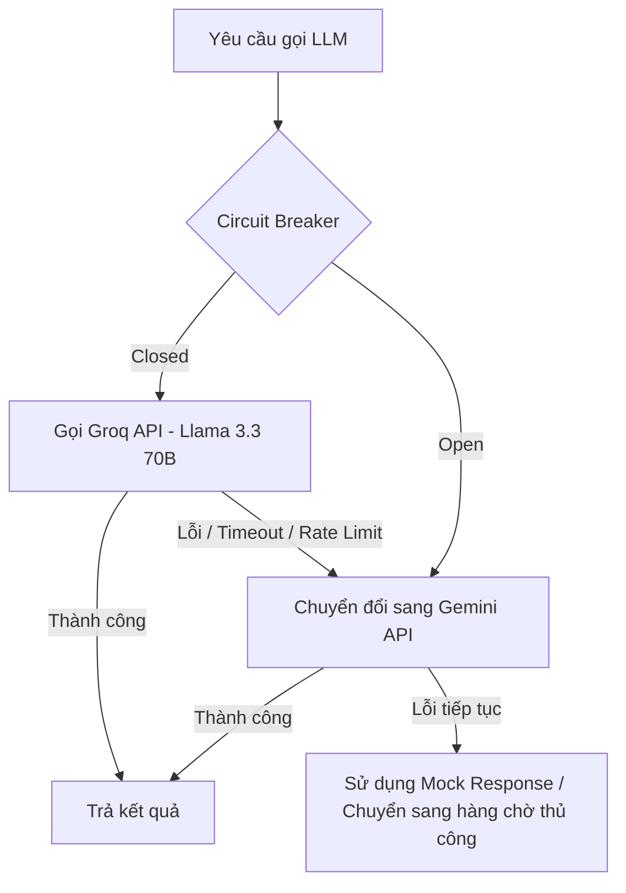

# TÍCH HỢP AI VÀ KIẾN TRÚC HYBRID RAG - SMARTCITY
**Tài liệu Thiết kế Hệ thống Trí tuệ Nhân tạo, Quy trình Điều phối & Quản trị AI (AI Governance)**
**Tác giả:** Phạm Bá Trí - Principal AI Systems Architect

---

## 1. Bản đồ Năng lực AI trong Hệ thống (AI Capability Map)

Hệ thống "Đà Nẵng Lắng Nghe" tích hợp một lớp dịch vụ AI toàn diện để giải quyết các bài toán từ bảo mật thông tin, tối ưu hiệu năng đến điều phối tự động sự cố đô thị:

```text
  ┌─────────────────────────────────────────────────────────────────────────┐
  │                           USER REQUEST PATH                             │
  └────────────────────────────────────┬────────────────────────────────────┘
                                       │
                        [ 1. Content Guardrail & PII ]  ──► (Local Regex & Leet-speak Decode)
                                       │
                         [ 2. Semantic Cache Check ]   ──► pgvector Cosine Distance < 0.08
                                       │
                                       ├─► [Hit] ──► Trả kết quả ngay (Latency ~10ms)
                                       │
                                       └─► [Miss]
                                             │
                        [ 3. Asynchronous AI Outbox ]  ──► PostgreSQL FOR UPDATE SKIP LOCKED
                                       │
                         [ 4. Speculative Racing ]     ──► Parallel Groq & Gemini Call
                                       │
                           [ 5. Decision & Route ]     ──► Auto-Dispatch & Unit Routing
                                       │
                        [ 6. Token & Latency Audit ]   ──► ai_analysis_logs Tracking
```

---

## 2. Các Đường ống AI Chi tiết (AI Pipelines)

### 2.1 Content Guardrail & PII Guard (Bộ lọc Đầu vào)
- **Mục tiêu:** Chống Prompt Injection, lọc từ ngữ thô tục (Toxicity) và bảo vệ thông tin cá nhân (PII Protection) ở mức cổng vào (Gateway Level) với độ trễ tối thiểu.
- **Cơ chế hoạt động:**
  1. **Chuẩn hóa chuỗi (Normalization):** Dùng NFD Normalization để loại bỏ dấu tiếng Việt động, ví dụ: chuyển `"làm sao"` thành `"lam sao"`.
  2. **Giải mã Leet-speak:** Chuyển đổi các ký tự thay thế phá hoại (ví dụ: `4` -> `a`, `h4ck` -> `hack`).
  3. **Bộ lọc Regex Nội bộ (Local Filter):** So khớp nhanh với danh sách mẫu cấm (blacklist) để phát hiện hành vi tấn công hoặc từ cấm mà không tốn chi phí gọi LLM bên ngoài (Latency ~1ms).
  4. **PII Masking:** Phát hiện số điện thoại (SĐT) và Số định danh cá nhân (CCCD/CMND) bằng Regex: `(?<![\d])0[0-9]{9}(?![\d])`. Tự động che dấu dữ liệu nhạy cảm thành `***` trước khi chuyển tiếp thông tin sang các LLM công cộng để đảm bảo tuân thủ bảo mật dữ liệu.

### 2.2 Semantic Cache (pgvector Cache)
- **Mục tiêu:** Lưu trữ các câu trả lời chất lượng cao để tái sử dụng, giảm thiểu chi phí API LLM và rút ngắn thời gian phản hồi cho các câu hỏi trùng lặp từ người dân.
- **Giải pháp Kỹ thuật:**
  - Sử dụng **PostgreSQL pgvector** để lưu trữ vector đặc trưng (Embeddings) của câu hỏi.
  - Sử dụng chỉ mục **HNSW** (`vector_cosine_ops`) để tìm kiếm lân cận gần nhất với hiệu năng cao.
  - **Similarity Threshold:** Đặt khoảng cách Cosine ở mức **0.08** (độ tương đồng ngữ nghĩa tương đương 92%).
  - **Quy trình hoạt động:** Khi người dùng gửi câu hỏi, hệ thống băm câu hỏi thành vector $\vec{v}_1$. Truy vấn DB tìm câu trả lời có vector $\vec{v}_2$ thỏa mãn:
    $$\text{Cosine Distance}(\vec{v}_1, \vec{v}_2) = 1 - \frac{\vec{v}_1 \cdot \vec{v}_2}{\|\vec{v}_1\| \|\vec{v}_2\|} < 0.08$$
    Nếu tìm thấy (Cache Hit), trả về kết quả ngay lập tức (độ trễ ~10ms). Nếu không (Cache Miss), chuyển tiếp gọi LLM và cập nhật kết quả mới vào bộ đệm.

### 2.3 Speculative Racing (Đua luồng song song)
- **Mục tiêu:** Tối ưu hóa tối đa thời gian phản hồi (Latency) bằng cách chạy đua kết quả giữa các nhà cung cấp mô hình khác nhau.
- **Cách thức hoạt động:**
  - Khi có yêu cầu phân tích khẩn cấp, hệ thống kích hoạt đồng thời 2 luồng xử lý không chặn (Non-blocking Async Threads):
    - **Luồng 1:** Gọi Groq API (sử dụng mô hình Llama 3.3 70B nhanh).
    - **Luồng 2:** Gọi Gemini API (sử dụng mô hình Gemini 2.5 Flash).
  - Hệ thống sử dụng `CompletableFuture.anyOf()` để lấy kết quả từ luồng hoàn thành trước và lập tức phát lệnh **hủy bỏ (cancel)** luồng đang chạy chậm hơn để tiết kiệm tài nguyên.
  - *Trade-off (Đánh đổi):* Tăng tốc độ phản hồi khoảng 20% nhưng làm tăng gấp đôi lượng token tiêu thụ và chi phí API trên mỗi yêu cầu. Giải pháp này chỉ được cấu hình cho các tài khoản VIP hoặc các tình huống khẩn cấp cấp độ CRITICAL.

### 2.4 Hybrid RAG Chatbot (Hệ thống Hỏi đáp Thủ tục Hành chính)
- **Cơ chế hoạt động:**
  1. **Query Transformation:** Phân tích câu hỏi của người dùng, tự động sinh các câu hỏi đồng nghĩa để bao phủ ngữ nghĩa.
  2. **Retrieval (Truy xuất kép):**
     - *Vector Search:* Tìm kiếm ngữ nghĩa trên pgvector dựa trên cosine distance.
     - *Full-text Search:* Tìm kiếm từ khóa truyền thống bằng chỉ mục GIN của PostgreSQL trên văn bản thô.
  3. **Reciprocal Rank Fusion (RRF):** Hợp nhất kết quả truy xuất từ hai bộ lọc dựa trên thuật toán RRF để xếp hạng lại tài liệu tham chiếu chất lượng tốt nhất.
  4. **Context Compression:** Loại bỏ các phần văn bản dư thừa trong tài liệu để giảm lượng token gửi lên LLM.
  5. **Self-RAG Grading:** Gọi một LLM nhỏ chạy ngầm để đánh giá chất lượng chunk tài liệu được tìm thấy (có chứa câu trả lời hay không) trước khi đưa vào prompt chính để sinh câu trả lời cuối cùng, hạn chế tối đa hiện tượng ảo giác (Hallucination).

---

## 3. Quản trị Prompt & Quản trị Mô hình (AI Governance)

Đảm bảo hệ thống hoạt động ổn định, minh bạch và có thể kiểm toán ở mọi khâu:

### 3.1 Prompt Lifecycle & Versioning (Vòng đời và Phiên bản Prompt)
- Mọi prompt gửi lên LLM (như prompt phân loại của Auto-Dispatch, prompt của Chatbot) được quản lý tập trung trong cấu hình hệ thống (System Configuration) dưới dạng phiên bản rõ ràng (`system_prompt_v1.0`, `system_prompt_v2.0`).
- Tuyệt đối không hardcode prompt trong mã nguồn Java. Việc cập nhật prompt mới được thực hiện thông qua cập nhật database cấu hình hoặc biến môi trường mà không cần phải compile hay redeploy lại backend.

### 3.2 Model Fallback Strategy (Chiến lược dự phòng Mô hình)
Hệ thống tích hợp cơ chế dự phòng đa tầng sử dụng **Resilience4j Circuit Breaker**:



### 3.3 Human-in-the-loop (Quyền kiểm soát của Con người)
AI đóng vai trò hỗ trợ điều phối tự động nhanh, nhưng con người (IOC Admin) giữ quyền quyết định tối cao:
- **Trust Score Gate:**
  - `Trust Score > 70` và không có độc tính (`is_toxic = false`): Tự động phân quyền và chuyển trạng thái phản ánh sang `PENDING_RECEIVE`.
  - `40 <= Trust Score <= 70`: Hệ thống chuyển trạng thái sang `NEED_LOCATION_REVIEW` hoặc gờ duyệt thủ công.
  - `Trust Score < 40`: Phản ánh bị tự động chuyển sang trạng thái nháp hoặc từ chối kèm thông báo yêu cầu người dân bổ sung hình ảnh thực tế/thông tin rõ ràng hơn.
- **Manual Override (Ghi đè thủ công):** Mọi quyết định tự động của AI đều có thể bị ghi đè bởi IOC Admin thông qua chức năng "Điều phối lại" trên Single Admin Portal. Khi Admin thực hiện ghi đè, hệ thống sẽ lưu nhật ký để làm dữ liệu tinh chỉnh (Fine-tuning) prompt trong tương lai.

---

## 4. Nhật ký Kiểm toán AI (AI Audit Architecture)

Mọi quyết định của AI đều được lưu trữ đầy đủ trong bảng `ai_analysis_logs` để phục vụ công tác kiểm toán chi phí và hiệu năng:

### 4.1 Cấu trúc Dữ liệu Nhật ký Kiểm toán AI

| Trường dữ liệu | Kiểu dữ liệu | Trách nhiệm kiểm toán |
| :--- | :--- | :--- |
| `id` | `BIGINT` | Khóa chính tự tăng |
| `feedback_id` | `BIGINT` | Khóa ngoại liên kết với phản ánh |
| `trust_score` | `INT` | Điểm độ tin cậy do AI chấm (0 - 100) |
| `is_toxic` | `BOOLEAN` | Cờ đánh dấu nội dung phản cảm/kích động |
| `domain` | `VARCHAR` | Lĩnh vực phân loại (Môi trường, An ninh, Hạ tầng...) |
| `priority` | `VARCHAR` | Mức độ khẩn cấp tự động (LOW, MEDIUM, HIGH, CRITICAL) |
| `reason` | `TEXT` | Giải thích lý do phân loại của AI |
| `raw_response` | `TEXT` | Nội dung JSON thô trả về từ LLM API |
| `tokens_used_input` | `INT` | Số lượng Prompt Tokens tiêu thụ |
| `tokens_used_output` | `INT` | Số lượng Completion Tokens tiêu thụ |
| `latency_ms` | `BIGINT` | Thời gian phản hồi của cuộc gọi API (ms) |
| `model_name` | `VARCHAR` | Tên mô hình chính xác đã thực thi (ví dụ: `gemini-2.5-flash`) |

---

## 5. Quy trình Xử lý Sự cố & Ngoại lệ AI (Failure & Recovery Flow)

Để đảm bảo hệ thống không bao giờ bị nghẽn hoặc mất dữ liệu khi AI gặp sự cố, quy trình xử lý ngoại lệ được thiết kế chi tiết:

### 5.1 Success Flow (Luồng Thành công)
```text
[Công dân gửi phản ánh] ──► [Lưu Outbox Task] ──► [Worker gọi AI thành công] ──► [Định tuyến tự động & WebSocket]
```

### 5.2 Failure Path (Luồng Gặp lỗi)
Khi Gemini API trả về lỗi mạng, hết hạn Key, hoặc lỗi JSON thô không parse được:
- Lỗi được bắt (catch) tại lớp `AutoDispatchService.java`.
- Worker ghi nhận thông báo lỗi vào trường `error_message` trong bảng `ai_tasks` và giữ nguyên trạng thái `PENDING`.
- Tự động cộng thêm 1 vào trường `retry_count`.

### 5.3 Retry Path (Luồng Thử lại)
- Worker ngầm quét lại hàng đợi sau 5 giây. Đối với các tác vụ có trạng thái `PENDING` và `retry_count < 3`, Worker thực hiện gọi lại AI.
- Sử dụng thuật toán giãn cách thời gian (Exponential Backoff): Thời gian giãn cách giữa các lần retry tăng dần ($2^n$ giây) để tránh spam làm nghẽn thêm hệ thống AI khi họ đang bị quá tải.

### 5.4 Recovery Path (Luồng Khôi phục Nghiệp vụ)
- Nếu sau 3 lần retry (`retry_count >= 3`) vẫn thất bại:
  - Worker cập nhật trạng thái `ai_tasks` thành `FAILED`.
  - Cập nhật trạng thái phản ánh sang `NEED_LOCATION_REVIEW` (để IOC Admin duyệt thủ công).
  - Tự động ghi nhật ký hệ thống: `"⚠️ [HỆ THỐNG] Phân tích AI tự động thất bại do sự cố đường truyền liên tục. Chuyển sang MANUAL_REVIEW."` vào bảng `feedback_audit_logs`.
  - Gửi thông báo WebSocket / Telegram Alert cho đội ngũ vận hành kỹ thuật.

### 5.5 Audit & Monitoring Path (Luồng Kiểm toán và Giám sát)
- Mọi tác vụ `FAILED` đều hiển thị trên màn hình Giám sát của IOC Admin.
- Tích hợp biểu đồ thống kê tỷ lệ lỗi AI theo thời gian thực trên dashboard để phát hiện sớm các đợt sập API của nhà cung cấp.

---

## 6. Các Chỉ số Đánh giá Hiệu năng AI (AI Evaluation Metrics)

Hệ thống đo lường chất lượng AI định kỳ hàng tuần thông qua các chỉ số:
1. **Classification Accuracy (Độ chính xác phân loại):** Đạt mục tiêu trên **95%** thông qua kiểm tra đối chiếu (Cross-check) giữa nhãn do AI gán và nhãn thực tế sau khi cán bộ xử lý xong.
2. **False Positive Rate (Tỷ lệ chặn nhầm):** Kiểm soát dưới **1%** đối với bộ lọc Content Guardrails để đảm bảo không chặn oan các báo cáo hợp lệ của người dân đang bức xúc.
3. **Average Latency (Độ trễ trung bình):**
   - Lọc Guardrails + PII (Local): `< 5ms`.
   - Semantic Cache Hit: `< 15ms`.
   - AI Auto-Dispatch (Async background): `< 8 giây`.
   - Chatbot RAG (Streaming response): `< 3 giây`.
4. **LLM Cost Optimization Rate (Hiệu quả tối ưu chi phí):** Đo lường tỷ lệ tiết kiệm ngân sách gọi API nhờ Semantic Cache (được tính bằng: $\frac{\text{Cache Hits}}{\text{Total Chat Queries}} \times 100\%$).
