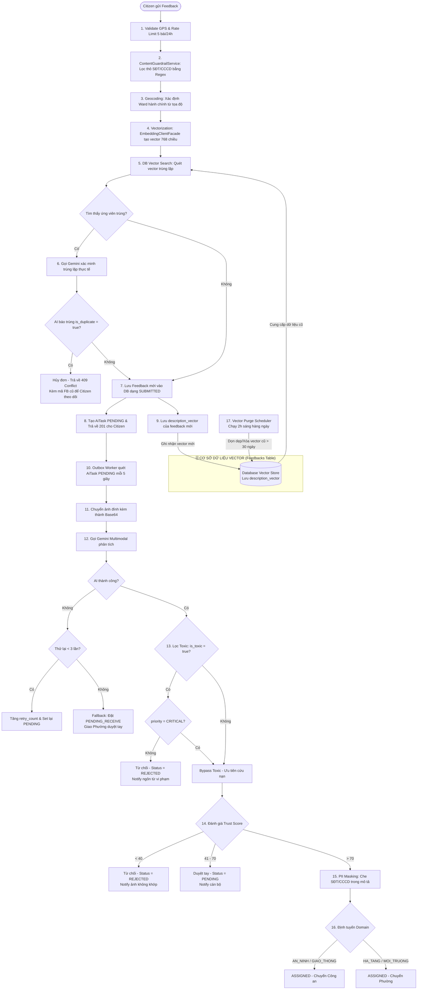
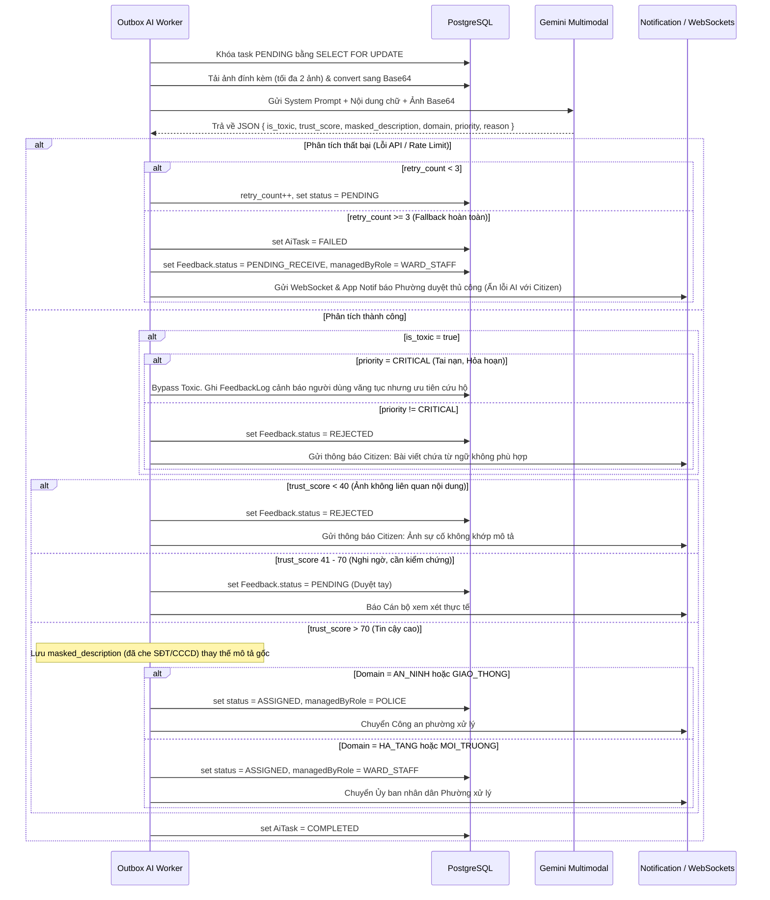

# Workflow: AI Phân loại & Kiểm duyệt Feedback (Full Flow Hệ Thống)

> Tài liệu mô tả chi tiết toàn bộ luồng xử lý trùng lặp (Deduplication), kiểm duyệt (Moderation), phân loại (Classification), định tuyến (Routing) và bảo mật thông tin (PII Masking) trong hệ thống SmartCity.

---

## 1. SƠ ĐỒ LUỒNG TOÀN DIỆN (FULL SYSTEM FLOW)



---

## 2. PHA 1: KIỂM TRA TRÙNG LẶP SỰ CỐ (REAL-TIME DEDUPLICATION)

Để tránh việc nhiều người dân cùng báo cáo một sự việc tại cùng một địa điểm gây quá tải cho cán bộ, hệ thống thực hiện kiểm tra trùng lặp thời gian thực trước khi lưu đơn:

### Bước 1: Tạo Vector nhúng
Mô tả sự cố (description) được gửi qua `EmbeddingClientFacade` gọi Gemini API (`text-embedding-004`) để sinh ra một vector nhúng **768 chiều** đại diện cho ngữ nghĩa.

### Bước 2: Truy vấn PostgreSQL + pgvector + PostGIS
Hệ thống tìm kiếm các ứng viên có khả năng trùng lặp cao bằng câu lệnh SQL:
```sql
SELECT tracking_code, description, latitude, longitude
FROM feedbacks
WHERE ward_id = :wardId  -- Cùng phường xử lý (hoặc check vị trí nếu ward null)
  AND description_vector <=> :queryVector::vector < 0.70 -- 1. Tương đồng ngữ nghĩa > 30% (Cosine distance < 0.7)
  AND ST_DWithin(location, ST_SetSRID(ST_Point(:longitude, :latitude), 4326), 0.005) -- 2. Khoảng cách địa lý ~500m
  AND (
      status IN ('PENDING', 'IN_PROGRESS', 'SUBMITTED', 'NEED_LOCATION_REVIEW', 'PENDING_RECEIVE', 'WAITING_INFO') -- 3. Đang thực hiện
      OR
      (status = 'RESOLVED' AND resolved_at >= NOW() - INTERVAL '7 days') -- 4. Hoặc đã hoàn thành nhưng chưa quá 7 ngày
  )
ORDER BY description_vector <=> :queryVector::vector ASC
LIMIT 3;
```

### Bước 3: Xác minh bằng AI (Gemini)
Nếu DB trả về từ 1 đến 3 ứng viên, hệ thống sẽ gửi nội dung của đơn mới cùng nội dung của các đơn cũ sang Gemini để đối chiếu chéo:
*   **Prompt kiểm tra:** *Hãy xác định xem sự cố mới có trùng lặp (cùng mô tả về một sự việc vật lý, cùng một đống rác, cùng một cái cây đổ...) với các sự cố cũ không.*
*   **Kết quả:** JSON `{ "is_duplicate": true/false, "tracking_code": "FB-OLD123", "reason": "..." }`.
*   **Xử lý:** Nếu trùng -> Ném lỗi `409 Conflict`, chặn không lưu đơn và hướng dẫn citizen theo dõi mã phản ánh cũ.

---

## 3. PHA 2: AI AUDIT & PHÂN LOẠI ĐỊNH TUYẾN (OUTBOX WORKER)

Sau khi đơn vượt qua vòng kiểm tra trùng lặp và được tạo thành công, một `AiTask` ở trạng thái `PENDING` được sinh ra. `AutoDispatchService` chạy ngầm mỗi 5 giây sẽ xử lý:



---

## 4. DỌN DẸP BỘ NHỚ VECTOR (VECTOR PURGE SCHEDULER)

Để tối ưu không gian lưu trữ của cơ sở dữ liệu Supabase/PostgreSQL (đặc biệt khi dung lượng RAM cho chỉ mục HNSW vector có giới hạn), hệ thống cài đặt bộ dọn dẹp tự động:

*   **Thời gian chạy:** 2:00 AM hàng ngày (`@Scheduled(cron = "0 0 2 * * *")`).
*   **Logic xử lý:** Tất cả các phản ánh đã giải quyết xong (`RESOLVED`) hoặc đã bị từ chối (`REJECTED`) mà thời gian cập nhật cuối cùng đã **quá 30 ngày** sẽ bị xóa sạch cột `description_vector` về `NULL`.
*   **Mục đích:** Chỉ lưu trữ vector của các phản ánh mới hoặc đang xử lý để phục vụ check trùng lặp, giải phóng tài nguyên cho các phản ánh quá cũ.

---

## 5. CÔNG CỤ DÀNH CHO CÁN BỘ: GOM NHÓM SỰ CỐ HÀNG LOẠT (BATCH DEDUPLICATION)

Ngoài việc kiểm tra trùng lặp thời gian thực lúc người dân gửi đơn, Cán bộ công an hoặc Phường có thể sử dụng tính năng **Phân tích trùng lặp hàng loạt** trên giao diện:

1.  **Endpoint:** `GET /api/police/feedbacks/analyze-duplicates` (định nghĩa tại `PoliceFeedbackService.java`).
2.  **Cách thức hoạt động:**
    *   Hệ thống quét tối đa 50 phản ánh đang hoạt động thuộc địa bàn Phường quản lý.
    *   Gộp toàn bộ thông tin (ID, tiêu đề, địa chỉ, mô tả) thành một văn bản gửi sang AI.
    *   AI tiến hành phân tích đa chiều và gom các bài viết phản ánh về cùng một sự việc vật lý vào các nhóm.
    *   AI trả về danh sách nhóm trùng lặp:
        ```json
        [
          {
            "groupId": "Nhóm sự cố rác thải Lê Duẩn",
            "feedbackIds": [102, 105, 108],
            "matchScore": 92,
            "reason": "Các phản ánh đều mô tả đống rác lớn bốc mùi trước số nhà 120 Lê Duẩn."
          }
        ]
        ```
3.  **Tác dụng:** Giúp cán bộ gộp nhanh các đơn trùng để xử lý một lần, gửi phản hồi hàng loạt cho tất cả người dân liên quan.
